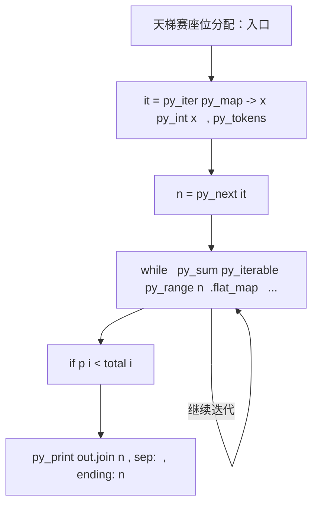
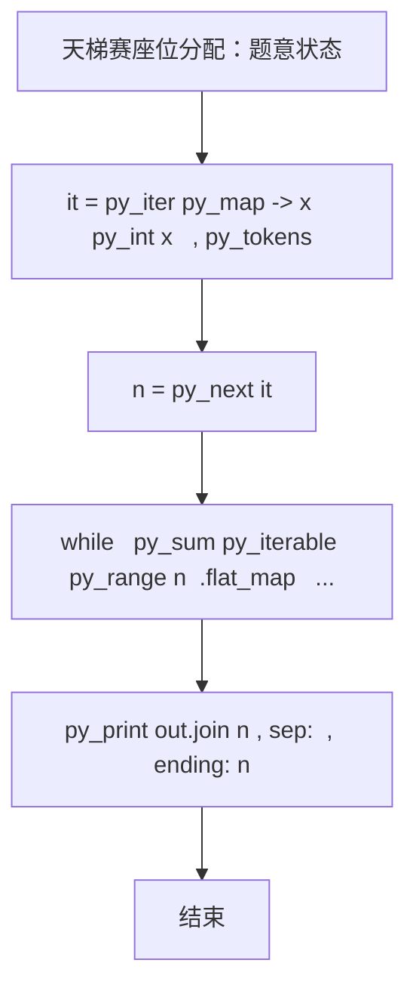

# L1-049 - 天梯赛座位分配（20 分）

| 项目 | 限制 |
| --- | --- |
| 时间限制 | 400 ms |
| 内存限制 | 65536 KB |
| 代码长度限制 | 16 KB |

## 题目描述

天梯赛每年有大量参赛队员，要保证同一所学校的所有队员都不能相邻，分配座位就成为一件比较麻烦的事情。为此我们制定如下策略：假设某赛场有 N 所学校参赛，第 i 所学校有 M[i] 支队伍，每队 10 位参赛选手。令每校选手排成一列纵队，第 i+1 队的选手排在第 i 队选手之后。从第 1 所学校开始，各校的第 1 位队员顺次入座，然后是各校的第 2 位队员…… 以此类推。如果最后只剩下 1 所学校的队伍还没有分配座位，则需要安排他们的队员隔位就坐。本题就要求你编写程序，自动为各校生成队员的座位号，从 1 开始编号。

### 输入格式

输入在一行中给出参赛的高校数 N （不超过100的正整数）；第二行给出 N 个不超过10的正整数，其中第 i 个数对应第 i 所高校的参赛队伍数，数字间以空格分隔。

### 输出格式

从第 1 所高校的第 1 支队伍开始，顺次输出队员的座位号。每队占一行，座位号间以 1 个空格分隔，行首尾不得有多余空格。另外，每所高校的第一行按“#X”输出该校的编号X，从 1 开始。

### 输入样例
```in
3
3 4 2
```

### 输出样例
```out
#1
1 4 7 10 13 16 19 22 25 28
31 34 37 40 43 46 49 52 55 58
61 63 65 67 69 71 73 75 77 79
#2
2 5 8 11 14 17 20 23 26 29
32 35 38 41 44 47 50 53 56 59
62 64 66 68 70 72 74 76 78 80
82 84 86 88 90 92 94 96 98 100
#3
3 6 9 12 15 18 21 24 27 30
33 36 39 42 45 48 51 54 57 60
```

## 参考样例

### 样例 1

**输入**
```
3
3 4 2
```

**输出**
```
#1
1 4 7 10 13 16 19 22 25 28
31 34 37 40 43 46 49 52 55 58
61 63 65 67 69 71 73 75 77 79
#2
2 5 8 11 14 17 20 23 26 29
32 35 38 41 44 47 50 53 56 59
62 64 66 68 70 72 74 76 78 80
82 84 86 88 90 92 94 96 98 100
#3
3 6 9 12 15 18 21 24 27 30
33 36 39 42 45 48 51 54 57 60
```

## 实现原理与解题思路

本题的实现原理是：按题目格式读取字符串或数值，逐项维护必要状态，并在每次判断时直接执行题目给出的规则。先读取标准输入并按题目格式拆分字段，使用代码中的`it`、`n`、`total`、`got`保存计算过程，通过 5 个循环阶段逐步更新；处理完成后按照题目规定的顺序和格式输出结果。

## 代码流程说明

1. 读取并解析标准输入，转换为题目所需的数据结构。
2. 按题意执行核心算法，维护中间状态并处理边界情况。
3. 整理计算结果，按照输出格式生成答案。

## 代码实现

下面给出可独立运行的完整 Ruby 实现，关键步骤已在代码中标注。

```ruby
# frozen_string_literal: true
# 这些辅助方法只负责把题目输入、输出和常见序列操作映射为 Ruby 写法，
# 算法主体仍在下方的 entry 方法中，代码复制后可以独立运行。
module PTACompat
  UNSET = Object.new

  class CounterHash < Hash
    def initialize
      super(0)
    end
  end

  def py_tokens
    @pta_tokens ||= STDIN.read.split
  end

  def py_input_data
    @pta_input_data ||= STDIN.read
  end

  def py_readline
    STDIN.gets.to_s.chomp
  end

  def py_lines
    @pta_lines ||= STDIN.each_line.map(&:chomp)
  end

  def py_print(*values, sep: " ", ending: "\n")
    STDOUT.write(values.map(&:to_s).join(sep) + ending)
  end

  def py_int(value)
    value.to_i
  end

  def py_float(value)
    value.to_f
  end

  def py_str(value)
    value.to_s
  end

  def py_bool_int(value)
    value ? 1 : 0
  end

  def py_truth(value)
    return false if value.nil? || value == false
    return false if value.respond_to?(:zero?) && value.zero?
    return false if value.respond_to?(:empty?) && value.empty?

    true
  end

  def py_range(*args)
    first, last, step =
      case args.length
      when 1
        [0, args[0], 1]
      when 2
        [args[0], args[1], 1]
      else
        args
      end
    first = first.to_i
    last = last.to_i
    step = step.to_i
    raise ArgumentError, "range step cannot be zero" if step.zero?

    values = []
    current = first
    if step.positive?
      while current < last
        values << current
        current += step
      end
    else
      while current > last
        values << current
        current += step
      end
    end
    values
  end

  def py_map(function, values)
    values.map { |value| function.call(value) }
  end

  def py_iter(value)
    value.to_enum
  end

  def py_next(iterator)
    iterator.next
  end

  def py_iterable(value)
    value.is_a?(String) ? value.chars : value.to_a
  end

  def py_enumerate(values)
    values.each_with_index.map { |value, index| [index, value] }
  end

  def py_zip(*values)
    values.first.zip(*values.drop(1))
  end

  def py_slice(value, start_index = nil, stop_index = nil, step = nil)
    step ||= 1
    source = value.is_a?(String) ? value.chars : value.to_a
    size = source.length
    start_index = step.positive? ? 0 : size - 1 if start_index.nil?
    stop_index = step.positive? ? size : -size - 1 if stop_index.nil?
    start_index += size if start_index.negative?
    stop_index += size if stop_index.negative? && stop_index >= -size
    start_index =
      (
        if step.positive?
          [[start_index, 0].max, size].min
        else
          [[start_index, -1].max, size - 1].min
        end
      )
    stop_index =
      (
        if step.positive?
          [[stop_index, 0].max, size].min
        else
          [[stop_index, -1].max, size - 1].min
        end
      )

    result = []
    index = start_index
    if step.positive?
      while index < stop_index
        result << source[index]
        index += step
      end
    else
      while index > stop_index
        result << source[index]
        index += step
      end
    end
    value.is_a?(String) ? result.join : result
  end

  def py_len(value)
    value.length
  end

  def py_sum(values, initial = 0)
    values.sum(initial)
  end

  def py_abs(value)
    value.abs
  end

  def py_div(a, b)
    a.to_f / b
  end

  def py_divmod(a, b)
    [a.div(b), a % b]
  end

  def py_factorial(value)
    (1..value).reduce(1, :*)
  end

  def py_gcd(a, b)
    a.gcd(b)
  end

  def py_pow(base, exponent, modulus = nil)
    modulus.nil? ? base**exponent : base.pow(exponent, modulus)
  end

  def py_in(item, container)
    container.include?(item)
  end

  def py_counter(_values)
    CounterHash.new
  end

  def py_sorted(values, key: nil, reverse: false)
    result = (key ? values.sort_by { |value| key.call(value) } : values.sort)
    reverse ? result.reverse : result
  end

  def py_max(*values, key: nil, default: UNSET)
    values = values.first.to_a if values.length == 1 &&
      values.first.respond_to?(:each) && !values.first.is_a?(Numeric)
    return default unless values.any?

    key ? values.max_by { |value| key.call(value) } : values.max
  end

  def py_min(*values, key: nil, default: UNSET)
    values = values.first.to_a if values.length == 1 &&
      values.first.respond_to?(:each) && !values.first.is_a?(Numeric)
    return default unless values.any?

    key ? values.min_by { |value| key.call(value) } : values.min
  end

  def py_re_sub(pattern, replacement, value)
    value.gsub(Regexp.new(pattern), replacement)
  end

  def py_lstrip(value, chars)
    value.sub(/\A[#{Regexp.escape(chars)}]+/, "")
  end

  def py_startswith_at(value, prefix, index)
    value[index, prefix.length] == prefix
  end

  def py_replace_slice(value, start_index, stop_index, replacement)
    value[start_index...stop_index] = replacement
    value
  end

  def py_bisect_left(values, target)
    left = 0
    right = values.length
    while left < right
      middle = (left + right) / 2
      if values[middle] < target
        left = middle + 1
      else
        right = middle
      end
    end
    left
  end

  def py_bisect_right(values, target)
    left = 0
    right = values.length
    while left < right
      middle = (left + right) / 2
      if values[middle] <= target
        left = middle + 1
      else
        right = middle
      end
    end
    left
  end
end

class Hash
  def items
    to_a
  end
end

include PTACompat

# 题目入口：读取输入、执行核心算法并输出答案。

def entry
  # 读取并解析题目输入。
  it = py_iter(py_map(->(x) { py_int(x) }, py_tokens))
  n = py_next(it)
  total = py_iterable(py_range(n)).flat_map { |_| [(py_next(it) * 10)] }
  got = py_iterable(py_range(n)).flat_map { |_| [[]] }
  p = ([0] * n)
  seat = 1
  last = (-1)
  # 按题目规则遍历输入或状态空间。
  while (
          (
            py_sum(
              py_iterable(py_range(n)).flat_map { |i| [((p[i] < total[i]))] }
            ) > 1
          )
        )
    for i in py_range(n)
      if ((p[i] < total[i]))
        got[i].append(seat)
        p[i] += 1
        seat += 1
        last = i
      end
    end
  end
  left =
    py_next(
      py_iterable(py_range(n)).flat_map do |i|
        next [] unless py_truth(((p[i] < total[i])))
        [i]
      end
    )
  if ((left >= 0))
    seat += 1 if ((last == left))
    while ((p[left] < total[left]))
      got[left].append(seat)
      p[left] += 1
      seat += 2
    end
  end
  # 初始化算法状态，保持后续转移所需的不变量。
  out = []
  for i, arr in py_enumerate(got)
    out.append("#%s" % [(i + 1)])
    for j in py_range(0, py_len(arr), 10)
      out.append(
        py_map(->(x) { py_str(x) }, py_slice(arr, j, (j + 10), nil)).join(" ")
      )
    end
  end
  # 按题目要求输出最终结果。
  py_print(out.join("\n"), sep: " ", ending: "\n")
end
entry

```

## 代码流程图



## 解题流程图


