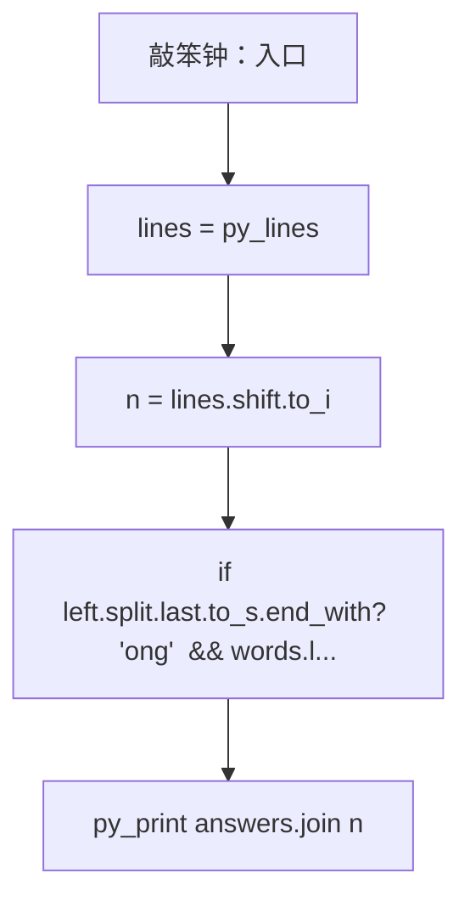
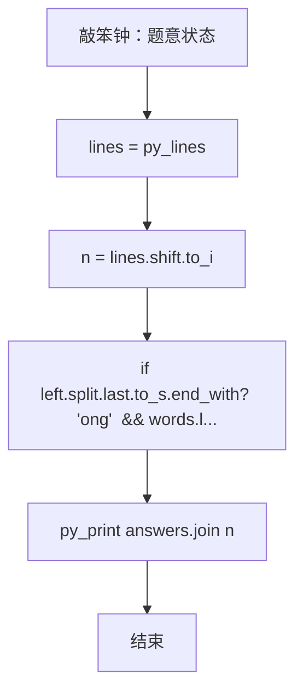

# L1-059 - 敲笨钟（20 分）

| 项目 | 限制 |
| --- | --- |
| 时间限制 | 400 ms |
| 内存限制 | 65536 KB |
| 代码长度限制 | 16 KB |

## 题目描述

微博上有个自称“大笨钟V”的家伙，每天敲钟催促码农们爱惜身体早点睡觉。为了增加敲钟的趣味性，还会糟改几句古诗词。其糟改的方法为：去网上搜寻压“ong”韵的古诗词，把句尾的三个字换成“敲笨钟”。例如唐代诗人李贺有名句曰：“寻章摘句老雕虫，晓月当帘挂玉弓”，其中“虫”（chong）和“弓”（gong）都压了“ong”韵。于是这句诗就被糟改为“寻章摘句老雕虫，晓月当帘敲笨钟”。

现在给你一大堆古诗词句，要求你写个程序自动将压“ong”韵的句子糟改成“敲笨钟”。

### 输入格式

输入首先在第一行给出一个不超过 20 的正整数 N。随后 N 行，每行用汉语拼音给出一句古诗词，分上下两半句，用逗号 `,` 分隔，句号 `.` 结尾。相邻两字的拼音之间用一个空格分隔。题目保证每个字的拼音不超过 6 个字符，每行字符的总长度不超过 100，并且下半句诗至少有 3 个字。

### 输出格式

对每一行诗句，判断其是否压“ong”韵。即上下两句末尾的字都是“ong”结尾。如果是压此韵的，就按题面方法糟改之后输出，输出格式同输入；否则输出 `Skipped`，即跳过此句。

### 输入样例
```in
5
xun zhang zhai ju lao diao chong, xiao yue dang lian gua yu gong.
tian sheng wo cai bi you yong, qian jin san jin huan fu lai.
xue zhui rou zhi leng wei rong, an xiao chen jing shu wei long.
zuo ye xing chen zuo ye feng, hua lou xi pan gui tang dong.
ren xian gui hua luo, ye jing chun shan kong.
```

### 输出样例
```out
xun zhang zhai ju lao diao chong, xiao yue dang lian qiao ben zhong.
Skipped
xue zhui rou zhi leng wei rong, an xiao chen jing qiao ben zhong.
Skipped
Skipped
```

## 参考样例

### 样例 1

**输入**
```
5
xun zhang zhai ju lao diao chong, xiao yue dang lian gua yu gong.
tian sheng wo cai bi you yong, qian jin san jin huan fu lai.
xue zhui rou zhi leng wei rong, an xiao chen jing shu wei long.
zuo ye xing chen zuo ye feng, hua lou xi pan gui tang dong.
ren xian gui hua luo, ye jing chun shan kong.
```

**输出**
```
xun zhang zhai ju lao diao chong, xiao yue dang lian qiao ben zhong.
Skipped
xue zhui rou zhi leng wei rong, an xiao chen jing qiao ben zhong.
Skipped
Skipped
```

## 实现原理与解题思路

本题的实现原理是：使用栈、队列或二分边界维护操作顺序，在每次操作后保持数据结构的题目约束。先读取标准输入并按题目格式拆分字段，使用代码中的`lines`、`n`、`answers`、`parts`保存计算过程，直接完成计算；处理完成后按照题目规定的顺序和格式输出结果。

## 代码流程说明

1. 读取并解析标准输入，转换为题目所需的数据结构。
2. 按题意执行核心算法，维护中间状态并处理边界情况。
3. 整理计算结果，按照输出格式生成答案。

## 代码实现

下面给出可独立运行的完整 Ruby 实现，关键步骤已在代码中标注。

```ruby
# frozen_string_literal: true
# 这些辅助方法只负责把题目输入、输出和常见序列操作映射为 Ruby 写法，
# 算法主体仍在下方的 entry 方法中，代码复制后可以独立运行。
module PTACompat
  UNSET = Object.new

  class CounterHash < Hash
    def initialize
      super(0)
    end
  end

  def py_tokens
    @pta_tokens ||= STDIN.read.split
  end

  def py_input_data
    @pta_input_data ||= STDIN.read
  end

  def py_readline
    STDIN.gets.to_s.chomp
  end

  def py_lines
    @pta_lines ||= STDIN.each_line.map(&:chomp)
  end

  def py_print(*values, sep: " ", ending: "\n")
    STDOUT.write(values.map(&:to_s).join(sep) + ending)
  end

  def py_int(value)
    value.to_i
  end

  def py_float(value)
    value.to_f
  end

  def py_str(value)
    value.to_s
  end

  def py_bool_int(value)
    value ? 1 : 0
  end

  def py_truth(value)
    return false if value.nil? || value == false
    return false if value.respond_to?(:zero?) && value.zero?
    return false if value.respond_to?(:empty?) && value.empty?

    true
  end

  def py_range(*args)
    first, last, step =
      case args.length
      when 1
        [0, args[0], 1]
      when 2
        [args[0], args[1], 1]
      else
        args
      end
    first = first.to_i
    last = last.to_i
    step = step.to_i
    raise ArgumentError, "range step cannot be zero" if step.zero?

    values = []
    current = first
    if step.positive?
      while current < last
        values << current
        current += step
      end
    else
      while current > last
        values << current
        current += step
      end
    end
    values
  end

  def py_map(function, values)
    values.map { |value| function.call(value) }
  end

  def py_iter(value)
    value.to_enum
  end

  def py_next(iterator)
    iterator.next
  end

  def py_iterable(value)
    value.is_a?(String) ? value.chars : value.to_a
  end

  def py_enumerate(values)
    values.each_with_index.map { |value, index| [index, value] }
  end

  def py_zip(*values)
    values.first.zip(*values.drop(1))
  end

  def py_slice(value, start_index = nil, stop_index = nil, step = nil)
    step ||= 1
    source = value.is_a?(String) ? value.chars : value.to_a
    size = source.length
    start_index = step.positive? ? 0 : size - 1 if start_index.nil?
    stop_index = step.positive? ? size : -size - 1 if stop_index.nil?
    start_index += size if start_index.negative?
    stop_index += size if stop_index.negative? && stop_index >= -size
    start_index =
      (
        if step.positive?
          [[start_index, 0].max, size].min
        else
          [[start_index, -1].max, size - 1].min
        end
      )
    stop_index =
      (
        if step.positive?
          [[stop_index, 0].max, size].min
        else
          [[stop_index, -1].max, size - 1].min
        end
      )

    result = []
    index = start_index
    if step.positive?
      while index < stop_index
        result << source[index]
        index += step
      end
    else
      while index > stop_index
        result << source[index]
        index += step
      end
    end
    value.is_a?(String) ? result.join : result
  end

  def py_len(value)
    value.length
  end

  def py_sum(values, initial = 0)
    values.sum(initial)
  end

  def py_abs(value)
    value.abs
  end

  def py_div(a, b)
    a.to_f / b
  end

  def py_divmod(a, b)
    [a.div(b), a % b]
  end

  def py_factorial(value)
    (1..value).reduce(1, :*)
  end

  def py_gcd(a, b)
    a.gcd(b)
  end

  def py_pow(base, exponent, modulus = nil)
    modulus.nil? ? base**exponent : base.pow(exponent, modulus)
  end

  def py_in(item, container)
    container.include?(item)
  end

  def py_counter(_values)
    CounterHash.new
  end

  def py_sorted(values, key: nil, reverse: false)
    result = (key ? values.sort_by { |value| key.call(value) } : values.sort)
    reverse ? result.reverse : result
  end

  def py_max(*values, key: nil, default: UNSET)
    values = values.first.to_a if values.length == 1 &&
      values.first.respond_to?(:each) && !values.first.is_a?(Numeric)
    return default unless values.any?

    key ? values.max_by { |value| key.call(value) } : values.max
  end

  def py_min(*values, key: nil, default: UNSET)
    values = values.first.to_a if values.length == 1 &&
      values.first.respond_to?(:each) && !values.first.is_a?(Numeric)
    return default unless values.any?

    key ? values.min_by { |value| key.call(value) } : values.min
  end

  def py_re_sub(pattern, replacement, value)
    value.gsub(Regexp.new(pattern), replacement)
  end

  def py_lstrip(value, chars)
    value.sub(/\A[#{Regexp.escape(chars)}]+/, "")
  end

  def py_startswith_at(value, prefix, index)
    value[index, prefix.length] == prefix
  end

  def py_replace_slice(value, start_index, stop_index, replacement)
    value[start_index...stop_index] = replacement
    value
  end

  def py_bisect_left(values, target)
    left = 0
    right = values.length
    while left < right
      middle = (left + right) / 2
      if values[middle] < target
        left = middle + 1
      else
        right = middle
      end
    end
    left
  end

  def py_bisect_right(values, target)
    left = 0
    right = values.length
    while left < right
      middle = (left + right) / 2
      if values[middle] <= target
        left = middle + 1
      else
        right = middle
      end
    end
    left
  end
end

class Hash
  def items
    to_a
  end
end

include PTACompat

# 题目入口：读取输入、执行核心算法并输出答案。

# 读取并解析题目输入。
lines = py_lines
n = lines.shift.to_i
answers =
  lines
    .first(n)
    .map do |line|
      parts = line.split(",", 2)
      next "Skipped" if parts.length < 2
      left, right = parts.map(&:strip)
      words = right[0...-1].to_s.split
      if left.split.last.to_s.end_with?("ong") &&
           words.last.to_s.end_with?("ong")
        "#{left}, #{(words[0...-3] + %w[qiao ben zhong]).join(" ")}."
      else
        "Skipped"
      end
    end
# 按题目要求输出最终结果。
py_print(answers.join("\n"))

```

## 代码流程图



## 解题流程图


