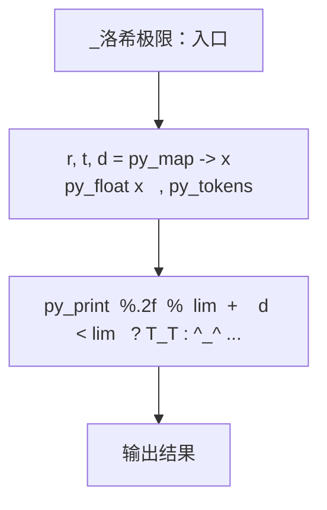
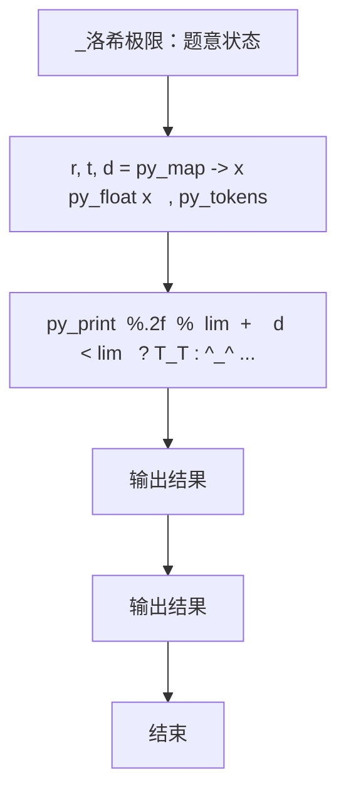

# L1-067 -  洛希极限（10 分）

| 项目 | 限制 |
| --- | --- |
| 时间限制 | 400 ms |
| 内存限制 | 65536 KB |
| 代码长度限制 | 16 KB |

## 题目描述

科幻电影《流浪地球》中一个重要的情节是地球距离木星太近时，大气开始被木星吸走，而随着不断接近地木“刚体洛希极限”，地球面临被彻底撕碎的危险。但实际上，这个计算是错误的。


洛希极限（Roche limit）是一个天体自身的引力与第二个天体造成的潮汐力相等时的距离。当两个天体的距离少于洛希极限，天体就会倾向碎散，继而成为第二个天体的环。它以首位计算这个极限的人爱德华·洛希命名。（摘自百度百科）

大天体密度与小天体的密度的比值开 3 次方后，再乘以大天体的半径以及一个倍数（流体对应的倍数是 2.455，刚体对应的倍数是 1.26），就是洛希极限的值。例如木星与地球的密度比值开 3 次方是 0.622，如果假设地球是流体，那么洛希极限就是 $$0.622\times 2.455=1.52701$$ 倍木星半径；但地球是刚体，对应的洛希极限是 $$0.622\times 1.26=0.78372$$ 倍木星半径，这个距离比木星半径小，即只有当地球位于木星内部的时候才会被撕碎，换言之，就是地球不可能被撕碎。

本题就请你判断一个小天体会不会被一个大天体撕碎。

### 输入格式

输入在一行中给出 3 个数字，依次为：大天体密度与小天体的密度的比值开 3 次方后计算出的值（$$\le 1$$）、小天体的属性（0 表示流体、1 表示刚体）、两个天体的距离与大天体半径的比值（$$>1$$ 但不超过 10）。

### 输出格式

在一行中首先输出小天体的洛希极限与大天体半径的比值（输出小数点后2位）；随后空一格；最后输出 `^_^` 如果小天体不会被撕碎，否则输出 `T_T`。

### 输入样例 1
```in
0.622 0 1.4
```

### 输出样例 1
```out
1.53 T_T
```

### 输入样例 2
```in
0.622 1 1.4
```

### 输出样例 2
```out
0.78 ^_^
```

## 参考样例

### 样例 1

**输入**
```
0.622 0 1.4
```

**输出**
```
1.53 T_T
```

### 样例 2

**输入**
```
0.622 1 1.4
```

**输出**
```
0.78 ^_^
```

## 实现原理与解题思路

本题的实现原理是：按题目格式读取字符串或数值，逐项维护必要状态，并在每次判断时直接执行题目给出的规则。先读取标准输入并按题目格式拆分字段，使用代码中的`lim`保存计算过程，直接完成计算；处理完成后按照题目规定的顺序和格式输出结果。

## 代码流程说明

1. 读取并解析标准输入，转换为题目所需的数据结构。
2. 按题意执行核心算法，维护中间状态并处理边界情况。
3. 整理计算结果，按照输出格式生成答案。

## 代码实现

下面给出可独立运行的完整 Ruby 实现，关键步骤已在代码中标注。

```ruby
# frozen_string_literal: true
# 这些辅助方法只负责把题目输入、输出和常见序列操作映射为 Ruby 写法，
# 算法主体仍在下方的 entry 方法中，代码复制后可以独立运行。
module PTACompat
  UNSET = Object.new

  class CounterHash < Hash
    def initialize
      super(0)
    end
  end

  def py_tokens
    @pta_tokens ||= STDIN.read.split
  end

  def py_input_data
    @pta_input_data ||= STDIN.read
  end

  def py_readline
    STDIN.gets.to_s.chomp
  end

  def py_lines
    @pta_lines ||= STDIN.each_line.map(&:chomp)
  end

  def py_print(*values, sep: " ", ending: "\n")
    STDOUT.write(values.map(&:to_s).join(sep) + ending)
  end

  def py_int(value)
    value.to_i
  end

  def py_float(value)
    value.to_f
  end

  def py_str(value)
    value.to_s
  end

  def py_bool_int(value)
    value ? 1 : 0
  end

  def py_truth(value)
    return false if value.nil? || value == false
    return false if value.respond_to?(:zero?) && value.zero?
    return false if value.respond_to?(:empty?) && value.empty?

    true
  end

  def py_range(*args)
    first, last, step =
      case args.length
      when 1
        [0, args[0], 1]
      when 2
        [args[0], args[1], 1]
      else
        args
      end
    first = first.to_i
    last = last.to_i
    step = step.to_i
    raise ArgumentError, "range step cannot be zero" if step.zero?

    values = []
    current = first
    if step.positive?
      while current < last
        values << current
        current += step
      end
    else
      while current > last
        values << current
        current += step
      end
    end
    values
  end

  def py_map(function, values)
    values.map { |value| function.call(value) }
  end

  def py_iter(value)
    value.to_enum
  end

  def py_next(iterator)
    iterator.next
  end

  def py_iterable(value)
    value.is_a?(String) ? value.chars : value.to_a
  end

  def py_enumerate(values)
    values.each_with_index.map { |value, index| [index, value] }
  end

  def py_zip(*values)
    values.first.zip(*values.drop(1))
  end

  def py_slice(value, start_index = nil, stop_index = nil, step = nil)
    step ||= 1
    source = value.is_a?(String) ? value.chars : value.to_a
    size = source.length
    start_index = step.positive? ? 0 : size - 1 if start_index.nil?
    stop_index = step.positive? ? size : -size - 1 if stop_index.nil?
    start_index += size if start_index.negative?
    stop_index += size if stop_index.negative? && stop_index >= -size
    start_index =
      (
        if step.positive?
          [[start_index, 0].max, size].min
        else
          [[start_index, -1].max, size - 1].min
        end
      )
    stop_index =
      (
        if step.positive?
          [[stop_index, 0].max, size].min
        else
          [[stop_index, -1].max, size - 1].min
        end
      )

    result = []
    index = start_index
    if step.positive?
      while index < stop_index
        result << source[index]
        index += step
      end
    else
      while index > stop_index
        result << source[index]
        index += step
      end
    end
    value.is_a?(String) ? result.join : result
  end

  def py_len(value)
    value.length
  end

  def py_sum(values, initial = 0)
    values.sum(initial)
  end

  def py_abs(value)
    value.abs
  end

  def py_div(a, b)
    a.to_f / b
  end

  def py_divmod(a, b)
    [a.div(b), a % b]
  end

  def py_factorial(value)
    (1..value).reduce(1, :*)
  end

  def py_gcd(a, b)
    a.gcd(b)
  end

  def py_pow(base, exponent, modulus = nil)
    modulus.nil? ? base**exponent : base.pow(exponent, modulus)
  end

  def py_in(item, container)
    container.include?(item)
  end

  def py_counter(_values)
    CounterHash.new
  end

  def py_sorted(values, key: nil, reverse: false)
    result = (key ? values.sort_by { |value| key.call(value) } : values.sort)
    reverse ? result.reverse : result
  end

  def py_max(*values, key: nil, default: UNSET)
    values = values.first.to_a if values.length == 1 &&
      values.first.respond_to?(:each) && !values.first.is_a?(Numeric)
    return default unless values.any?

    key ? values.max_by { |value| key.call(value) } : values.max
  end

  def py_min(*values, key: nil, default: UNSET)
    values = values.first.to_a if values.length == 1 &&
      values.first.respond_to?(:each) && !values.first.is_a?(Numeric)
    return default unless values.any?

    key ? values.min_by { |value| key.call(value) } : values.min
  end

  def py_re_sub(pattern, replacement, value)
    value.gsub(Regexp.new(pattern), replacement)
  end

  def py_lstrip(value, chars)
    value.sub(/\A[#{Regexp.escape(chars)}]+/, "")
  end

  def py_startswith_at(value, prefix, index)
    value[index, prefix.length] == prefix
  end

  def py_replace_slice(value, start_index, stop_index, replacement)
    value[start_index...stop_index] = replacement
    value
  end

  def py_bisect_left(values, target)
    left = 0
    right = values.length
    while left < right
      middle = (left + right) / 2
      if values[middle] < target
        left = middle + 1
      else
        right = middle
      end
    end
    left
  end

  def py_bisect_right(values, target)
    left = 0
    right = values.length
    while left < right
      middle = (left + right) / 2
      if values[middle] <= target
        left = middle + 1
      else
        right = middle
      end
    end
    left
  end
end

class Hash
  def items
    to_a
  end
end

include PTACompat

# 题目入口：读取输入、执行核心算法并输出答案。

def entry
  # 读取并解析题目输入。
  r, t, d = py_map(->(x) { py_float(x) }, py_tokens)
  lim = (r * (((t == 0)) ? 2.455 : 1.26))
  # 按题目要求输出最终结果。
  py_print(
    ("%.2f " % [lim] + (((d < lim)) ? "T_T" : "^_^")),
    sep: " ",
    ending: "\n"
  )
end
entry

```

## 代码流程图



## 解题流程图


