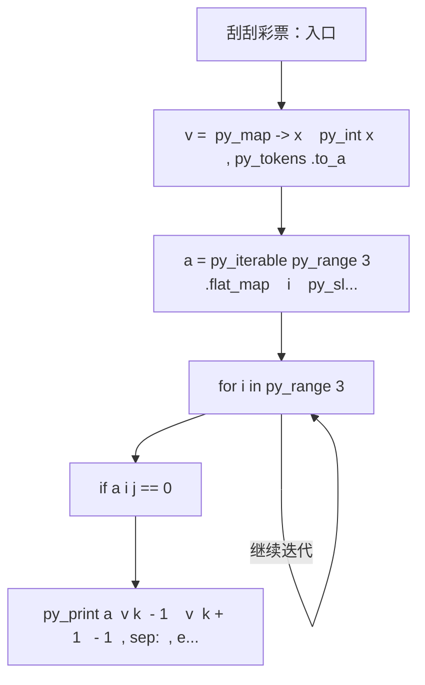
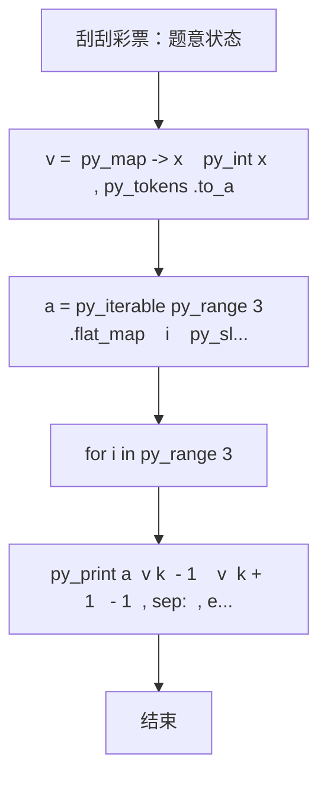

# L1-072 - 刮刮彩票（20 分）

| 项目 | 限制 |
| --- | --- |
| 时间限制 | 400 ms |
| 内存限制 | 65536 KB |
| 代码长度限制 | 16 KB |

## 题目描述

“刮刮彩票”是一款网络游戏里面的一个小游戏。如图所示：


每次游戏玩家会拿到一张彩票，上面会有 9 个数字，分别为数字 1 到数字 9，数字各不重复，并以 $$3\times3$$ 的“九宫格”形式排布在彩票上。

在游戏开始时能看见一个位置上的数字，其他位置上的数字均不可见。你可以选择三个位置的数字刮开，这样玩家就能看见四个位置上的数字了。最后玩家再从 3 横、3 竖、2 斜共 8 个方向中挑选一个方向，方向上三个数字的和可根据下列表格进行兑奖，获得对应数额的金币。

| 数字合计 | 获得金币 | 数字合计 | 获得金币 |
| -------- | -------- | -------- | -------- |
| 6     | 10,000     | 16     | 72     |
| 7     | 36     | 17     | 180     |
| 8     | 720     | 18     | 119     |
| 9     | 360     | 19     | 36     |
| 10     | 80     | 20     | 306     |
| 11    | 252     | 21     | 1,080     |
| 12    | 108     | 22    | 144     |
| 13    | 72     | 23    | 1,800     |
| 14    | 54     | 24    | 3,600     |
| 15    | 180     |      ||      |

现在请你写出一个模拟程序，模拟玩家的游戏过程。

### 输入格式

输入第一部分给出一张合法的彩票，即用 3 行 3 列给出 0 至 9 的数字。**0 表示的是这个位置上的数字初始时就能看见了**，而不是彩票上的数字为 0。

第二部给出玩家刮开的三个位置，分为三行，每行按格式 `x y` 给出玩家刮开的位置的行号和列号（题目中定义左上角的位置为第 1 行、第 1 列。）。数据保证玩家不会重复刮开已刮开的数字。

最后一部分给出玩家选择的方向，即一个整数： 1 至 3 表示选择横向的第一行、第二行、第三行，4 至 6 表示纵向的第一列、第二列、第三列，7、8分别表示左上到右下的主对角线和右上到左下的副对角线。

### 输出格式

对于每一个刮开的操作，在一行中输出玩家能看到的数字。最后对于选择的方向，在一行中输出玩家获得的金币数量。

### 输入样例
```in
1 2 3
4 5 6
7 8 0
1 1
2 2
2 3
7
```

### 输出样例
```out
1
5
6
180
```

## 参考样例

### 样例 1

**输入**
```
1 2 3
4 5 6
7 8 0
1 1
2 2
2 3
7
```

**输出**
```
1
5
6
180
```

## 实现原理与解题思路

本题的实现原理是：按题目格式读取字符串或数值，逐项维护必要状态，并在每次判断时直接执行题目给出的规则。先读取标准输入并按题目格式拆分字段，使用代码中的`v`、`a`、`missing`、`k`保存计算过程，通过 3 个循环阶段逐步更新；处理完成后按照题目规定的顺序和格式输出结果。

## 代码流程说明

1. 读取并解析标准输入，转换为题目所需的数据结构。
2. 按题意执行核心算法，维护中间状态并处理边界情况。
3. 整理计算结果，按照输出格式生成答案。

## 代码实现

下面给出可独立运行的完整 Ruby 实现，关键步骤已在代码中标注。

```ruby
# frozen_string_literal: true
# 这些辅助方法只负责把题目输入、输出和常见序列操作映射为 Ruby 写法，
# 算法主体仍在下方的 entry 方法中，代码复制后可以独立运行。
module PTACompat
  UNSET = Object.new

  class CounterHash < Hash
    def initialize
      super(0)
    end
  end

  def py_tokens
    @pta_tokens ||= STDIN.read.split
  end

  def py_input_data
    @pta_input_data ||= STDIN.read
  end

  def py_readline
    STDIN.gets.to_s.chomp
  end

  def py_lines
    @pta_lines ||= STDIN.each_line.map(&:chomp)
  end

  def py_print(*values, sep: " ", ending: "\n")
    STDOUT.write(values.map(&:to_s).join(sep) + ending)
  end

  def py_int(value)
    value.to_i
  end

  def py_float(value)
    value.to_f
  end

  def py_str(value)
    value.to_s
  end

  def py_bool_int(value)
    value ? 1 : 0
  end

  def py_truth(value)
    return false if value.nil? || value == false
    return false if value.respond_to?(:zero?) && value.zero?
    return false if value.respond_to?(:empty?) && value.empty?

    true
  end

  def py_range(*args)
    first, last, step =
      case args.length
      when 1
        [0, args[0], 1]
      when 2
        [args[0], args[1], 1]
      else
        args
      end
    first = first.to_i
    last = last.to_i
    step = step.to_i
    raise ArgumentError, "range step cannot be zero" if step.zero?

    values = []
    current = first
    if step.positive?
      while current < last
        values << current
        current += step
      end
    else
      while current > last
        values << current
        current += step
      end
    end
    values
  end

  def py_map(function, values)
    values.map { |value| function.call(value) }
  end

  def py_iter(value)
    value.to_enum
  end

  def py_next(iterator)
    iterator.next
  end

  def py_iterable(value)
    value.is_a?(String) ? value.chars : value.to_a
  end

  def py_enumerate(values)
    values.each_with_index.map { |value, index| [index, value] }
  end

  def py_zip(*values)
    values.first.zip(*values.drop(1))
  end

  def py_slice(value, start_index = nil, stop_index = nil, step = nil)
    step ||= 1
    source = value.is_a?(String) ? value.chars : value.to_a
    size = source.length
    start_index = step.positive? ? 0 : size - 1 if start_index.nil?
    stop_index = step.positive? ? size : -size - 1 if stop_index.nil?
    start_index += size if start_index.negative?
    stop_index += size if stop_index.negative? && stop_index >= -size
    start_index =
      (
        if step.positive?
          [[start_index, 0].max, size].min
        else
          [[start_index, -1].max, size - 1].min
        end
      )
    stop_index =
      (
        if step.positive?
          [[stop_index, 0].max, size].min
        else
          [[stop_index, -1].max, size - 1].min
        end
      )

    result = []
    index = start_index
    if step.positive?
      while index < stop_index
        result << source[index]
        index += step
      end
    else
      while index > stop_index
        result << source[index]
        index += step
      end
    end
    value.is_a?(String) ? result.join : result
  end

  def py_len(value)
    value.length
  end

  def py_sum(values, initial = 0)
    values.sum(initial)
  end

  def py_abs(value)
    value.abs
  end

  def py_div(a, b)
    a.to_f / b
  end

  def py_divmod(a, b)
    [a.div(b), a % b]
  end

  def py_factorial(value)
    (1..value).reduce(1, :*)
  end

  def py_gcd(a, b)
    a.gcd(b)
  end

  def py_pow(base, exponent, modulus = nil)
    modulus.nil? ? base**exponent : base.pow(exponent, modulus)
  end

  def py_in(item, container)
    container.include?(item)
  end

  def py_counter(_values)
    CounterHash.new
  end

  def py_sorted(values, key: nil, reverse: false)
    result = (key ? values.sort_by { |value| key.call(value) } : values.sort)
    reverse ? result.reverse : result
  end

  def py_max(*values, key: nil, default: UNSET)
    values = values.first.to_a if values.length == 1 &&
      values.first.respond_to?(:each) && !values.first.is_a?(Numeric)
    return default unless values.any?

    key ? values.max_by { |value| key.call(value) } : values.max
  end

  def py_min(*values, key: nil, default: UNSET)
    values = values.first.to_a if values.length == 1 &&
      values.first.respond_to?(:each) && !values.first.is_a?(Numeric)
    return default unless values.any?

    key ? values.min_by { |value| key.call(value) } : values.min
  end

  def py_re_sub(pattern, replacement, value)
    value.gsub(Regexp.new(pattern), replacement)
  end

  def py_lstrip(value, chars)
    value.sub(/\A[#{Regexp.escape(chars)}]+/, "")
  end

  def py_startswith_at(value, prefix, index)
    value[index, prefix.length] == prefix
  end

  def py_replace_slice(value, start_index, stop_index, replacement)
    value[start_index...stop_index] = replacement
    value
  end

  def py_bisect_left(values, target)
    left = 0
    right = values.length
    while left < right
      middle = (left + right) / 2
      if values[middle] < target
        left = middle + 1
      else
        right = middle
      end
    end
    left
  end

  def py_bisect_right(values, target)
    left = 0
    right = values.length
    while left < right
      middle = (left + right) / 2
      if values[middle] <= target
        left = middle + 1
      else
        right = middle
      end
    end
    left
  end
end

class Hash
  def items
    to_a
  end
end

include PTACompat

# 题目入口：读取输入、执行核心算法并输出答案。

def entry
  # 读取并解析题目输入。
  v = (py_map(->(x) { py_int(x) }, py_tokens).to_a)
  a =
    py_iterable(py_range(3)).flat_map do |i|
      [py_slice(v, (i * 3), ((i * 3) + 3), nil)]
    end
  missing =
    (
      Set.new([1, 2, 3, 4, 5, 6, 7, 8, 9]) - Set.new(py_slice(v, nil, 9, nil))
    ).pop()
  # 按题目规则遍历输入或状态空间。
  for i in py_range(3)
    for j in py_range(3)
      a[i][j] = missing if ((a[i][j] == 0))
    end
  end
  k = 9
  for _ in py_range(3)
    # 按题目要求输出最终结果。
    py_print(a[(v[k] - 1)][(v[(k + 1)] - 1)], sep: " ", ending: "\n")
    k += 2
  end
  d = v[k]
  if ((d <= 3))
    sm = py_sum(a[(d - 1)])
  else
    if ((d <= 6))
      sm = py_sum(py_iterable(py_range(3)).flat_map { |i| [a[i][(d - 4)]] })
    else
      if ((d == 7))
        sm = py_sum(py_iterable(py_range(3)).flat_map { |i| [a[i][i]] })
      else
        sm = py_sum(py_iterable(py_range(3)).flat_map { |i| [a[i][(2 - i)]] })
      end
    end
  end
  pr = [
    0,
    0,
    0,
    0,
    0,
    0,
    10_000,
    36,
    720,
    360,
    80,
    252,
    108,
    72,
    54,
    180,
    72,
    180,
    119,
    36,
    306,
    1080,
    144,
    1800,
    3600
  ]
  py_print(pr[sm], sep: " ", ending: "\n")
end
entry

```

## 代码流程图



## 解题流程图


