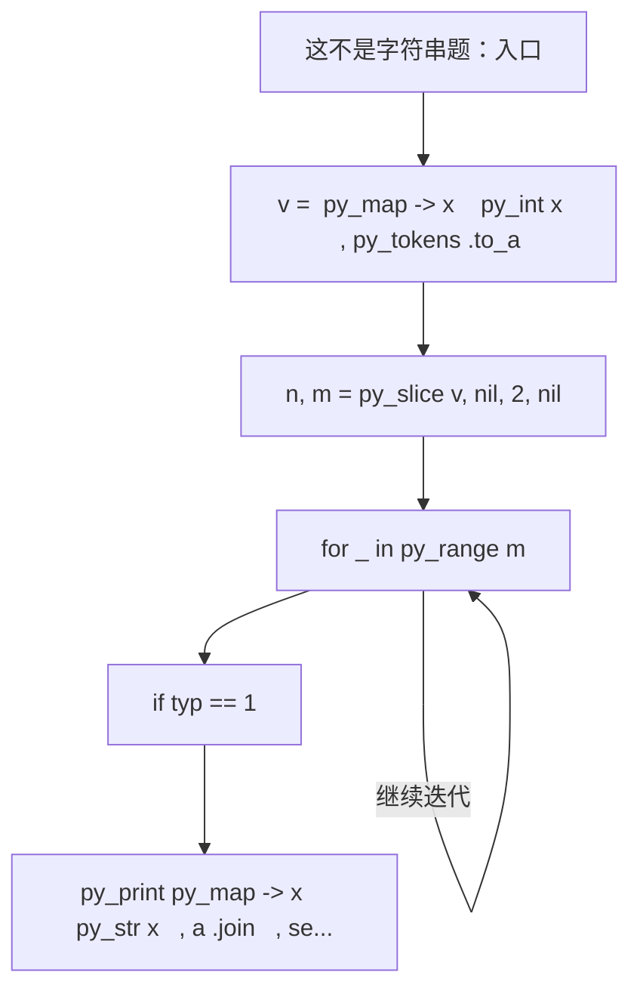
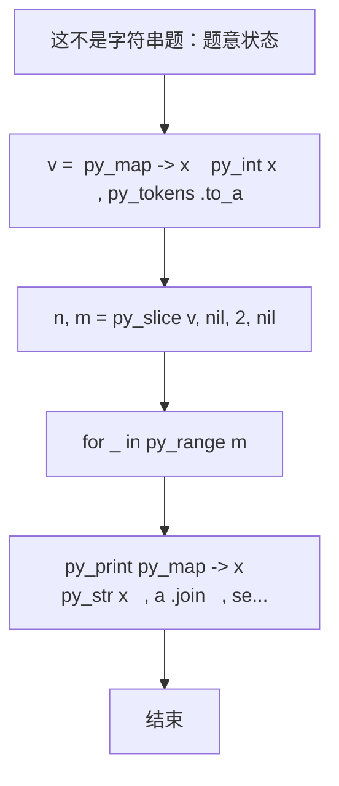

# L1-110 - 这不是字符串题（15 分）

- **时间限制**: 400 ms
- **内存限制**: 65536 KB
- **代码长度限制**: 16 KB

---

## 题目描述


因为每年天梯赛字符串题的解答率都不尽如人意，因此出题组从几年前开始决定：每年的天梯赛的 15 分一定会有一道字符串题，另外一道则一定不是字符串题。

小特现在有 $N$ 个正整数 $A_i$，不知道为什么，小特打算“动”一下这些数字，具体而言，她希望做 $M$ 次操作，每次是以下三种操作之一：
1. 在当前正整数序列里查找给定的连续正整数序列是否存在，如存在，则将其替换成另外一个正整数序列；
2. 对于当前整个正整数序列，如果相邻之间的数字和为偶数，则在它们中间插入它们的平均数；
3. 翻转当前正整数序列指定下标之间的一段数字。这里的翻转指的是对于一段数字序列 $A_i, A_{i+1}, \dots, A_{j-1}, A_j$，将其变为 $A_j, A_{j-1}, \dots, A_{i+1}, A_i$。

请你输出按输入顺序依次完成若干次操作后的结果。

### 输入格式:

输入第一行是两个正整数 $N, M$ ($1 \le N, M \le 10^3$)，分别表示正整数个数以及操作次数。

接下来的一行有 $N$ 个用一个空格隔开的正整数 $A_i$ ($1 \le A_i \le 26$)，表示需要进行操作的原始数字序列。

紧接着有 $M$ 部分，每一部分表示一次操作，你需要按照输入顺序依次执行这些操作。记 $L$ 为当前操作序列长度（注意原始序列在经过数次操作后，其长度可能不再是 $N$）。每部分的格式与约定如下：
* 第一行是一个 1 到 3 的正整数，表示操作类型，对应着题面中描述的操作（1 对应查找-替换操作，2 对应插入平均数操作，3 对应翻转操作）；
* 对于第 1 种操作：
  * 第二行首先有一个正整数 $L_1$ ($1 \le L_1\le L$)，表示需要查找的正整数序列的长度，接下来有 $L_1$ 个正整数（范围与 $A_i$ 一致），表示要查找的序列里的数字，数字之间用一个空格隔开。查找时序列是连续的，不能拆分。
  * 第三行跟第二行格式一致，给出需要替换的序列长度 $L_2$ 和对应的正整数序列。如果原序列中有多个可替换的正整数序列，只替换第一个数开始序号最小的一段，且一次操作只替换一次。注意 $L_2$ 范围可能远超出 $L$。
  * 如果没有符合要求的可替换序列，则直接不进行任何操作。
* 对于第 2 种操作：
  * 没有后续输入，直接按照题面要求对整个序列进行操作。
* 对于第 3 种操作：
  * 第二行是两个正整数 $l, r$ ($1 \le l \le r \le L$)，表示需要翻转的连续一段的左端点和右端点下标（闭区间）。

每次操作结束后的序列为下一次操作的起始序列。

保证操作过程中所有数字序列长度不超过 $100N$。题目中的所有下标均从 1 开始。

### 输出格式:

输出进行完全部操作后的最终正整数数列，数之间用一个空格隔开，注意最后不要输出多余空格。

### 输入样例:
```in
39 5
14 9 2 21 8 21 9 10 21 5 4 5 26 8 5 26 8 5 14 4 5 2 21 19 8 9 26 9 6 21 3 8 21 1 14 20 9 2 1
1
3 26 8 5
2 14 1
3
37 38
1
11 26 9 6 21 3 8 21 1 14 20 9
14 1 2 3 4 5 6 7 8 9 10 11 12 13 14
2
3
2 40
```

### 输出样例:
```out
14 9 8 7 6 5 4 3 2 1 5 9 8 19 20 21 2 5 4 9 14 5 8 17 26 1 14 5 4 5 13 21 10 9 15 21 8 21 2 9 10 11 12 13 14 1 2
```

## 示例

### 示例 1

**输入:**
```
39 5
14 9 2 21 8 21 9 10 21 5 4 5 26 8 5 26 8 5 14 4 5 2 21 19 8 9 26 9 6 21 3 8 21 1 14 20 9 2 1
1
3 26 8 5
2 14 1
3
37 38
1
11 26 9 6 21 3 8 21 1 14 20 9
14 1 2 3 4 5 6 7 8 9 10 11 12 13 14
2
3
2 40
```

**输出:**
```
14 9 8 7 6 5 4 3 2 1 5 9 8 19 20 21 2 5 4 9 14 5 8 17 26 1 14 5 4 5 13 21 10 9 15 21 8 21 2 9 10 11 12 13 14 1 2
```

### 实现原理与解题思路

本题的实现原理是：按题目格式读取字符串或数值，逐项维护必要状态，并在每次判断时直接执行题目给出的规则。先读取标准输入并按题目格式拆分字段，使用代码中的`v`、`a`、`k`、`typ`保存计算过程，通过 3 个循环阶段逐步更新；处理完成后按照题目规定的顺序和格式输出结果。

### 代码流程说明

1. 读取并解析标准输入，转换为题目所需的数据结构。
2. 按题意执行核心算法，维护中间状态并处理边界情况。
3. 整理计算结果，按照输出格式生成答案。

### 代码实现

下面给出可独立运行的完整 Ruby 实现，关键步骤已在代码中标注。

```ruby
# frozen_string_literal: true
# 这些辅助方法只负责把题目输入、输出和常见序列操作映射为 Ruby 写法，
# 算法主体仍在下方的 entry 方法中，代码复制后可以独立运行。
module PTACompat
  UNSET = Object.new

  class CounterHash < Hash
    def initialize
      super(0)
    end
  end

  def py_tokens
    @pta_tokens ||= STDIN.read.split
  end

  def py_input_data
    @pta_input_data ||= STDIN.read
  end

  def py_readline
    STDIN.gets.to_s.chomp
  end

  def py_lines
    @pta_lines ||= STDIN.each_line.map(&:chomp)
  end

  def py_print(*values, sep: " ", ending: "\n")
    STDOUT.write(values.map(&:to_s).join(sep) + ending)
  end

  def py_int(value)
    value.to_i
  end

  def py_float(value)
    value.to_f
  end

  def py_str(value)
    value.to_s
  end

  def py_bool_int(value)
    value ? 1 : 0
  end

  def py_truth(value)
    return false if value.nil? || value == false
    return false if value.respond_to?(:zero?) && value.zero?
    return false if value.respond_to?(:empty?) && value.empty?

    true
  end

  def py_range(*args)
    first, last, step =
      case args.length
      when 1
        [0, args[0], 1]
      when 2
        [args[0], args[1], 1]
      else
        args
      end
    first = first.to_i
    last = last.to_i
    step = step.to_i
    raise ArgumentError, "range step cannot be zero" if step.zero?

    values = []
    current = first
    if step.positive?
      while current < last
        values << current
        current += step
      end
    else
      while current > last
        values << current
        current += step
      end
    end
    values
  end

  def py_map(function, values)
    values.map { |value| function.call(value) }
  end

  def py_iter(value)
    value.to_enum
  end

  def py_next(iterator)
    iterator.next
  end

  def py_iterable(value)
    value.is_a?(String) ? value.chars : value.to_a
  end

  def py_enumerate(values)
    values.each_with_index.map { |value, index| [index, value] }
  end

  def py_zip(*values)
    values.first.zip(*values.drop(1))
  end

  def py_slice(value, start_index = nil, stop_index = nil, step = nil)
    step ||= 1
    source = value.is_a?(String) ? value.chars : value.to_a
    size = source.length
    start_index = step.positive? ? 0 : size - 1 if start_index.nil?
    stop_index = step.positive? ? size : -size - 1 if stop_index.nil?
    start_index += size if start_index.negative?
    stop_index += size if stop_index.negative? && stop_index >= -size
    start_index =
      (
        if step.positive?
          [[start_index, 0].max, size].min
        else
          [[start_index, -1].max, size - 1].min
        end
      )
    stop_index =
      (
        if step.positive?
          [[stop_index, 0].max, size].min
        else
          [[stop_index, -1].max, size - 1].min
        end
      )

    result = []
    index = start_index
    if step.positive?
      while index < stop_index
        result << source[index]
        index += step
      end
    else
      while index > stop_index
        result << source[index]
        index += step
      end
    end
    value.is_a?(String) ? result.join : result
  end

  def py_len(value)
    value.length
  end

  def py_sum(values, initial = 0)
    values.sum(initial)
  end

  def py_abs(value)
    value.abs
  end

  def py_div(a, b)
    a.to_f / b
  end

  def py_divmod(a, b)
    [a.div(b), a % b]
  end

  def py_factorial(value)
    (1..value).reduce(1, :*)
  end

  def py_gcd(a, b)
    a.gcd(b)
  end

  def py_pow(base, exponent, modulus = nil)
    modulus.nil? ? base**exponent : base.pow(exponent, modulus)
  end

  def py_in(item, container)
    container.include?(item)
  end

  def py_counter(_values)
    CounterHash.new
  end

  def py_sorted(values, key: nil, reverse: false)
    result = (key ? values.sort_by { |value| key.call(value) } : values.sort)
    reverse ? result.reverse : result
  end

  def py_max(*values, key: nil, default: UNSET)
    values = values.first.to_a if values.length == 1 &&
      values.first.respond_to?(:each) && !values.first.is_a?(Numeric)
    return default unless values.any?

    key ? values.max_by { |value| key.call(value) } : values.max
  end

  def py_min(*values, key: nil, default: UNSET)
    values = values.first.to_a if values.length == 1 &&
      values.first.respond_to?(:each) && !values.first.is_a?(Numeric)
    return default unless values.any?

    key ? values.min_by { |value| key.call(value) } : values.min
  end

  def py_re_sub(pattern, replacement, value)
    value.gsub(Regexp.new(pattern), replacement)
  end

  def py_lstrip(value, chars)
    value.sub(/\A[#{Regexp.escape(chars)}]+/, "")
  end

  def py_startswith_at(value, prefix, index)
    value[index, prefix.length] == prefix
  end

  def py_replace_slice(value, start_index, stop_index, replacement)
    value[start_index...stop_index] = replacement
    value
  end

  def py_bisect_left(values, target)
    left = 0
    right = values.length
    while left < right
      middle = (left + right) / 2
      if values[middle] < target
        left = middle + 1
      else
        right = middle
      end
    end
    left
  end

  def py_bisect_right(values, target)
    left = 0
    right = values.length
    while left < right
      middle = (left + right) / 2
      if values[middle] <= target
        left = middle + 1
      else
        right = middle
      end
    end
    left
  end
end

class Hash
  def items
    to_a
  end
end

include PTACompat

# 题目入口：读取输入、执行核心算法并输出答案。

def entry
  # 读取并解析题目输入。
  v = (py_map(->(x) { py_int(x) }, py_tokens).to_a)
  n, m = py_slice(v, nil, 2, nil)
  a = py_slice(v, 2, (2 + n), nil)
  k = (2 + n)
  # 按题目规则遍历输入或状态空间。
  for _ in py_range(m)
    typ = v[k]
    k += 1
    if ((typ == 1))
      l = v[k]
      find = py_slice(v, (k + 1), ((k + 1) + l), nil)
      l2 = v[((k + 1) + l)]
      repl = py_slice(v, ((k + 2) + l), (((k + 2) + l) + l2), nil)
      k += ((2 + l) + l2)
      for i in py_range(((py_len(a) - l) + 1))
        if ((py_slice(a, i, (i + l), nil) == find))
          py_replace_slice(a, i, (i + l), repl)
          break
        end
      end
    else
      if ((typ == 2))
        i = 0
        while (((i + 1) < py_len(a)))
          if ((((a[i] + a[(i + 1)]) % 2) == 0))
            a.insert((i + 1), ((a[i] + a[(i + 1)]).div(2)))
            i += 2
          else
            i += 1
          end
        end
      else
        l, r = [(v[k] - 1), (v[(k + 1)] - 1)]
        k += 2
        py_replace_slice(
          a,
          l,
          (r + 1),
          py_slice(py_slice(a, l, (r + 1), nil), nil, nil, (-1))
        )
      end
    end
  end
  # 按题目要求输出最终结果。
  py_print(py_map(->(x) { py_str(x) }, a).join(" "), sep: " ", ending: "\n")
end
entry

```

### 代码流程图



### 解题流程图


