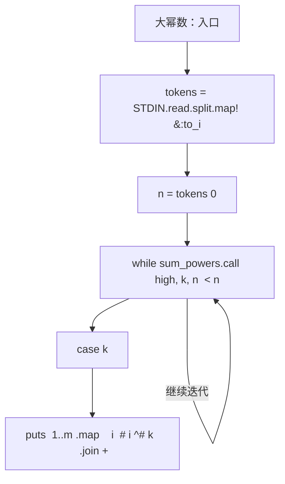
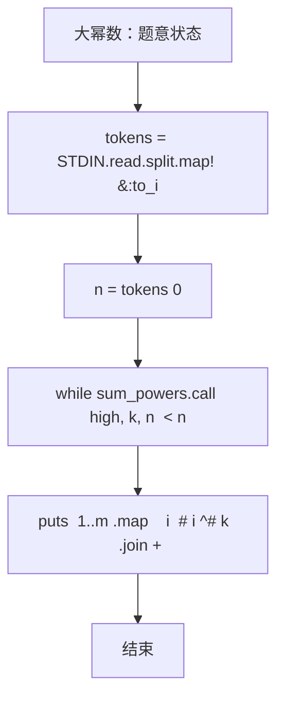

# L1-111 - 大幂数（20 分）

| 项目 | 限制 |
| --- | --- |
| 时间限制 | 400 ms |
| 内存限制 | 65536 KB |
| 代码长度限制 | 16 KB |

## 题目描述

如果一个正整数可以表示为从 1 开始的连续自然数的非 0 幂次和，就称之为“大幂数”。例如 2025 就是一个大幂数，因为 $2025=1^3+2^3+3^3+4^3+5^3+6^3+7^3+8^3+9^3$。本题就请你判断一个给定的数字 $n$ 是否大幂数，如果是，就输出其幂次和。

另一方面，大幂数的幂次和表示可能是不唯一的，例如 91 可以表示为 $91=1^1+2^1+3^1+4^1+5^1+6^1+7^1+8^1+9^1+10^1+11^1+12^1+13^1$，同时也可以表示为 $91=1^2+2^2+3^2+4^2+5^2+6^2$，这时你只需要输出幂次最大的那个和即可。

### 输入格式

输入在一行中给出一个正整数 $n$（$2<n< 2^{31}$）。

### 输出格式

如果 $n$ 是大幂数，则在一行中输出幂次最大的那个和，格式为：
```
1^k+2^k+...+m^k
```
其中 `k` 是所有幂次和中最大的幂次。如果解不存在，则在一行中输出 `Impossible for n.`，其中 `n` 是输入的 $n$ 的值。

### 输入样例 1
```in
91
```

### 输出样例 1
```out
1^2+2^2+3^2+4^2+5^2+6^2
```

### 输入样例 2
```in
2147483647
```

### 输出样例 2
```out
Impossible for 2147483647.
```

## 参考样例

### 样例 1

**输入**
```
91
```

**输出**
```
1^2+2^2+3^2+4^2+5^2+6^2
```

### 样例 2

**输入**
```
2147483647
```

**输出**
```
Impossible for 2147483647.
```

## 实现原理与解题思路

本题的实现原理是：按题目格式读取字符串或数值，逐项维护必要状态，并在每次判断时直接执行题目给出的规则。先准备题目要求的固定数据，使用代码中的`tokens`、`n`、`sum_powers`、`t`保存计算过程，通过 2 个循环阶段逐步更新；处理完成后按照题目规定的顺序和格式输出结果。

## 代码流程说明

1. 读取并解析标准输入，转换为题目所需的数据结构。
2. 按题意执行核心算法，维护中间状态并处理边界情况。
3. 整理计算结果，按照输出格式生成答案。

## 代码实现

下面给出可独立运行的完整 Ruby 实现，关键步骤已在代码中标注。

```ruby
# frozen_string_literal: true
# 这些辅助方法只负责把题目输入、输出和常见序列操作映射为 Ruby 写法，
# 算法主体仍在下方的 entry 方法中，代码复制后可以独立运行。
module PTACompat
  UNSET = Object.new

  class CounterHash < Hash
    def initialize
      super(0)
    end
  end

  def py_tokens
    @pta_tokens ||= STDIN.read.split
  end

  def py_input_data
    @pta_input_data ||= STDIN.read
  end

  def py_readline
    STDIN.gets.to_s.chomp
  end

  def py_lines
    @pta_lines ||= STDIN.each_line.map(&:chomp)
  end

  def py_print(*values, sep: " ", ending: "\n")
    STDOUT.write(values.map(&:to_s).join(sep) + ending)
  end

  def py_int(value)
    value.to_i
  end

  def py_float(value)
    value.to_f
  end

  def py_str(value)
    value.to_s
  end

  def py_bool_int(value)
    value ? 1 : 0
  end

  def py_truth(value)
    return false if value.nil? || value == false
    return false if value.respond_to?(:zero?) && value.zero?
    return false if value.respond_to?(:empty?) && value.empty?

    true
  end

  def py_range(*args)
    first, last, step =
      case args.length
      when 1
        [0, args[0], 1]
      when 2
        [args[0], args[1], 1]
      else
        args
      end
    first = first.to_i
    last = last.to_i
    step = step.to_i
    raise ArgumentError, "range step cannot be zero" if step.zero?

    values = []
    current = first
    if step.positive?
      while current < last
        values << current
        current += step
      end
    else
      while current > last
        values << current
        current += step
      end
    end
    values
  end

  def py_map(function, values)
    values.map { |value| function.call(value) }
  end

  def py_iter(value)
    value.to_enum
  end

  def py_next(iterator)
    iterator.next
  end

  def py_iterable(value)
    value.is_a?(String) ? value.chars : value.to_a
  end

  def py_enumerate(values)
    values.each_with_index.map { |value, index| [index, value] }
  end

  def py_zip(*values)
    values.first.zip(*values.drop(1))
  end

  def py_slice(value, start_index = nil, stop_index = nil, step = nil)
    step ||= 1
    source = value.is_a?(String) ? value.chars : value.to_a
    size = source.length
    start_index = step.positive? ? 0 : size - 1 if start_index.nil?
    stop_index = step.positive? ? size : -size - 1 if stop_index.nil?
    start_index += size if start_index.negative?
    stop_index += size if stop_index.negative? && stop_index >= -size
    start_index =
      (
        if step.positive?
          [[start_index, 0].max, size].min
        else
          [[start_index, -1].max, size - 1].min
        end
      )
    stop_index =
      (
        if step.positive?
          [[stop_index, 0].max, size].min
        else
          [[stop_index, -1].max, size - 1].min
        end
      )

    result = []
    index = start_index
    if step.positive?
      while index < stop_index
        result << source[index]
        index += step
      end
    else
      while index > stop_index
        result << source[index]
        index += step
      end
    end
    value.is_a?(String) ? result.join : result
  end

  def py_len(value)
    value.length
  end

  def py_sum(values, initial = 0)
    values.sum(initial)
  end

  def py_abs(value)
    value.abs
  end

  def py_div(a, b)
    a.to_f / b
  end

  def py_divmod(a, b)
    [a.div(b), a % b]
  end

  def py_factorial(value)
    (1..value).reduce(1, :*)
  end

  def py_gcd(a, b)
    a.gcd(b)
  end

  def py_pow(base, exponent, modulus = nil)
    modulus.nil? ? base**exponent : base.pow(exponent, modulus)
  end

  def py_in(item, container)
    container.include?(item)
  end

  def py_counter(_values)
    CounterHash.new
  end

  def py_sorted(values, key: nil, reverse: false)
    result = (key ? values.sort_by { |value| key.call(value) } : values.sort)
    reverse ? result.reverse : result
  end

  def py_max(*values, key: nil, default: UNSET)
    values = values.first.to_a if values.length == 1 &&
      values.first.respond_to?(:each) && !values.first.is_a?(Numeric)
    return default unless values.any?

    key ? values.max_by { |value| key.call(value) } : values.max
  end

  def py_min(*values, key: nil, default: UNSET)
    values = values.first.to_a if values.length == 1 &&
      values.first.respond_to?(:each) && !values.first.is_a?(Numeric)
    return default unless values.any?

    key ? values.min_by { |value| key.call(value) } : values.min
  end

  def py_re_sub(pattern, replacement, value)
    value.gsub(Regexp.new(pattern), replacement)
  end

  def py_lstrip(value, chars)
    value.sub(/\A[#{Regexp.escape(chars)}]+/, "")
  end

  def py_startswith_at(value, prefix, index)
    value[index, prefix.length] == prefix
  end

  def py_replace_slice(value, start_index, stop_index, replacement)
    value[start_index...stop_index] = replacement
    value
  end

  def py_bisect_left(values, target)
    left = 0
    right = values.length
    while left < right
      middle = (left + right) / 2
      if values[middle] < target
        left = middle + 1
      else
        right = middle
      end
    end
    left
  end

  def py_bisect_right(values, target)
    left = 0
    right = values.length
    while left < right
      middle = (left + right) / 2
      if values[middle] <= target
        left = middle + 1
      else
        right = middle
      end
    end
    left
  end
end

class Hash
  def items
    to_a
  end
end

include PTACompat

# 题目入口：读取输入、执行核心算法并输出答案。

# L1-111 大幂数
# 对每个幂次从大到小寻找 m，使 1^k+...+m^k=n。
# 对大输入使用单调性二分，避免按 m 线性枚举。

tokens = STDIN.read.split.map!(&:to_i)
exit if tokens.empty?
n = tokens[0]

sum_powers =
  lambda do |m, k, limit|
    case k
    when 1
      m * (m + 1) / 2
    when 2
      m * (m + 1) * (2 * m + 1) / 6
    when 3
      t = m * (m + 1) / 2
      t * t
    else
      total = 0
      1.upto(m) do |i|
        total += i**k
        break if total > limit
      end
      total
    end
  end

find_length =
  lambda do |k|
    high = (k == 1 ? n : 1)
    high *= 2 while sum_powers.call(high, k, n) < n
    low = 1
    # 按题目规则遍历输入或状态空间。
    while low <= high
      middle = (low + high) / 2
      value = sum_powers.call(middle, k, n)
      if value == n
        next_length = middle
        break
      elsif value < n
        low = middle + 1
      else
        high = middle - 1
      end
    end
    next_length
  end

answer = nil
31.downto(1) do |k|
  length = find_length.call(k)
  if length
    answer = [k, length]
    break
  end
end

if answer
  k, m = answer
  puts (1..m).map { |i| "#{i}^#{k}" }.join("+")
else
  puts "Impossible for #{n}."
end

```

## 代码流程图



## 解题流程图


