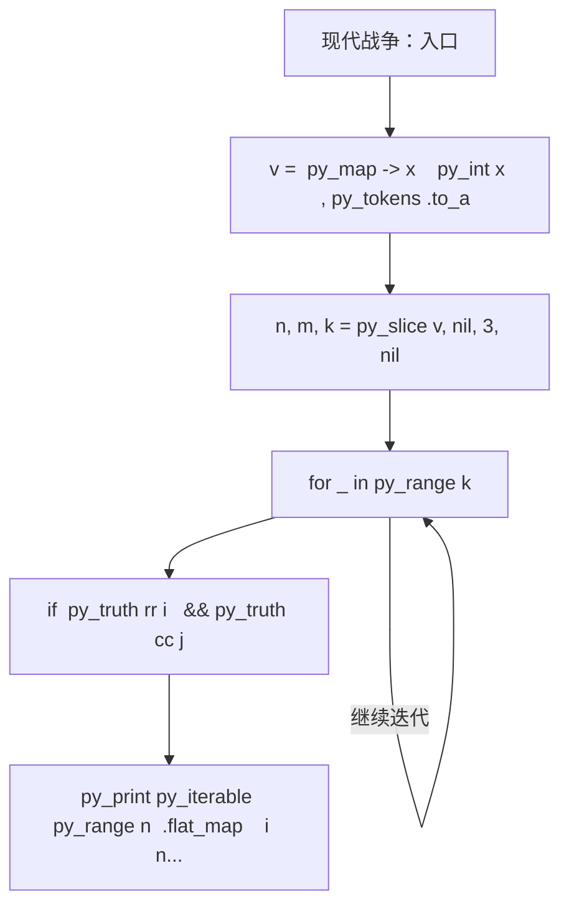
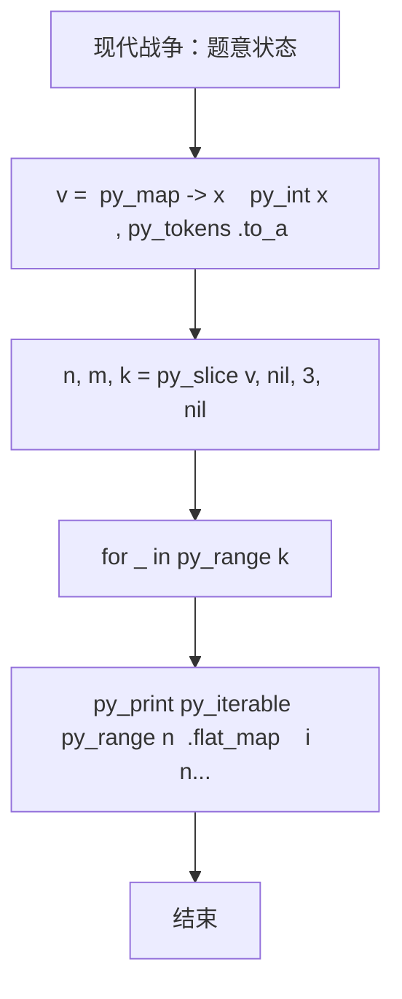

# L1-112 - 现代战争（20 分）

- **时间限制**: 1000 ms
- **内存限制**: 65536 KB
- **代码长度限制**: 16 KB

---

## 题目描述


在最新的《命运召唤：现代战争》中，你要扮演 B 国的一名战斗机飞行员，前往轰炸 A 国的高价值建筑。A 国的建筑群可视为一个由 $n\times m$ 个小方格组成的地图，每个小方格中有一幢建筑，并且你已经知道了所有建筑的价值。
作为一名优秀的战斗机飞行员，你打算轰炸 $k$ 幢建筑，轰炸方式是：你选择当前所有还存在的建筑里最高价值的一幢投下炸弹，这个炸弹会将这个建筑所在的一整行和一整列都炸平。随后系统将彻底抹除被炸平的建筑，将剩下的地块合并成 $(n-1)\times (m-1)$ 的地图。

例如对原始地图
```
1 2 3
7 9 8
6 5 4
```
进行一次轰炸后，更新后的地图为：
```
1 3
6 4
```
请你编写程序，输出你轰炸了 $k$ 幢建筑后的地图。

*注：游戏纯属虚构，如有雷同纯属巧合*

### 输入格式:

输入第一行给出三个正整数 $n$、$m$（$2\le n, m\le 1000$）和 $k$（$< \min \{ n,m\}$），依次对应地图中建筑的行数、列数，以及轰炸步数。随后 $n$ 行，每行 $m$ 个整数，为地图中对应建筑的价值。
题目保证所有元素在 $[-2^{30}, 2^{30}]$ 区间内，且互不相等。同行数字间以空格分隔。

### 输出格式:

输出轰炸 $k$ 幢建筑后的地图。同行数字间以 1 个空格分隔，行首尾不得有多余空格。

### 输入样例:
```in
4 5 2
3 8 6 1 10
28 9 21 37 5
4 11 7 25 18
15 23 2 17 14
```

### 输出样例:
```out
3 6 10
4 7 18
```

## 示例

### 示例 1

**输入:**
```
4 5 2
3 8 6 1 10
28 9 21 37 5
4 11 7 25 18
15 23 2 17 14
```

**输出:**
```
3 6 10
4 7 18
```

### 实现原理与解题思路

本题的实现原理是：先对记录按关键字排序，再按题目规定的优先级顺序处理，保证每一步选择满足当前最优条件。先读取标准输入并按题目格式拆分字段，使用代码中的`v`、`a`、`cells`、`rr`保存计算过程，通过 2 个循环阶段逐步更新；处理完成后按照题目规定的顺序和格式输出结果。

### 代码流程说明

1. 读取并解析标准输入，转换为题目所需的数据结构。
2. 按题意执行核心算法，维护中间状态并处理边界情况。
3. 整理计算结果，按照输出格式生成答案。

### 代码实现

下面给出可独立运行的完整 Ruby 实现，关键步骤已在代码中标注。

```ruby
# frozen_string_literal: true
# 这些辅助方法只负责把题目输入、输出和常见序列操作映射为 Ruby 写法，
# 算法主体仍在下方的 entry 方法中，代码复制后可以独立运行。
module PTACompat
  UNSET = Object.new

  class CounterHash < Hash
    def initialize
      super(0)
    end
  end

  def py_tokens
    @pta_tokens ||= STDIN.read.split
  end

  def py_input_data
    @pta_input_data ||= STDIN.read
  end

  def py_readline
    STDIN.gets.to_s.chomp
  end

  def py_lines
    @pta_lines ||= STDIN.each_line.map(&:chomp)
  end

  def py_print(*values, sep: " ", ending: "\n")
    STDOUT.write(values.map(&:to_s).join(sep) + ending)
  end

  def py_int(value)
    value.to_i
  end

  def py_float(value)
    value.to_f
  end

  def py_str(value)
    value.to_s
  end

  def py_bool_int(value)
    value ? 1 : 0
  end

  def py_truth(value)
    return false if value.nil? || value == false
    return false if value.respond_to?(:zero?) && value.zero?
    return false if value.respond_to?(:empty?) && value.empty?

    true
  end

  def py_range(*args)
    first, last, step =
      case args.length
      when 1
        [0, args[0], 1]
      when 2
        [args[0], args[1], 1]
      else
        args
      end
    first = first.to_i
    last = last.to_i
    step = step.to_i
    raise ArgumentError, "range step cannot be zero" if step.zero?

    values = []
    current = first
    if step.positive?
      while current < last
        values << current
        current += step
      end
    else
      while current > last
        values << current
        current += step
      end
    end
    values
  end

  def py_map(function, values)
    values.map { |value| function.call(value) }
  end

  def py_iter(value)
    value.to_enum
  end

  def py_next(iterator)
    iterator.next
  end

  def py_iterable(value)
    value.is_a?(String) ? value.chars : value.to_a
  end

  def py_enumerate(values)
    values.each_with_index.map { |value, index| [index, value] }
  end

  def py_zip(*values)
    values.first.zip(*values.drop(1))
  end

  def py_slice(value, start_index = nil, stop_index = nil, step = nil)
    step ||= 1
    source = value.is_a?(String) ? value.chars : value.to_a
    size = source.length
    start_index = step.positive? ? 0 : size - 1 if start_index.nil?
    stop_index = step.positive? ? size : -size - 1 if stop_index.nil?
    start_index += size if start_index.negative?
    stop_index += size if stop_index.negative? && stop_index >= -size
    start_index =
      (
        if step.positive?
          [[start_index, 0].max, size].min
        else
          [[start_index, -1].max, size - 1].min
        end
      )
    stop_index =
      (
        if step.positive?
          [[stop_index, 0].max, size].min
        else
          [[stop_index, -1].max, size - 1].min
        end
      )

    result = []
    index = start_index
    if step.positive?
      while index < stop_index
        result << source[index]
        index += step
      end
    else
      while index > stop_index
        result << source[index]
        index += step
      end
    end
    value.is_a?(String) ? result.join : result
  end

  def py_len(value)
    value.length
  end

  def py_sum(values, initial = 0)
    values.sum(initial)
  end

  def py_abs(value)
    value.abs
  end

  def py_div(a, b)
    a.to_f / b
  end

  def py_divmod(a, b)
    [a.div(b), a % b]
  end

  def py_factorial(value)
    (1..value).reduce(1, :*)
  end

  def py_gcd(a, b)
    a.gcd(b)
  end

  def py_pow(base, exponent, modulus = nil)
    modulus.nil? ? base**exponent : base.pow(exponent, modulus)
  end

  def py_in(item, container)
    container.include?(item)
  end

  def py_counter(_values)
    CounterHash.new
  end

  def py_sorted(values, key: nil, reverse: false)
    result = (key ? values.sort_by { |value| key.call(value) } : values.sort)
    reverse ? result.reverse : result
  end

  def py_max(*values, key: nil, default: UNSET)
    values = values.first.to_a if values.length == 1 &&
      values.first.respond_to?(:each) && !values.first.is_a?(Numeric)
    return default unless values.any?

    key ? values.max_by { |value| key.call(value) } : values.max
  end

  def py_min(*values, key: nil, default: UNSET)
    values = values.first.to_a if values.length == 1 &&
      values.first.respond_to?(:each) && !values.first.is_a?(Numeric)
    return default unless values.any?

    key ? values.min_by { |value| key.call(value) } : values.min
  end

  def py_re_sub(pattern, replacement, value)
    value.gsub(Regexp.new(pattern), replacement)
  end

  def py_lstrip(value, chars)
    value.sub(/\A[#{Regexp.escape(chars)}]+/, "")
  end

  def py_startswith_at(value, prefix, index)
    value[index, prefix.length] == prefix
  end

  def py_replace_slice(value, start_index, stop_index, replacement)
    value[start_index...stop_index] = replacement
    value
  end

  def py_bisect_left(values, target)
    left = 0
    right = values.length
    while left < right
      middle = (left + right) / 2
      if values[middle] < target
        left = middle + 1
      else
        right = middle
      end
    end
    left
  end

  def py_bisect_right(values, target)
    left = 0
    right = values.length
    while left < right
      middle = (left + right) / 2
      if values[middle] <= target
        left = middle + 1
      else
        right = middle
      end
    end
    left
  end
end

class Hash
  def items
    to_a
  end
end

include PTACompat

# 题目入口：读取输入、执行核心算法并输出答案。

def entry
  # 读取并解析题目输入。
  v = (py_map(->(x) { py_int(x) }, py_tokens).to_a)
  n, m, k = py_slice(v, nil, 3, nil)
  a =
    py_iterable(py_range(n)).flat_map do |i|
      [py_slice(v, (3 + (i * m)), (3 + ((i + 1) * m)), nil)]
    end
  cells =
    py_sorted(
      py_iterable(py_range(n)).flat_map do |i|
        py_iterable(py_range(m)).flat_map { |j| [[a[i][j], i, j]] }
      end
    )
  rr = ([1] * n)
  cc = ([1] * m)
  # 按题目规则遍历输入或状态空间。
  for _ in py_range(k)
    for _, i, j in cells.to_a.reverse
      if (py_truth(rr[i]) && py_truth(cc[j]))
        rr[i] = 0
        cc[j] = 0
        break
      end
    end
  end
  # 按题目要求输出最终结果。
  py_print(
    py_iterable(py_range(n))
      .flat_map do |i|
        next [] unless py_truth(rr[i])
        [
          py_iterable(py_range(m))
            .flat_map do |j|
              next [] unless py_truth(cc[j])
              [py_str(a[i][j])]
            end
            .join(" ")
        ]
      end
      .join("\n"),
    sep: " ",
    ending: "\n"
  )
end
entry

```

### 代码流程图



### 解题流程图


