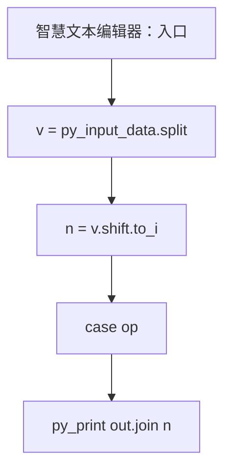
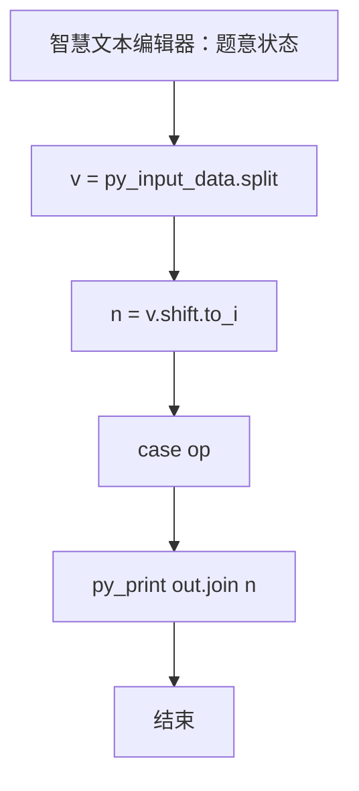

# L1-120 - 智慧文本编辑器（20 分）

- **时间限制**: 400 ms
- **内存限制**: 65536 KB
- **代码长度限制**: 16 KB

---

## 题目描述


众所周知，随着基于大语言模型（LLM）的人工智能的大规模普及，现在越来越多的系统拥有了人工智能模块（当然，拼题 A 也有）。为了响应潮流，龙龙打算也做一个智慧文本编辑器，但因为大语言模型的 API 太贵了，龙龙打算让这个编辑器的“智慧”停留在名字上就好了。但功能还是得写的，具体来说，对于当前正在编辑的文档，这个编辑器应当支持以下三个功能：

1. 查找指定字符串 $s_1$ 前 3 次出现的位置；
2. 在指定位置 $p$ 插入一个指定字符串 $s_2$；
3. 将某一段连续的字符串翻转。

真的文本编辑器可太复杂了，这里我们只简单化考虑由大小写英文字母和数字组成的字符串。

### 输入格式:

输入第一行是一个整数 $N$ ($1 \le N \le 50$)，表示操作的数量。

第二行是一个字符串 $S$ ($1 \le |S| \le 10^3$)，表示待操作的初始字符串。

接下来的 $N$ 行，每行给出一条操作指令。根据操作种类，分别为以下格式：

* ```1 s1```：对应查找操作，查找字符串 $s_1$ 在当前字符串 $T$ 中前 3 次出现的位置。
* ```2 p s2```：对应插入操作，将字符串 $s_2$ 插入到当前字符串 $T$ 中“下标为 $p$ 的字符”之前。当 $p = |T|$ 时，表示插入到字符串末尾。
* ```3 l r```：对应翻转操作，将当前字符串 $T$ 中下标从 $l$ 到 $r$ 的连续子串翻转。

字符串下标从 0 开始。保证所有输入中的字符串都只包含大小写英文字母和数字，且满足：$1 \le |s_1| \le 5$，$1 \le |s_2| \le 10$。

对于第二类和第三类操作，保证输入下标合法，即第二类操作满足 $0 \le p \le |T|$，第三类操作满足 $0 \le l \le r < |T|$。

说明：对于任意字符串 $X$，$|X|$ 表示字符串 $X$ 的长度。

### 输出格式:

对于第一类操作，按从小到大的顺序输出查找到的所有位置（即目标字符串的第一个字符在当前字符串中的下标），相邻两个位置之间用 1 个空格分隔。如果不足 3 次，就按实际查找到的次数输出；如果一次也没有找到，输出 ```-1```。

注意：只要位置不同，就算是不同次出现，出现的字符串允许相互重叠。例如 `ababa` 中出现了 2 次 `aba`，位置依次为 0 和 2。

对于第二类和第三类操作，输出操作后的结果字符串。

### 输入样例:
```in
10
ababa
1 a
1 aba
1 aca
2 0 X
2 6 Y
2 3 M
3 2 6
3 4 4
1 aa
3 0 7
```

### 输出样例:
```out
0 2 4
0 2
-1
Xababa
XababaY
XabMabaY
XaabaMbY
XaabaMbY
1
YbMabaaX
```

## 示例

### 示例 1

**输入:**
```
10
ababa
1 a
1 aba
1 aca
2 0 X
2 6 Y
2 3 M
3 2 6
3 4 4
1 aa
3 0 7
```

**输出:**
```
0 2 4
0 2
-1
Xababa
XababaY
XabMabaY
XaabaMbY
XaabaMbY
1
YbMabaaX
```

### 实现原理与解题思路

本题的实现原理是：使用栈、队列或二分边界维护操作顺序，在每次操作后保持数据结构的题目约束。先读取标准输入并按题目格式拆分字段，使用代码中的`v`、`n`、`s`、`out`保存计算过程，直接完成计算；处理完成后按照题目规定的顺序和格式输出结果。

### 代码流程说明

1. 读取并解析标准输入，转换为题目所需的数据结构。
2. 按题意执行核心算法，维护中间状态并处理边界情况。
3. 整理计算结果，按照输出格式生成答案。

### 代码实现

下面给出可独立运行的完整 Ruby 实现，关键步骤已在代码中标注。

```ruby
# frozen_string_literal: true
# 这些辅助方法只负责把题目输入、输出和常见序列操作映射为 Ruby 写法，
# 算法主体仍在下方的 entry 方法中，代码复制后可以独立运行。
module PTACompat
  UNSET = Object.new

  class CounterHash < Hash
    def initialize
      super(0)
    end
  end

  def py_tokens
    @pta_tokens ||= STDIN.read.split
  end

  def py_input_data
    @pta_input_data ||= STDIN.read
  end

  def py_readline
    STDIN.gets.to_s.chomp
  end

  def py_lines
    @pta_lines ||= STDIN.each_line.map(&:chomp)
  end

  def py_print(*values, sep: " ", ending: "\n")
    STDOUT.write(values.map(&:to_s).join(sep) + ending)
  end

  def py_int(value)
    value.to_i
  end

  def py_float(value)
    value.to_f
  end

  def py_str(value)
    value.to_s
  end

  def py_bool_int(value)
    value ? 1 : 0
  end

  def py_truth(value)
    return false if value.nil? || value == false
    return false if value.respond_to?(:zero?) && value.zero?
    return false if value.respond_to?(:empty?) && value.empty?

    true
  end

  def py_range(*args)
    first, last, step =
      case args.length
      when 1
        [0, args[0], 1]
      when 2
        [args[0], args[1], 1]
      else
        args
      end
    first = first.to_i
    last = last.to_i
    step = step.to_i
    raise ArgumentError, "range step cannot be zero" if step.zero?

    values = []
    current = first
    if step.positive?
      while current < last
        values << current
        current += step
      end
    else
      while current > last
        values << current
        current += step
      end
    end
    values
  end

  def py_map(function, values)
    values.map { |value| function.call(value) }
  end

  def py_iter(value)
    value.to_enum
  end

  def py_next(iterator)
    iterator.next
  end

  def py_iterable(value)
    value.is_a?(String) ? value.chars : value.to_a
  end

  def py_enumerate(values)
    values.each_with_index.map { |value, index| [index, value] }
  end

  def py_zip(*values)
    values.first.zip(*values.drop(1))
  end

  def py_slice(value, start_index = nil, stop_index = nil, step = nil)
    step ||= 1
    source = value.is_a?(String) ? value.chars : value.to_a
    size = source.length
    start_index = step.positive? ? 0 : size - 1 if start_index.nil?
    stop_index = step.positive? ? size : -size - 1 if stop_index.nil?
    start_index += size if start_index.negative?
    stop_index += size if stop_index.negative? && stop_index >= -size
    start_index =
      (
        if step.positive?
          [[start_index, 0].max, size].min
        else
          [[start_index, -1].max, size - 1].min
        end
      )
    stop_index =
      (
        if step.positive?
          [[stop_index, 0].max, size].min
        else
          [[stop_index, -1].max, size - 1].min
        end
      )

    result = []
    index = start_index
    if step.positive?
      while index < stop_index
        result << source[index]
        index += step
      end
    else
      while index > stop_index
        result << source[index]
        index += step
      end
    end
    value.is_a?(String) ? result.join : result
  end

  def py_len(value)
    value.length
  end

  def py_sum(values, initial = 0)
    values.sum(initial)
  end

  def py_abs(value)
    value.abs
  end

  def py_div(a, b)
    a.to_f / b
  end

  def py_divmod(a, b)
    [a.div(b), a % b]
  end

  def py_factorial(value)
    (1..value).reduce(1, :*)
  end

  def py_gcd(a, b)
    a.gcd(b)
  end

  def py_pow(base, exponent, modulus = nil)
    modulus.nil? ? base**exponent : base.pow(exponent, modulus)
  end

  def py_in(item, container)
    container.include?(item)
  end

  def py_counter(_values)
    CounterHash.new
  end

  def py_sorted(values, key: nil, reverse: false)
    result = (key ? values.sort_by { |value| key.call(value) } : values.sort)
    reverse ? result.reverse : result
  end

  def py_max(*values, key: nil, default: UNSET)
    values = values.first.to_a if values.length == 1 &&
      values.first.respond_to?(:each) && !values.first.is_a?(Numeric)
    return default unless values.any?

    key ? values.max_by { |value| key.call(value) } : values.max
  end

  def py_min(*values, key: nil, default: UNSET)
    values = values.first.to_a if values.length == 1 &&
      values.first.respond_to?(:each) && !values.first.is_a?(Numeric)
    return default unless values.any?

    key ? values.min_by { |value| key.call(value) } : values.min
  end

  def py_re_sub(pattern, replacement, value)
    value.gsub(Regexp.new(pattern), replacement)
  end

  def py_lstrip(value, chars)
    value.sub(/\A[#{Regexp.escape(chars)}]+/, "")
  end

  def py_startswith_at(value, prefix, index)
    value[index, prefix.length] == prefix
  end

  def py_replace_slice(value, start_index, stop_index, replacement)
    value[start_index...stop_index] = replacement
    value
  end

  def py_bisect_left(values, target)
    left = 0
    right = values.length
    while left < right
      middle = (left + right) / 2
      if values[middle] < target
        left = middle + 1
      else
        right = middle
      end
    end
    left
  end

  def py_bisect_right(values, target)
    left = 0
    right = values.length
    while left < right
      middle = (left + right) / 2
      if values[middle] <= target
        left = middle + 1
      else
        right = middle
      end
    end
    left
  end
end

class Hash
  def items
    to_a
  end
end

include PTACompat

# 题目入口：读取输入、执行核心算法并输出答案。

# 读取并解析题目输入。
v = py_input_data.split
n = v.shift.to_i
s = v.shift
# 初始化算法状态，保持后续转移所需的不变量。
out = []
n.times do
  op = v.shift.to_i
  case op
  when 1
    q = v.shift
    hits =
      (0..[s.length - q.length, 0].max)
        .select { |i| s[i, q.length] == q }
        .first(3)
    out << (hits.empty? ? "-1" : hits.join(" "))
  when 2
    p = [[v.shift.to_i, 0].max, s.length].min
    q = v.shift
    s = s[0, p].to_s + q + s[p..].to_s
    out << s
  else
    l = v.shift.to_i
    r = v.shift.to_i
    s = s[0, l].to_s + s[l..r].to_s.reverse + s[(r + 1)..].to_s
    out << s
  end
end
# 按题目要求输出最终结果。
py_print(out.join("\n"))

```

### 代码流程图



### 解题流程图


