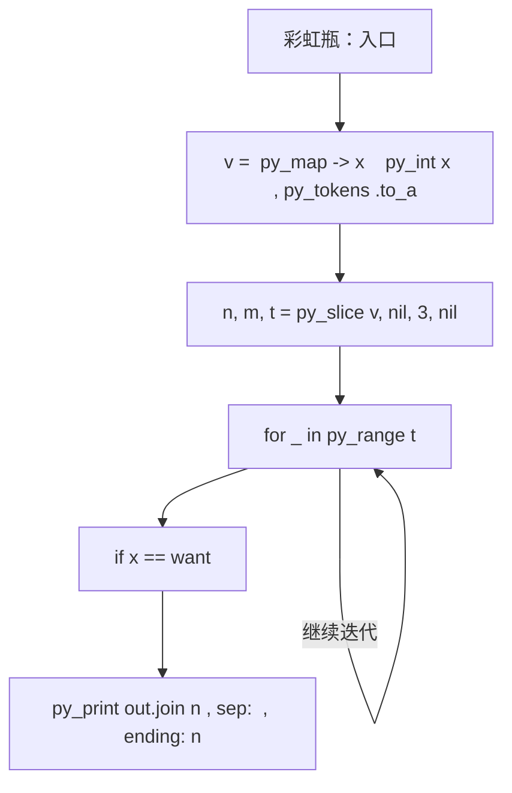
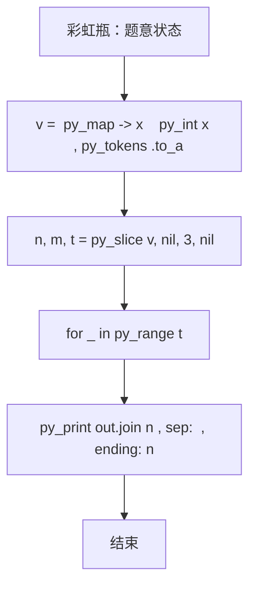

# L2-032 - 彩虹瓶（25 分）

- **时间限制**: 400 ms
- **内存限制**: 65536 KB
- **代码长度限制**: 16 KB

---

## 题目描述


彩虹瓶的制作过程（并不）是这样的：先把一大批空瓶铺放在装填场地上，然后按照一定的顺序将每种颜色的小球均匀撒到这批瓶子里。

假设彩虹瓶里要按顺序装 N 种颜色的小球（不妨将顺序就编号为 1 到 N）。现在工厂里有每种颜色的小球各一箱，工人需要一箱一箱地将小球从工厂里搬到装填场地。如果搬来的这箱小球正好是可以装填的颜色，就直接拆箱装填；如果不是，就把箱子先码放在一个临时货架上，码放的方法就是一箱一箱堆上去。当一种颜色装填完以后，先看看货架顶端的一箱是不是下一个要装填的颜色，如果是就取下来装填，否则去工厂里再搬一箱过来。

如果工厂里发货的顺序比较好，工人就可以顺利地完成装填。例如要按顺序装填 7 种颜色，工厂按照 7、6、1、3、2、5、4 这个顺序发货，则工人先拿到 7、6 两种不能装填的颜色，将其按照 7 在下、6 在上的顺序堆在货架上；拿到 1 时可以直接装填；拿到 3 时又得临时码放在 6 号颜色箱上；拿到 2 时可以直接装填；随后从货架顶取下 3 进行装填；然后拿到 5，临时码放到 6 上面；最后取了 4 号颜色直接装填；剩下的工作就是顺序从货架上取下 5、6、7 依次装填。

但如果工厂按照 3、1、5、4、2、6、7 这个顺序发货，工人就必须要愤怒地折腾货架了，因为装填完 2 号颜色以后，不把货架上的多个箱子搬下来就拿不到 3 号箱，就不可能顺利完成任务。

另外，货架的容量有限，如果要堆积的货物超过容量，工人也没办法顺利完成任务。例如工厂按照 7、6、5、4、3、2、1 这个顺序发货，如果货架够高，能码放 6 只箱子，那还是可以顺利完工的；但如果货架只能码放 5 只箱子，工人就又要愤怒了……

本题就请你判断一下，工厂的发货顺序能否让工人顺利完成任务。

### 输入格式:

输入首先在第一行给出 3 个正整数，分别是彩虹瓶的颜色数量 $$N$$（$$1 < N \le 10^3$$）、临时货架的容量 $$M$$（$$< N$$）、以及需要判断的发货顺序的数量 $$K$$。

随后 $$K$$ 行，每行给出 $$N$$ 个数字，是 1 到$$N$$ 的一个排列，对应工厂的发货顺序。

一行中的数字都以空格分隔。

### 输出格式:

对每个发货顺序，如果工人可以愉快完工，就在一行中输出 `YES`；否则输出 `NO`。

### 输入样例:
```in
7 5 3
7 6 1 3 2 5 4
3 1 5 4 2 6 7
7 6 5 4 3 2 1
```

### 输出样例:
```out
YES
NO
NO
```

## 示例

### 示例 1

**输入:**
```
7 5 3
7 6 1 3 2 5 4
3 1 5 4 2 6 7
7 6 5 4 3 2 1
```

**输出:**
```
YES
NO
NO
```

### 实现原理与解题思路

本题的实现原理是：按题目格式读取字符串或数值，逐项维护必要状态，并在每次判断时直接执行题目给出的规则。先读取标准输入并按题目格式拆分字段，使用代码中的`v`、`k`、`out`、`a`保存计算过程，通过 4 个循环阶段逐步更新；处理完成后按照题目规定的顺序和格式输出结果。

### 代码流程说明

1. 读取并解析标准输入，转换为题目所需的数据结构。
2. 按题意执行核心算法，维护中间状态并处理边界情况。
3. 整理计算结果，按照输出格式生成答案。

### 代码实现

下面给出可独立运行的完整 Ruby 实现，关键步骤已在代码中标注。

```ruby
# frozen_string_literal: true
# 这些辅助方法只负责把题目输入、输出和常见序列操作映射为 Ruby 写法，
# 算法主体仍在下方的 entry 方法中，代码复制后可以独立运行。
module PTACompat
  UNSET = Object.new

  class CounterHash < Hash
    def initialize
      super(0)
    end
  end

  def py_tokens
    @pta_tokens ||= STDIN.read.split
  end

  def py_input_data
    @pta_input_data ||= STDIN.read
  end

  def py_readline
    STDIN.gets.to_s.chomp
  end

  def py_lines
    @pta_lines ||= STDIN.each_line.map(&:chomp)
  end

  def py_print(*values, sep: " ", ending: "\n")
    STDOUT.write(values.map(&:to_s).join(sep) + ending)
  end

  def py_int(value)
    value.to_i
  end

  def py_float(value)
    value.to_f
  end

  def py_str(value)
    value.to_s
  end

  def py_bool_int(value)
    value ? 1 : 0
  end

  def py_truth(value)
    return false if value.nil? || value == false
    return false if value.respond_to?(:zero?) && value.zero?
    return false if value.respond_to?(:empty?) && value.empty?

    true
  end

  def py_range(*args)
    first, last, step =
      case args.length
      when 1
        [0, args[0], 1]
      when 2
        [args[0], args[1], 1]
      else
        args
      end
    first = first.to_i
    last = last.to_i
    step = step.to_i
    raise ArgumentError, "range step cannot be zero" if step.zero?

    values = []
    current = first
    if step.positive?
      while current < last
        values << current
        current += step
      end
    else
      while current > last
        values << current
        current += step
      end
    end
    values
  end

  def py_map(function, values)
    values.map { |value| function.call(value) }
  end

  def py_iter(value)
    value.to_enum
  end

  def py_next(iterator)
    iterator.next
  end

  def py_iterable(value)
    value.is_a?(String) ? value.chars : value.to_a
  end

  def py_enumerate(values)
    values.each_with_index.map { |value, index| [index, value] }
  end

  def py_zip(*values)
    values.first.zip(*values.drop(1))
  end

  def py_slice(value, start_index = nil, stop_index = nil, step = nil)
    step ||= 1
    source = value.is_a?(String) ? value.chars : value.to_a
    size = source.length
    start_index = step.positive? ? 0 : size - 1 if start_index.nil?
    stop_index = step.positive? ? size : -size - 1 if stop_index.nil?
    start_index += size if start_index.negative?
    stop_index += size if stop_index.negative? && stop_index >= -size
    start_index =
      (
        if step.positive?
          [[start_index, 0].max, size].min
        else
          [[start_index, -1].max, size - 1].min
        end
      )
    stop_index =
      (
        if step.positive?
          [[stop_index, 0].max, size].min
        else
          [[stop_index, -1].max, size - 1].min
        end
      )

    result = []
    index = start_index
    if step.positive?
      while index < stop_index
        result << source[index]
        index += step
      end
    else
      while index > stop_index
        result << source[index]
        index += step
      end
    end
    value.is_a?(String) ? result.join : result
  end

  def py_len(value)
    value.length
  end

  def py_sum(values, initial = 0)
    values.sum(initial)
  end

  def py_abs(value)
    value.abs
  end

  def py_div(a, b)
    a.to_f / b
  end

  def py_divmod(a, b)
    [a.div(b), a % b]
  end

  def py_factorial(value)
    (1..value).reduce(1, :*)
  end

  def py_gcd(a, b)
    a.gcd(b)
  end

  def py_pow(base, exponent, modulus = nil)
    modulus.nil? ? base**exponent : base.pow(exponent, modulus)
  end

  def py_in(item, container)
    container.include?(item)
  end

  def py_counter(_values)
    CounterHash.new
  end

  def py_sorted(values, key: nil, reverse: false)
    result = (key ? values.sort_by { |value| key.call(value) } : values.sort)
    reverse ? result.reverse : result
  end

  def py_max(*values, key: nil, default: UNSET)
    values = values.first.to_a if values.length == 1 &&
      values.first.respond_to?(:each) && !values.first.is_a?(Numeric)
    return default unless values.any?

    key ? values.max_by { |value| key.call(value) } : values.max
  end

  def py_min(*values, key: nil, default: UNSET)
    values = values.first.to_a if values.length == 1 &&
      values.first.respond_to?(:each) && !values.first.is_a?(Numeric)
    return default unless values.any?

    key ? values.min_by { |value| key.call(value) } : values.min
  end

  def py_re_sub(pattern, replacement, value)
    value.gsub(Regexp.new(pattern), replacement)
  end

  def py_lstrip(value, chars)
    value.sub(/\A[#{Regexp.escape(chars)}]+/, "")
  end

  def py_startswith_at(value, prefix, index)
    value[index, prefix.length] == prefix
  end

  def py_replace_slice(value, start_index, stop_index, replacement)
    value[start_index...stop_index] = replacement
    value
  end

  def py_bisect_left(values, target)
    left = 0
    right = values.length
    while left < right
      middle = (left + right) / 2
      if values[middle] < target
        left = middle + 1
      else
        right = middle
      end
    end
    left
  end

  def py_bisect_right(values, target)
    left = 0
    right = values.length
    while left < right
      middle = (left + right) / 2
      if values[middle] <= target
        left = middle + 1
      else
        right = middle
      end
    end
    left
  end
end

class Hash
  def items
    to_a
  end
end

include PTACompat

# 题目入口：读取输入、执行核心算法并输出答案。

def entry
  # 读取并解析题目输入。
  v = (py_map(->(x) { py_int(x) }, py_tokens).to_a)
  n, m, t = py_slice(v, nil, 3, nil)
  k = 3
  # 初始化算法状态，保持后续转移所需的不变量。
  out = []
  # 按题目规则遍历输入或状态空间。
  for _ in py_range(t)
    a = py_slice(v, k, (k + n), nil)
    k += n
    st = []
    want = 1
    ok = true
    for x in a
      if ((x == want))
        want += 1
      else
        if ((py_len(st) >= m))
          ok = false
          break
        end
        st.append(x)
      end
      while (py_truth(st) && ((st[(-1)] == want)))
        st.pop()
        want += 1
      end
    end
    while (py_truth(st) && ((st[(-1)] == want)))
      st.pop()
      want += 1
    end
    out.append(((py_truth(ok) && ((want == (n + 1)))) ? "YES" : "NO"))
  end
  # 按题目要求输出最终结果。
  py_print(out.join("\n"), sep: " ", ending: "\n")
end
entry

```

### 代码流程图



### 解题流程图


