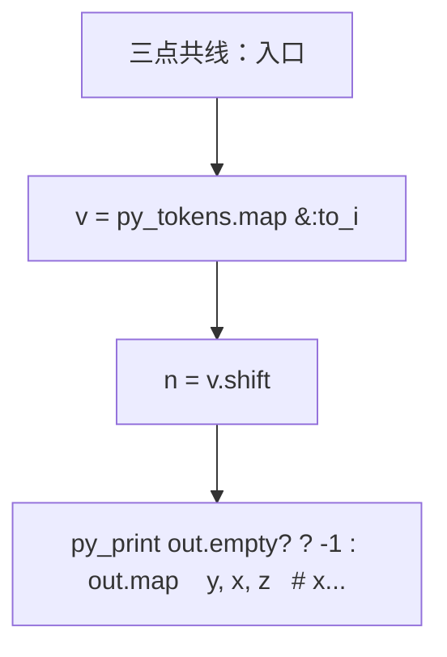
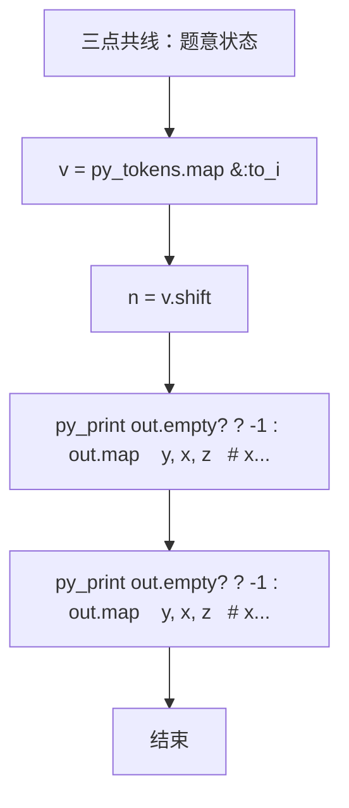

# L2-054 - 三点共线（25 分）

- **时间限制**: 2000 ms
- **内存限制**: 65536 KB
- **代码长度限制**: 16 KB

---

## 题目描述


给定平面上 $n$ 个点的坐标 $(x_i,y_i)$（$i=1, \cdots , n$），其中 $y$ 坐标只能是 0、1 或 2，是否存在三个不同的点位于一条**非水平**的直线上？

本题就请你找出所有共线的解。

### 输入格式:

输入首先在第一行给出正整数 $n$（$3\le n \le 5\times 10^4$），为所有点的个数。
随后 $n$ 行，每行给出一个点的坐标：第一个数为 $x$ 轴坐标，第二个数为 $y$ 轴坐标。其中，$x$ 坐标是绝对值不超过 $10^6$ 的整数，$y$ 坐标在 { 0，1，2 } 这三个数字中取值。同行数字间以空格分隔。

### 输出格式:

如果无解，则在一行中输出 `-1`。

如果有解，每一行输出共线的三个点坐标。每个点的坐标格式为 `[x, y]`，点之间用 1 个空格分隔，按照 `y` = 0、1、2 的顺序输出。

如果有多解，首先按照 `y` = 1 的 `x` 坐标升序输出；还有相同则按照 `y` = 0 的 `x` 坐标升序输出。

注意不能输出重复的解（即不能有两行输出是一样的内容）。题目保证任何一组测试的输出均不超过 $10^5$ 组不同的解。

### 输入样例 1：
```in
17
90 0
60 2
1 1
0 0
50 0
-30 2
79 2
50 0
-20 1
75 1
-10 1
-20 1
1 1
100 2
22 0
-10 0
-1 2
```

### 输出样例 1：
```out
[-10, 0] [-20, 1] [-30, 2]
[50, 0] [75, 1] [100, 2]
[90, 0] [75, 1] [60, 2]
```

### 输入样例 2：
```in
20
-1 2
1 1
-13 0
63 1
-29 1
17 2
-1 2
0 0
-22 0
53 2
1 1
97 1
-10 0
0 0
1 0
-11 1
-37 2
26 1
-18 2
69 0
```

### 输出样例 2：
```out
-1
```

## 示例

### 示例 1

**输入:**
```
17
90 0
60 2
1 1
0 0
50 0
-30 2
79 2
50 0
-20 1
75 1
-10 1
-20 1
1 1
100 2
22 0
-10 0
-1 2
```

**输出:**
```
[-10, 0] [-20, 1] [-30, 2]
[50, 0] [75, 1] [100, 2]
[90, 0] [75, 1] [60, 2]
```

### 示例 2

**输入:**
```
20
-1 2
1 1
-13 0
63 1
-29 1
17 2
-1 2
0 0
-22 0
53 2
1 1
97 1
-10 0
0 0
1 0
-11 1
-37 2
26 1
-18 2
69 0
```

**输出:**
```
-1
```

### 实现原理与解题思路

本题的实现原理是：使用栈、队列或二分边界维护操作顺序，在每次操作后保持数据结构的题目约束。先读取标准输入并按题目格式拆分字段，使用代码中的`v`、`n`、`points`、`x`保存计算过程，直接完成计算；处理完成后按照题目规定的顺序和格式输出结果。

### 代码流程说明

1. 读取并解析标准输入，转换为题目所需的数据结构。
2. 按题意执行核心算法，维护中间状态并处理边界情况。
3. 整理计算结果，按照输出格式生成答案。

### 代码实现

下面给出可独立运行的完整 Ruby 实现，关键步骤已在代码中标注。

```ruby
# frozen_string_literal: true
# 这些辅助方法只负责把题目输入、输出和常见序列操作映射为 Ruby 写法，
# 算法主体仍在下方的 entry 方法中，代码复制后可以独立运行。
module PTACompat
  UNSET = Object.new

  class CounterHash < Hash
    def initialize
      super(0)
    end
  end

  def py_tokens
    @pta_tokens ||= STDIN.read.split
  end

  def py_input_data
    @pta_input_data ||= STDIN.read
  end

  def py_readline
    STDIN.gets.to_s.chomp
  end

  def py_lines
    @pta_lines ||= STDIN.each_line.map(&:chomp)
  end

  def py_print(*values, sep: " ", ending: "\n")
    STDOUT.write(values.map(&:to_s).join(sep) + ending)
  end

  def py_int(value)
    value.to_i
  end

  def py_float(value)
    value.to_f
  end

  def py_str(value)
    value.to_s
  end

  def py_bool_int(value)
    value ? 1 : 0
  end

  def py_truth(value)
    return false if value.nil? || value == false
    return false if value.respond_to?(:zero?) && value.zero?
    return false if value.respond_to?(:empty?) && value.empty?

    true
  end

  def py_range(*args)
    first, last, step =
      case args.length
      when 1
        [0, args[0], 1]
      when 2
        [args[0], args[1], 1]
      else
        args
      end
    first = first.to_i
    last = last.to_i
    step = step.to_i
    raise ArgumentError, "range step cannot be zero" if step.zero?

    values = []
    current = first
    if step.positive?
      while current < last
        values << current
        current += step
      end
    else
      while current > last
        values << current
        current += step
      end
    end
    values
  end

  def py_map(function, values)
    values.map { |value| function.call(value) }
  end

  def py_iter(value)
    value.to_enum
  end

  def py_next(iterator)
    iterator.next
  end

  def py_iterable(value)
    value.is_a?(String) ? value.chars : value.to_a
  end

  def py_enumerate(values)
    values.each_with_index.map { |value, index| [index, value] }
  end

  def py_zip(*values)
    values.first.zip(*values.drop(1))
  end

  def py_slice(value, start_index = nil, stop_index = nil, step = nil)
    step ||= 1
    source = value.is_a?(String) ? value.chars : value.to_a
    size = source.length
    start_index = step.positive? ? 0 : size - 1 if start_index.nil?
    stop_index = step.positive? ? size : -size - 1 if stop_index.nil?
    start_index += size if start_index.negative?
    stop_index += size if stop_index.negative? && stop_index >= -size
    start_index =
      (
        if step.positive?
          [[start_index, 0].max, size].min
        else
          [[start_index, -1].max, size - 1].min
        end
      )
    stop_index =
      (
        if step.positive?
          [[stop_index, 0].max, size].min
        else
          [[stop_index, -1].max, size - 1].min
        end
      )

    result = []
    index = start_index
    if step.positive?
      while index < stop_index
        result << source[index]
        index += step
      end
    else
      while index > stop_index
        result << source[index]
        index += step
      end
    end
    value.is_a?(String) ? result.join : result
  end

  def py_len(value)
    value.length
  end

  def py_sum(values, initial = 0)
    values.sum(initial)
  end

  def py_abs(value)
    value.abs
  end

  def py_div(a, b)
    a.to_f / b
  end

  def py_divmod(a, b)
    [a.div(b), a % b]
  end

  def py_factorial(value)
    (1..value).reduce(1, :*)
  end

  def py_gcd(a, b)
    a.gcd(b)
  end

  def py_pow(base, exponent, modulus = nil)
    modulus.nil? ? base**exponent : base.pow(exponent, modulus)
  end

  def py_in(item, container)
    container.include?(item)
  end

  def py_counter(_values)
    CounterHash.new
  end

  def py_sorted(values, key: nil, reverse: false)
    result = (key ? values.sort_by { |value| key.call(value) } : values.sort)
    reverse ? result.reverse : result
  end

  def py_max(*values, key: nil, default: UNSET)
    values = values.first.to_a if values.length == 1 &&
      values.first.respond_to?(:each) && !values.first.is_a?(Numeric)
    return default unless values.any?

    key ? values.max_by { |value| key.call(value) } : values.max
  end

  def py_min(*values, key: nil, default: UNSET)
    values = values.first.to_a if values.length == 1 &&
      values.first.respond_to?(:each) && !values.first.is_a?(Numeric)
    return default unless values.any?

    key ? values.min_by { |value| key.call(value) } : values.min
  end

  def py_re_sub(pattern, replacement, value)
    value.gsub(Regexp.new(pattern), replacement)
  end

  def py_lstrip(value, chars)
    value.sub(/\A[#{Regexp.escape(chars)}]+/, "")
  end

  def py_startswith_at(value, prefix, index)
    value[index, prefix.length] == prefix
  end

  def py_replace_slice(value, start_index, stop_index, replacement)
    value[start_index...stop_index] = replacement
    value
  end

  def py_bisect_left(values, target)
    left = 0
    right = values.length
    while left < right
      middle = (left + right) / 2
      if values[middle] < target
        left = middle + 1
      else
        right = middle
      end
    end
    left
  end

  def py_bisect_right(values, target)
    left = 0
    right = values.length
    while left < right
      middle = (left + right) / 2
      if values[middle] <= target
        left = middle + 1
      else
        right = middle
      end
    end
    left
  end
end

class Hash
  def items
    to_a
  end
end

include PTACompat

# 题目入口：读取输入、执行核心算法并输出答案。

# 读取并解析题目输入。
v = py_tokens.map(&:to_i)
n = v.shift
points = { 0 => {}, 1 => {}, 2 => {} }
n.times do
  x = v.shift
  y = v.shift
  points[y][x] = true
end
# 初始化算法状态，保持后续转移所需的不变量。
out = []
points[1].each_key do |y|
  points[0].each_key do |x|
    z = 2 * y - x
    out << [y, x, z] if points[2].key?(z)
  end
end
out.sort_by! { |y, x, z| [x, y, z] }
# 按题目要求输出最终结果。
py_print(
  (
    if out.empty?
      "-1"
    else
      out.map { |y, x, z| "[#{x}, 0] [#{y}, 1] [#{z}, 2]" }.join("\n")
    end
  )
)

```

### 代码流程图



### 解题流程图


