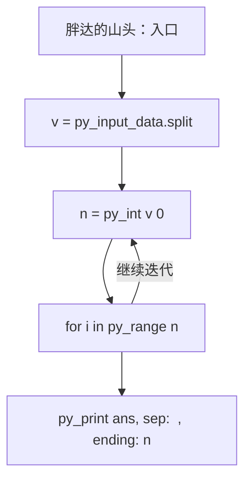
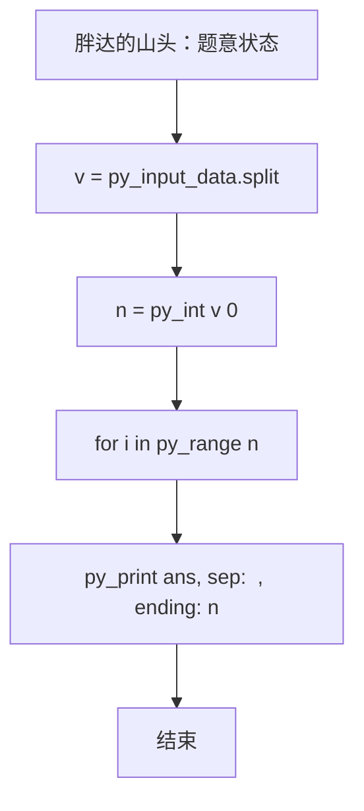

# L2-055 - 胖达的山头（25 分）

- **时间限制**: 150 ms
- **内存限制**: 65536 KB
- **代码长度限制**: 16 KB

---

## 题目描述


胖达是大熊猫的昵称。上图是著名的“西直门三太子”萌兰的一字马。

一只成年大熊猫需要有自己独立的生活区域，如果两只成年大熊猫在同一时间进入同一片区域，很可能会发生打斗事件。

大熊猫保护中心计划将保护区划分成若干座山头，让胖达们都过上没有冲突的安逸生活。当然如果为每位胖达分配一个山头是最理想的，但中心计划安置数十万只胖达 —— 这是个长远计划（截至2024年，世界上共有近 1900 只大熊猫），而保护区面积有限，这样做会使得每个山头面积过于局促。于是中心负责人找到了你，带着所有胖达的活跃时间表，请你帮助他们计算一下，如果让所有活跃时间段内的胖达都位于不同的山头，最少需要建设多少个山头？

### 输入格式:

输入在第一行给出正整数 $n$（$\le 10^5$），为胖达数量。随后 $n$ 行，每行给出一位胖达的活跃时间段（闭区间），格式为：
```
start finish
```
其中 `start` 为胖达活跃的起始时间点，`finish` 为终止时间点。两个时间点均以 `hh:mm:ss` 的格式给出（`hh` 表示小时、`mm` 表示分钟、`ss` 表示秒，从 `00:00:00` 到 `23:59:59`，并且保证 `start` 早于 `finish`。

### 输出格式:

在一行中输出保护中心最少需要建设的山头的数量。注意：要求是任何一个山头任何时间点都不能存在超过一只处于活跃时间段的大熊猫。

### 输入样例:
```in
4
16:30:00 23:00:00
04:50:00 11:25:59
11:25:59 22:00:00
11:26:00 15:45:23
```

### 输出样例:
```out
2
```

## 示例

### 示例 1

**输入:**
```
4
16:30:00 23:00:00
04:50:00 11:25:59
11:25:59 22:00:00
11:26:00 15:45:23
```

**输出:**
```
2
```

### 实现原理与解题思路

本题的实现原理是：按题目格式读取字符串或数值，逐项维护必要状态，并在每次判断时直接执行题目给出的规则。先读取标准输入并按题目格式拆分字段，使用代码中的`v`、`n`、`d`、`x`保存计算过程，通过 2 个循环阶段逐步更新；处理完成后按照题目规定的顺序和格式输出结果。

### 代码流程说明

1. 读取并解析标准输入，转换为题目所需的数据结构。
2. 按题意执行核心算法，维护中间状态并处理边界情况。
3. 整理计算结果，按照输出格式生成答案。

### 代码实现

下面给出可独立运行的完整 Ruby 实现，关键步骤已在代码中标注。

```ruby
# frozen_string_literal: true
# 这些辅助方法只负责把题目输入、输出和常见序列操作映射为 Ruby 写法，
# 算法主体仍在下方的 entry 方法中，代码复制后可以独立运行。
module PTACompat
  UNSET = Object.new

  class CounterHash < Hash
    def initialize
      super(0)
    end
  end

  def py_tokens
    @pta_tokens ||= STDIN.read.split
  end

  def py_input_data
    @pta_input_data ||= STDIN.read
  end

  def py_readline
    STDIN.gets.to_s.chomp
  end

  def py_lines
    @pta_lines ||= STDIN.each_line.map(&:chomp)
  end

  def py_print(*values, sep: " ", ending: "\n")
    STDOUT.write(values.map(&:to_s).join(sep) + ending)
  end

  def py_int(value)
    value.to_i
  end

  def py_float(value)
    value.to_f
  end

  def py_str(value)
    value.to_s
  end

  def py_bool_int(value)
    value ? 1 : 0
  end

  def py_truth(value)
    return false if value.nil? || value == false
    return false if value.respond_to?(:zero?) && value.zero?
    return false if value.respond_to?(:empty?) && value.empty?

    true
  end

  def py_range(*args)
    first, last, step =
      case args.length
      when 1
        [0, args[0], 1]
      when 2
        [args[0], args[1], 1]
      else
        args
      end
    first = first.to_i
    last = last.to_i
    step = step.to_i
    raise ArgumentError, "range step cannot be zero" if step.zero?

    values = []
    current = first
    if step.positive?
      while current < last
        values << current
        current += step
      end
    else
      while current > last
        values << current
        current += step
      end
    end
    values
  end

  def py_map(function, values)
    values.map { |value| function.call(value) }
  end

  def py_iter(value)
    value.to_enum
  end

  def py_next(iterator)
    iterator.next
  end

  def py_iterable(value)
    value.is_a?(String) ? value.chars : value.to_a
  end

  def py_enumerate(values)
    values.each_with_index.map { |value, index| [index, value] }
  end

  def py_zip(*values)
    values.first.zip(*values.drop(1))
  end

  def py_slice(value, start_index = nil, stop_index = nil, step = nil)
    step ||= 1
    source = value.is_a?(String) ? value.chars : value.to_a
    size = source.length
    start_index = step.positive? ? 0 : size - 1 if start_index.nil?
    stop_index = step.positive? ? size : -size - 1 if stop_index.nil?
    start_index += size if start_index.negative?
    stop_index += size if stop_index.negative? && stop_index >= -size
    start_index =
      (
        if step.positive?
          [[start_index, 0].max, size].min
        else
          [[start_index, -1].max, size - 1].min
        end
      )
    stop_index =
      (
        if step.positive?
          [[stop_index, 0].max, size].min
        else
          [[stop_index, -1].max, size - 1].min
        end
      )

    result = []
    index = start_index
    if step.positive?
      while index < stop_index
        result << source[index]
        index += step
      end
    else
      while index > stop_index
        result << source[index]
        index += step
      end
    end
    value.is_a?(String) ? result.join : result
  end

  def py_len(value)
    value.length
  end

  def py_sum(values, initial = 0)
    values.sum(initial)
  end

  def py_abs(value)
    value.abs
  end

  def py_div(a, b)
    a.to_f / b
  end

  def py_divmod(a, b)
    [a.div(b), a % b]
  end

  def py_factorial(value)
    (1..value).reduce(1, :*)
  end

  def py_gcd(a, b)
    a.gcd(b)
  end

  def py_pow(base, exponent, modulus = nil)
    modulus.nil? ? base**exponent : base.pow(exponent, modulus)
  end

  def py_in(item, container)
    container.include?(item)
  end

  def py_counter(_values)
    CounterHash.new
  end

  def py_sorted(values, key: nil, reverse: false)
    result = (key ? values.sort_by { |value| key.call(value) } : values.sort)
    reverse ? result.reverse : result
  end

  def py_max(*values, key: nil, default: UNSET)
    values = values.first.to_a if values.length == 1 &&
      values.first.respond_to?(:each) && !values.first.is_a?(Numeric)
    return default unless values.any?

    key ? values.max_by { |value| key.call(value) } : values.max
  end

  def py_min(*values, key: nil, default: UNSET)
    values = values.first.to_a if values.length == 1 &&
      values.first.respond_to?(:each) && !values.first.is_a?(Numeric)
    return default unless values.any?

    key ? values.min_by { |value| key.call(value) } : values.min
  end

  def py_re_sub(pattern, replacement, value)
    value.gsub(Regexp.new(pattern), replacement)
  end

  def py_lstrip(value, chars)
    value.sub(/\A[#{Regexp.escape(chars)}]+/, "")
  end

  def py_startswith_at(value, prefix, index)
    value[index, prefix.length] == prefix
  end

  def py_replace_slice(value, start_index, stop_index, replacement)
    value[start_index...stop_index] = replacement
    value
  end

  def py_bisect_left(values, target)
    left = 0
    right = values.length
    while left < right
      middle = (left + right) / 2
      if values[middle] < target
        left = middle + 1
      else
        right = middle
      end
    end
    left
  end

  def py_bisect_right(values, target)
    left = 0
    right = values.length
    while left < right
      middle = (left + right) / 2
      if values[middle] <= target
        left = middle + 1
      else
        right = middle
      end
    end
    left
  end
end

class Hash
  def items
    to_a
  end
end

include PTACompat

# 题目入口：读取输入、执行核心算法并输出答案。

def entry
  # 读取并解析题目输入。
  v = py_input_data.split
  n = py_int(v[0])
  d = ([0] * 86_402)
  # 按题目规则遍历输入或状态空间。
  for i in py_range(n)
    a, b = py_slice(v, (1 + (2 * i)), (3 + (2 * i)), nil)
    x =
      py_sum(
        py_iterable(py_enumerate(a.split(":"))).flat_map do |__item_0|
          j, z = __item_0
          [(py_int(z) * (60**(2 - j)))]
        end
      )
    y =
      py_sum(
        py_iterable(py_enumerate(b.split(":"))).flat_map do |__item_0|
          j, z = __item_0
          [(py_int(z) * (60**(2 - j)))]
        end
      )
    d[x] += 1
    d[(y + 1)] -= 1
  end
  cur = 0
  # 初始化算法状态，保持后续转移所需的不变量。
  ans = 0
  for x in py_slice(d, nil, 86_400, nil)
    cur += x
    ans = py_max(ans, cur)
  end
  # 按题目要求输出最终结果。
  py_print(ans, sep: " ", ending: "\n")
end
entry

```

### 代码流程图



### 解题流程图


