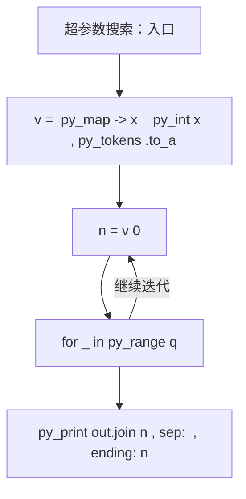
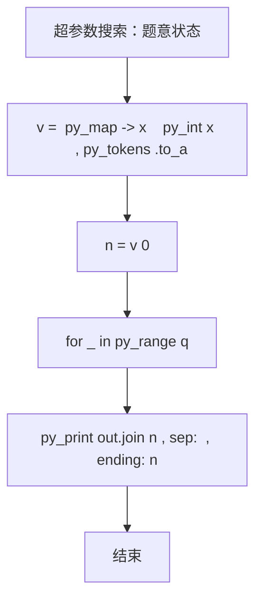

# L2-058 - 超参数搜索（25 分）

| 项目 | 限制 |
| --- | --- |
| 时间限制 | 400 ms |
| 内存限制 | 65536 KB |
| 代码长度限制 | 16 KB |

## 题目描述

神经网络模型的**超参数**是训练前需预先设定的参数，直接影响模型性能。在机器学习过程中需要对超参数进行优化，给学习器选择一组最优超参数，以提高学习的性能和效果。假设我们记录了一系列不同参数组合在验证集上的性能得分（如准确率），本题就请你找出性能得分最高的参数组合。更进一步，对于工程师提出的任一个目标性能得分 $x$，你也要从所有性能得分大于 $x$ 的参数组合中，找到那个得分最小的组合。

### 输入格式

输入第一行给出正整数 $n$（$1<n\le 10^5$），为所有在验证集上跑过的参数组合的总量。于是我们将所有参数组合从 1 到 $n$ 进行编号。第二行给出 $n$ 个区间 $[0, 10^8]$ 内的整数，第 $i$ 个数字表示编号为 $i$ 的参数组合的性能得分。随后一行给出正整数 $m$（$\le n/2$），为工程师查询次数。接下来 $m$ 行，每行给出一个查询的目标性能得分 $x$，同样在区间 $[0, 10^8]$ 内。

### 输出格式

首先第一行按升序列出所有性能得分最高的参数组合的编号。同行数字间以 1 个空格分隔，行首尾不得有多余空格。
随后对每一次查询 $x$，我们需要从所有性能得分大于 $x$ 的参数组合中，找到并输出那个得分最小的组合编号。如果这样的参数组合不唯一，则输出编号最小的解。如果这样的参数组合不存在，则输出 0。

### 输入样例
```in
10
87 91 65 72 95 84 77 95 91 85
3
87
75
95
```

### 输出样例
```out
5 8
2
7
0
```

## 参考样例

### 样例 1

**输入**
```
10
87 91 65 72 95 84 77 95 91 85
3
87
75
95
```

**输出**
```
5 8
2
7
0
```

## 实现原理与解题思路

本题的实现原理是：先对记录按关键字排序，再按题目规定的优先级顺序处理，保证每一步选择满足当前最优条件。先读取标准输入并按题目格式拆分字段，使用代码中的`v`、`n`、`a`、`k`保存计算过程，通过 1 个循环阶段逐步更新；处理完成后按照题目规定的顺序和格式输出结果。

## 代码流程说明

1. 读取并解析标准输入，转换为题目所需的数据结构。
2. 按题意执行核心算法，维护中间状态并处理边界情况。
3. 整理计算结果，按照输出格式生成答案。

## 代码实现

下面给出可独立运行的完整 Ruby 实现，关键步骤已在代码中标注。

```ruby
# frozen_string_literal: true
# 这些辅助方法只负责把题目输入、输出和常见序列操作映射为 Ruby 写法，
# 算法主体仍在下方的 entry 方法中，代码复制后可以独立运行。
module PTACompat
  UNSET = Object.new

  class CounterHash < Hash
    def initialize
      super(0)
    end
  end

  def py_tokens
    @pta_tokens ||= STDIN.read.split
  end

  def py_input_data
    @pta_input_data ||= STDIN.read
  end

  def py_readline
    STDIN.gets.to_s.chomp
  end

  def py_lines
    @pta_lines ||= STDIN.each_line.map(&:chomp)
  end

  def py_print(*values, sep: " ", ending: "\n")
    STDOUT.write(values.map(&:to_s).join(sep) + ending)
  end

  def py_int(value)
    value.to_i
  end

  def py_float(value)
    value.to_f
  end

  def py_str(value)
    value.to_s
  end

  def py_bool_int(value)
    value ? 1 : 0
  end

  def py_truth(value)
    return false if value.nil? || value == false
    return false if value.respond_to?(:zero?) && value.zero?
    return false if value.respond_to?(:empty?) && value.empty?

    true
  end

  def py_range(*args)
    first, last, step =
      case args.length
      when 1
        [0, args[0], 1]
      when 2
        [args[0], args[1], 1]
      else
        args
      end
    first = first.to_i
    last = last.to_i
    step = step.to_i
    raise ArgumentError, "range step cannot be zero" if step.zero?

    values = []
    current = first
    if step.positive?
      while current < last
        values << current
        current += step
      end
    else
      while current > last
        values << current
        current += step
      end
    end
    values
  end

  def py_map(function, values)
    values.map { |value| function.call(value) }
  end

  def py_iter(value)
    value.to_enum
  end

  def py_next(iterator)
    iterator.next
  end

  def py_iterable(value)
    value.is_a?(String) ? value.chars : value.to_a
  end

  def py_enumerate(values)
    values.each_with_index.map { |value, index| [index, value] }
  end

  def py_zip(*values)
    values.first.zip(*values.drop(1))
  end

  def py_slice(value, start_index = nil, stop_index = nil, step = nil)
    step ||= 1
    source = value.is_a?(String) ? value.chars : value.to_a
    size = source.length
    start_index = step.positive? ? 0 : size - 1 if start_index.nil?
    stop_index = step.positive? ? size : -size - 1 if stop_index.nil?
    start_index += size if start_index.negative?
    stop_index += size if stop_index.negative? && stop_index >= -size
    start_index =
      (
        if step.positive?
          [[start_index, 0].max, size].min
        else
          [[start_index, -1].max, size - 1].min
        end
      )
    stop_index =
      (
        if step.positive?
          [[stop_index, 0].max, size].min
        else
          [[stop_index, -1].max, size - 1].min
        end
      )

    result = []
    index = start_index
    if step.positive?
      while index < stop_index
        result << source[index]
        index += step
      end
    else
      while index > stop_index
        result << source[index]
        index += step
      end
    end
    value.is_a?(String) ? result.join : result
  end

  def py_len(value)
    value.length
  end

  def py_sum(values, initial = 0)
    values.sum(initial)
  end

  def py_abs(value)
    value.abs
  end

  def py_div(a, b)
    a.to_f / b
  end

  def py_divmod(a, b)
    [a.div(b), a % b]
  end

  def py_factorial(value)
    (1..value).reduce(1, :*)
  end

  def py_gcd(a, b)
    a.gcd(b)
  end

  def py_pow(base, exponent, modulus = nil)
    modulus.nil? ? base**exponent : base.pow(exponent, modulus)
  end

  def py_in(item, container)
    container.include?(item)
  end

  def py_counter(_values)
    CounterHash.new
  end

  def py_sorted(values, key: nil, reverse: false)
    result = (key ? values.sort_by { |value| key.call(value) } : values.sort)
    reverse ? result.reverse : result
  end

  def py_max(*values, key: nil, default: UNSET)
    values = values.first.to_a if values.length == 1 &&
      values.first.respond_to?(:each) && !values.first.is_a?(Numeric)
    return default unless values.any?

    key ? values.max_by { |value| key.call(value) } : values.max
  end

  def py_min(*values, key: nil, default: UNSET)
    values = values.first.to_a if values.length == 1 &&
      values.first.respond_to?(:each) && !values.first.is_a?(Numeric)
    return default unless values.any?

    key ? values.min_by { |value| key.call(value) } : values.min
  end

  def py_re_sub(pattern, replacement, value)
    value.gsub(Regexp.new(pattern), replacement)
  end

  def py_lstrip(value, chars)
    value.sub(/\A[#{Regexp.escape(chars)}]+/, "")
  end

  def py_startswith_at(value, prefix, index)
    value[index, prefix.length] == prefix
  end

  def py_replace_slice(value, start_index, stop_index, replacement)
    value[start_index...stop_index] = replacement
    value
  end

  def py_bisect_left(values, target)
    left = 0
    right = values.length
    while left < right
      middle = (left + right) / 2
      if values[middle] < target
        left = middle + 1
      else
        right = middle
      end
    end
    left
  end

  def py_bisect_right(values, target)
    left = 0
    right = values.length
    while left < right
      middle = (left + right) / 2
      if values[middle] <= target
        left = middle + 1
      else
        right = middle
      end
    end
    left
  end
end

class Hash
  def items
    to_a
  end
end

include PTACompat

# 题目入口：读取输入、执行核心算法并输出答案。

def entry
  # 读取并解析题目输入。
  v = (py_map(->(x) { py_int(x) }, py_tokens).to_a)
  n = v[0]
  a = py_slice(v, 1, (1 + n), nil)
  k = 1
  sc = ([0] + a)
  mx = py_max(a)
  # 初始化算法状态，保持后续转移所需的不变量。
  out = [
    py_iterable(py_range(1, (n + 1)))
      .flat_map do |i|
        next [] unless py_truth(((sc[i] == mx)))
        [py_str(i)]
      end
      .join(" ")
  ]
  q = v[(1 + n)]
  k = (2 + n)
  vals = py_sorted(Set.new(a))
  mi =
    Hash[
      py_iterable(vals).flat_map do |x|
        [
          [
            x,
            py_min(
              py_iterable(py_enumerate(a)).flat_map do |__item_0|
                i, y = __item_0
                next [] unless py_truth(((y == x)))
                [(i + 1)]
              end
            )
          ]
        ]
      end
    ]
  # 按题目规则遍历输入或状态空间。
  for _ in py_range(q)
    x = v[k]
    k += 1
    i = py_bisect_right(vals, x)
    out.append((((i < py_len(vals))) ? py_str(mi[vals[i]]) : "0"))
  end
  # 按题目要求输出最终结果。
  py_print(out.join("\n"), sep: " ", ending: "\n")
end
entry

```

## 代码流程图



## 解题流程图


