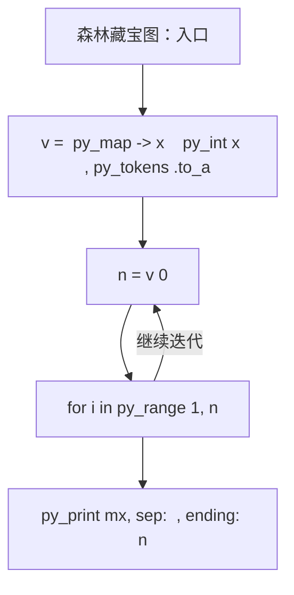
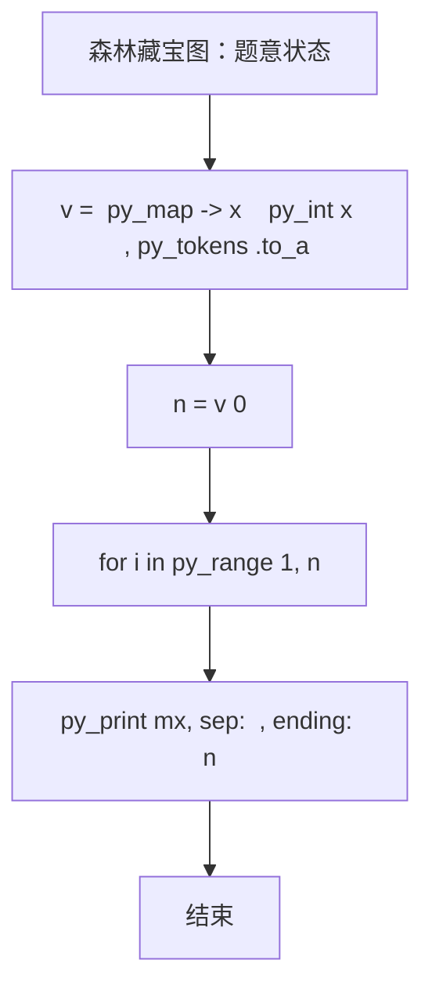

# L2-059 - 森林藏宝图（25 分）

- **时间限制**: 150 ms
- **内存限制**: 65536 KB
- **代码长度限制**: 16 KB

---

## 题目描述


姥姥手里有一张森林藏宝图（别问怎么得到的），图中标记了森林的入口，还画了通往多个藏宝地的小路。画这张藏宝图的人，还贴心地为每条小路标记了一个“安全系数”，是区间 $[0,100]$ 中的整数。

为了方便规划，姥姥给每个有分叉的路口、以及每个藏宝地都做了编号，其中森林的入口编号为 0。略加研究后，姥姥有了一个重要的发现：如果我们一路向前不走回头路，那么从 0 号入口到每个藏宝地的路径都是**存在且唯一**的！换言之，我们不可能从两条不同的岔路殊途同归地走到同一个藏宝地。此外，从入口沿任何一条小路一直走到**尽头**，都会到达一个藏宝地。

姥姥不打算冒太大风险，所以只打算沿着安全系数比较大的路走。本题就请你帮个忙，看看如果只考虑途经最小的安全系数最大的路径，有可能取到哪些宝藏？即从 0 号入口到该藏宝地路径上，所有小路安全系数的**最小值**最大。

### 输入格式:

输入在第一行给出图中标记的顶点总数 $n$（$1<n\le 10^5$）—— 如题面所述，森林的入口编号为 0，其它节点（分叉路口和藏宝地）的编号从 1 到 $n-1$。随后 $n-1$ 行，第 $i$（$1\le i < n$）行给出编号为 $i$ 的节点的**前驱节点**的编号 $j$、以及从 $j$ 到 $i$ 这条小路的安全系数 $s_{ji}$（$0\le s_{ji}\le 100$）。一行中的数字间以空格分隔。

注：所谓节点 $i$ 的“前驱节点”，是指从 0 号入口出发，到达 $i$ 之前所到达的那个节点。因为从 0 号入口到每个藏宝地的路径都是唯一的，容易证明每个节点的前驱节点也是唯一的。

### 输出格式:

首先在第一行输出解的途经最小安全系数的最大值 —— 所谓“解”，即按题目要求给姥姥推荐的藏宝地，也就是从 0 号入口出发，到该藏宝地路径上所有小路安全系数的**最小值**最大。
第二行按递增顺序输出解的编号。编号间以一个空格分隔，行首尾不得有多余空格。

### 输入样例:
```in
9
0 30
0 10
0 0
1 8
1 15
2 20
4 40
5 10
```

### 输出样例:
```out
10
6 8
```

## 示例

### 示例 1

**输入:**
```
9
0 30
0 10
0 0
1 8
1 15
2 20
4 40
5 10
```

**输出:**
```
10
6 8
```

### 实现原理与解题思路

本题的实现原理是：按题目格式读取字符串或数值，逐项维护必要状态，并在每次判断时直接执行题目给出的规则。先读取标准输入并按题目格式拆分字段，使用代码中的`v`、`n`、`g`、`w`保存计算过程，通过 3 个循环阶段逐步更新；处理完成后按照题目规定的顺序和格式输出结果。

### 代码流程说明

1. 读取并解析标准输入，转换为题目所需的数据结构。
2. 按题意执行核心算法，维护中间状态并处理边界情况。
3. 整理计算结果，按照输出格式生成答案。

### 代码实现

下面给出可独立运行的完整 Ruby 实现，关键步骤已在代码中标注。

```ruby
# frozen_string_literal: true
# 这些辅助方法只负责把题目输入、输出和常见序列操作映射为 Ruby 写法，
# 算法主体仍在下方的 entry 方法中，代码复制后可以独立运行。
module PTACompat
  UNSET = Object.new

  class CounterHash < Hash
    def initialize
      super(0)
    end
  end

  def py_tokens
    @pta_tokens ||= STDIN.read.split
  end

  def py_input_data
    @pta_input_data ||= STDIN.read
  end

  def py_readline
    STDIN.gets.to_s.chomp
  end

  def py_lines
    @pta_lines ||= STDIN.each_line.map(&:chomp)
  end

  def py_print(*values, sep: " ", ending: "\n")
    STDOUT.write(values.map(&:to_s).join(sep) + ending)
  end

  def py_int(value)
    value.to_i
  end

  def py_float(value)
    value.to_f
  end

  def py_str(value)
    value.to_s
  end

  def py_bool_int(value)
    value ? 1 : 0
  end

  def py_truth(value)
    return false if value.nil? || value == false
    return false if value.respond_to?(:zero?) && value.zero?
    return false if value.respond_to?(:empty?) && value.empty?

    true
  end

  def py_range(*args)
    first, last, step =
      case args.length
      when 1
        [0, args[0], 1]
      when 2
        [args[0], args[1], 1]
      else
        args
      end
    first = first.to_i
    last = last.to_i
    step = step.to_i
    raise ArgumentError, "range step cannot be zero" if step.zero?

    values = []
    current = first
    if step.positive?
      while current < last
        values << current
        current += step
      end
    else
      while current > last
        values << current
        current += step
      end
    end
    values
  end

  def py_map(function, values)
    values.map { |value| function.call(value) }
  end

  def py_iter(value)
    value.to_enum
  end

  def py_next(iterator)
    iterator.next
  end

  def py_iterable(value)
    value.is_a?(String) ? value.chars : value.to_a
  end

  def py_enumerate(values)
    values.each_with_index.map { |value, index| [index, value] }
  end

  def py_zip(*values)
    values.first.zip(*values.drop(1))
  end

  def py_slice(value, start_index = nil, stop_index = nil, step = nil)
    step ||= 1
    source = value.is_a?(String) ? value.chars : value.to_a
    size = source.length
    start_index = step.positive? ? 0 : size - 1 if start_index.nil?
    stop_index = step.positive? ? size : -size - 1 if stop_index.nil?
    start_index += size if start_index.negative?
    stop_index += size if stop_index.negative? && stop_index >= -size
    start_index =
      (
        if step.positive?
          [[start_index, 0].max, size].min
        else
          [[start_index, -1].max, size - 1].min
        end
      )
    stop_index =
      (
        if step.positive?
          [[stop_index, 0].max, size].min
        else
          [[stop_index, -1].max, size - 1].min
        end
      )

    result = []
    index = start_index
    if step.positive?
      while index < stop_index
        result << source[index]
        index += step
      end
    else
      while index > stop_index
        result << source[index]
        index += step
      end
    end
    value.is_a?(String) ? result.join : result
  end

  def py_len(value)
    value.length
  end

  def py_sum(values, initial = 0)
    values.sum(initial)
  end

  def py_abs(value)
    value.abs
  end

  def py_div(a, b)
    a.to_f / b
  end

  def py_divmod(a, b)
    [a.div(b), a % b]
  end

  def py_factorial(value)
    (1..value).reduce(1, :*)
  end

  def py_gcd(a, b)
    a.gcd(b)
  end

  def py_pow(base, exponent, modulus = nil)
    modulus.nil? ? base**exponent : base.pow(exponent, modulus)
  end

  def py_in(item, container)
    container.include?(item)
  end

  def py_counter(_values)
    CounterHash.new
  end

  def py_sorted(values, key: nil, reverse: false)
    result = (key ? values.sort_by { |value| key.call(value) } : values.sort)
    reverse ? result.reverse : result
  end

  def py_max(*values, key: nil, default: UNSET)
    values = values.first.to_a if values.length == 1 &&
      values.first.respond_to?(:each) && !values.first.is_a?(Numeric)
    return default unless values.any?

    key ? values.max_by { |value| key.call(value) } : values.max
  end

  def py_min(*values, key: nil, default: UNSET)
    values = values.first.to_a if values.length == 1 &&
      values.first.respond_to?(:each) && !values.first.is_a?(Numeric)
    return default unless values.any?

    key ? values.min_by { |value| key.call(value) } : values.min
  end

  def py_re_sub(pattern, replacement, value)
    value.gsub(Regexp.new(pattern), replacement)
  end

  def py_lstrip(value, chars)
    value.sub(/\A[#{Regexp.escape(chars)}]+/, "")
  end

  def py_startswith_at(value, prefix, index)
    value[index, prefix.length] == prefix
  end

  def py_replace_slice(value, start_index, stop_index, replacement)
    value[start_index...stop_index] = replacement
    value
  end

  def py_bisect_left(values, target)
    left = 0
    right = values.length
    while left < right
      middle = (left + right) / 2
      if values[middle] < target
        left = middle + 1
      else
        right = middle
      end
    end
    left
  end

  def py_bisect_right(values, target)
    left = 0
    right = values.length
    while left < right
      middle = (left + right) / 2
      if values[middle] <= target
        left = middle + 1
      else
        right = middle
      end
    end
    left
  end
end

class Hash
  def items
    to_a
  end
end

include PTACompat

# 题目入口：读取输入、执行核心算法并输出答案。

def entry
  # 读取并解析题目输入。
  v = (py_map(->(x) { py_int(x) }, py_tokens).to_a)
  n = v[0]
  # 初始化算法状态，保持后续转移所需的不变量。
  g = py_iterable(py_range(n)).flat_map { |_| [[]] }
  w = ([0] * n)
  k = 1
  # 按题目规则遍历输入或状态空间。
  for i in py_range(1, n)
    p, s = py_slice(v, k, (k + 2), nil)
    k += 2
    g[p].append(i)
    w[i] = s
  end
  best = ([(10**9)] * n)
  best[0] = (10**9)
  q = [0]
  for x in q
    for y in g[x]
      best[y] = py_min(best[x], w[y])
      q.append(y)
    end
  end
  leaves =
    py_iterable(py_range(1, n)).flat_map do |i|
      next [] unless py_truth((!py_truth(g[i])))
      [i]
    end
  mx = py_max(py_iterable(leaves).flat_map { |i| [best[i]] })
  # 按题目要求输出最终结果。
  py_print(mx, sep: " ", ending: "\n")
  py_print(
    py_map(
      ->(x) { py_str(x) },
      py_iterable(leaves).flat_map do |i|
        next [] unless py_truth(((best[i] == mx)))
        [i]
      end
    ).join(" "),
    sep: " ",
    ending: "\n"
  )
end
entry

```

### 代码流程图



### 解题流程图


