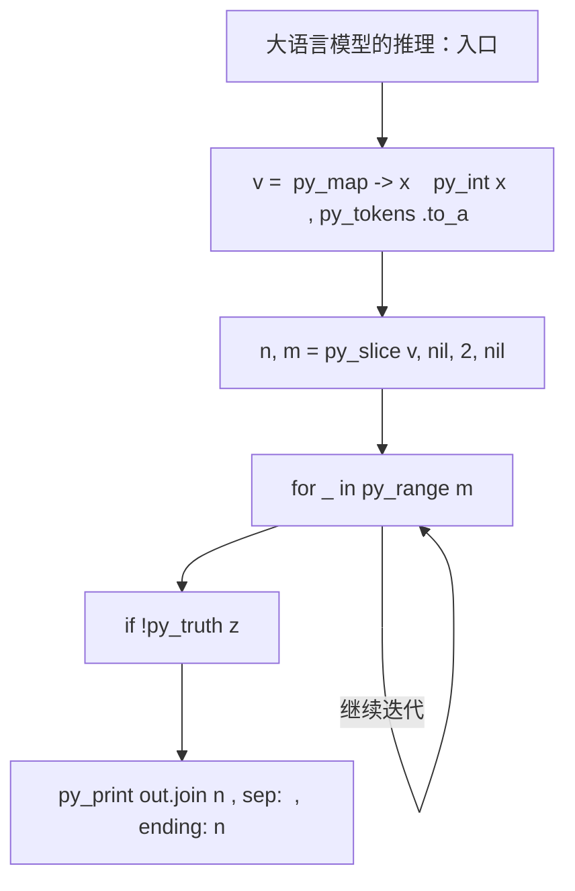
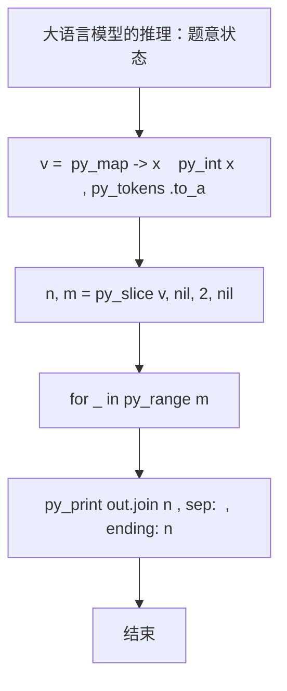

# L2-060 - 大语言模型的推理（25 分）

| 项目 | 限制 |
| --- | --- |
| 时间限制 | 400 ms |
| 内存限制 | 65536 KB |
| 代码长度限制 | 16 KB |

## 题目描述


在新一代智能推理引擎中，一个大语言模型被设计为“逐步思考”的模式。它在回答复杂问题时，会从一个初始想法（称为“根思维节点”）出发，每一步都基于当前思路，生成若干个可能的下一步推理方向，每个方向代表一个子想法。我们考虑一个简化的推理策略：当有多个子想法可以继续时，模型选择推理概率最高的子想法尝试展开。如果最高概率有并列，则选择编号最小的子想法尝试展开。注意：模型不会重复思考同一个想法，以避免循环推理。所以严格说来，模型在选择下一步推理方向时，保证排除路径中已访问过的想法。一旦某个推理路径走到尽头（即没有新的子想法可生成），就结束本次推理。

本题就请你实现这个推理过程。

### 输入格式

输入第一行给出两个正整数：$n$（$\le 10^4$）为模型中定义的想法的个数（于是所有的想法从 1 到 $n$ 编号）；$m$（$\le 10n$）为“思维跳跃”关系的数量。随后 $m$ 行，每行描述一个“思维跳跃”关系，格式为：
```
id1 id2 p
```
表示从编号为 `id1` 的想法引出编号为 `id2` 的想法的概率等于 `p`%。题目保证 `id1` 和 `id2` 互不相等，均为合法编号，且任一对关系不会重复给出；`p` 是区间 [1, 100] 内的整数。注意：上述“引出”的关系是单向的，即“A 引出 B”并不意味着 B 可以引出 A。
接下来一行给出正整数 $K$（$\le 100$），后面跟着 $K$ 个想法编号。

### 输出格式

对于输入中给出的 $K$ 个想法编号，顺序输出以每个想法为根思维节点的推理路径（包括根思维节点本身）。每个推理路径占一行，相邻想法编号的输出间以 `->` 分隔，行首尾不得有多余空格。

### 输入样例
```in
10 18
2 3 1
2 1 3
2 6 3
6 2 3
3 1 4
1 6 5
6 1 2
1 4 5
1 5 4
4 5 1
5 6 3
5 7 4
7 4 7
7 8 1
8 9 8
9 7 9
9 5 9
3 8 6
5 2 3 10 6 7
```

### 输出样例
```out
2->1->4->5->7->8->9
3->8->9->5->7->4
10
6->2->1->4->5->7->8->9
7->4->5->6->2->1
```

## 参考样例

### 样例 1

**输入**
```
10 18
2 3 1
2 1 3
2 6 3
6 2 3
3 1 4
1 6 5
6 1 2
1 4 5
1 5 4
4 5 1
5 6 3
5 7 4
7 4 7
7 8 1
8 9 8
9 7 9
9 5 9
3 8 6
5 2 3 10 6 7
```

**输出**
```
2->1->4->5->7->8->9
3->8->9->5->7->4
10
6->2->1->4->5->7->8->9
7->4->5->6->2->1
```

## 实现原理与解题思路

本题的实现原理是：将输入关系组织成邻接表，通过搜索访问可达状态，并在遍历中维护题目要求的结果。先读取标准输入并按题目格式拆分字段，使用代码中的`v`、`k`、`g`、`q`保存计算过程，通过 3 个循环阶段逐步更新；处理完成后按照题目规定的顺序和格式输出结果。

## 代码流程说明

1. 读取并解析标准输入，转换为题目所需的数据结构。
2. 按题意执行核心算法，维护中间状态并处理边界情况。
3. 整理计算结果，按照输出格式生成答案。

## 代码实现

下面给出可独立运行的完整 Ruby 实现，关键步骤已在代码中标注。

```ruby
# frozen_string_literal: true
# 这些辅助方法只负责把题目输入、输出和常见序列操作映射为 Ruby 写法，
# 算法主体仍在下方的 entry 方法中，代码复制后可以独立运行。
module PTACompat
  UNSET = Object.new

  class CounterHash < Hash
    def initialize
      super(0)
    end
  end

  def py_tokens
    @pta_tokens ||= STDIN.read.split
  end

  def py_input_data
    @pta_input_data ||= STDIN.read
  end

  def py_readline
    STDIN.gets.to_s.chomp
  end

  def py_lines
    @pta_lines ||= STDIN.each_line.map(&:chomp)
  end

  def py_print(*values, sep: " ", ending: "\n")
    STDOUT.write(values.map(&:to_s).join(sep) + ending)
  end

  def py_int(value)
    value.to_i
  end

  def py_float(value)
    value.to_f
  end

  def py_str(value)
    value.to_s
  end

  def py_bool_int(value)
    value ? 1 : 0
  end

  def py_truth(value)
    return false if value.nil? || value == false
    return false if value.respond_to?(:zero?) && value.zero?
    return false if value.respond_to?(:empty?) && value.empty?

    true
  end

  def py_range(*args)
    first, last, step =
      case args.length
      when 1
        [0, args[0], 1]
      when 2
        [args[0], args[1], 1]
      else
        args
      end
    first = first.to_i
    last = last.to_i
    step = step.to_i
    raise ArgumentError, "range step cannot be zero" if step.zero?

    values = []
    current = first
    if step.positive?
      while current < last
        values << current
        current += step
      end
    else
      while current > last
        values << current
        current += step
      end
    end
    values
  end

  def py_map(function, values)
    values.map { |value| function.call(value) }
  end

  def py_iter(value)
    value.to_enum
  end

  def py_next(iterator)
    iterator.next
  end

  def py_iterable(value)
    value.is_a?(String) ? value.chars : value.to_a
  end

  def py_enumerate(values)
    values.each_with_index.map { |value, index| [index, value] }
  end

  def py_zip(*values)
    values.first.zip(*values.drop(1))
  end

  def py_slice(value, start_index = nil, stop_index = nil, step = nil)
    step ||= 1
    source = value.is_a?(String) ? value.chars : value.to_a
    size = source.length
    start_index = step.positive? ? 0 : size - 1 if start_index.nil?
    stop_index = step.positive? ? size : -size - 1 if stop_index.nil?
    start_index += size if start_index.negative?
    stop_index += size if stop_index.negative? && stop_index >= -size
    start_index =
      (
        if step.positive?
          [[start_index, 0].max, size].min
        else
          [[start_index, -1].max, size - 1].min
        end
      )
    stop_index =
      (
        if step.positive?
          [[stop_index, 0].max, size].min
        else
          [[stop_index, -1].max, size - 1].min
        end
      )

    result = []
    index = start_index
    if step.positive?
      while index < stop_index
        result << source[index]
        index += step
      end
    else
      while index > stop_index
        result << source[index]
        index += step
      end
    end
    value.is_a?(String) ? result.join : result
  end

  def py_len(value)
    value.length
  end

  def py_sum(values, initial = 0)
    values.sum(initial)
  end

  def py_abs(value)
    value.abs
  end

  def py_div(a, b)
    a.to_f / b
  end

  def py_divmod(a, b)
    [a.div(b), a % b]
  end

  def py_factorial(value)
    (1..value).reduce(1, :*)
  end

  def py_gcd(a, b)
    a.gcd(b)
  end

  def py_pow(base, exponent, modulus = nil)
    modulus.nil? ? base**exponent : base.pow(exponent, modulus)
  end

  def py_in(item, container)
    container.include?(item)
  end

  def py_counter(_values)
    CounterHash.new
  end

  def py_sorted(values, key: nil, reverse: false)
    result = (key ? values.sort_by { |value| key.call(value) } : values.sort)
    reverse ? result.reverse : result
  end

  def py_max(*values, key: nil, default: UNSET)
    values = values.first.to_a if values.length == 1 &&
      values.first.respond_to?(:each) && !values.first.is_a?(Numeric)
    return default unless values.any?

    key ? values.max_by { |value| key.call(value) } : values.max
  end

  def py_min(*values, key: nil, default: UNSET)
    values = values.first.to_a if values.length == 1 &&
      values.first.respond_to?(:each) && !values.first.is_a?(Numeric)
    return default unless values.any?

    key ? values.min_by { |value| key.call(value) } : values.min
  end

  def py_re_sub(pattern, replacement, value)
    value.gsub(Regexp.new(pattern), replacement)
  end

  def py_lstrip(value, chars)
    value.sub(/\A[#{Regexp.escape(chars)}]+/, "")
  end

  def py_startswith_at(value, prefix, index)
    value[index, prefix.length] == prefix
  end

  def py_replace_slice(value, start_index, stop_index, replacement)
    value[start_index...stop_index] = replacement
    value
  end

  def py_bisect_left(values, target)
    left = 0
    right = values.length
    while left < right
      middle = (left + right) / 2
      if values[middle] < target
        left = middle + 1
      else
        right = middle
      end
    end
    left
  end

  def py_bisect_right(values, target)
    left = 0
    right = values.length
    while left < right
      middle = (left + right) / 2
      if values[middle] <= target
        left = middle + 1
      else
        right = middle
      end
    end
    left
  end
end

class Hash
  def items
    to_a
  end
end

include PTACompat

# 题目入口：读取输入、执行核心算法并输出答案。

def entry
  # 读取并解析题目输入。
  v = (py_map(->(x) { py_int(x) }, py_tokens).to_a)
  n, m = py_slice(v, nil, 2, nil)
  k = 2
  # 初始化算法状态，保持后续转移所需的不变量。
  g = py_iterable(py_range((n + 1))).flat_map { |_| [[]] }
  # 按题目规则遍历输入或状态空间。
  for _ in py_range(m)
    a, b, p = py_slice(v, k, (k + 3), nil)
    k += 3
    g[a].append([p, b])
  end
  q = v[k]
  k += 1
  out = []
  for _ in py_range(q)
    x = v[k]
    k += 1
    seen = Set.new([x])
    a = [x]
    while py_truth(1)
      z =
        py_iterable(g[x]).flat_map do |__item_0|
          p, y = __item_0
          next [] unless py_truth((!py_in(y, seen)))
          [[p, y]]
        end
      break if (!py_truth(z))
      _, x = py_max(z, key: lambda { |t| [t[0], (-t[1])] })
      seen.add(x)
      a.append(x)
    end
    out.append(py_map(->(x) { py_str(x) }, a).join("->"))
  end
  # 按题目要求输出最终结果。
  py_print(out.join("\n"), sep: " ", ending: "\n")
end
entry

```

## 代码流程图



## 解题流程图


