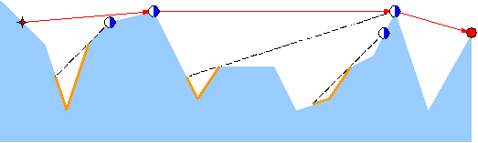
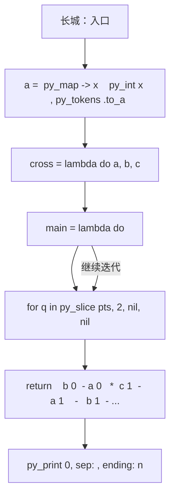
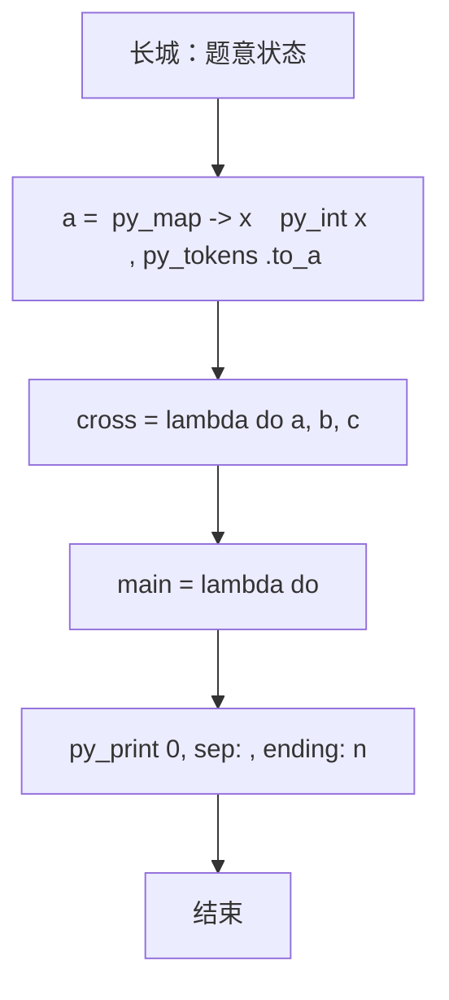

# L3-009 - 长城（30 分）

- **时间限制**: 500 ms
- **内存限制**: 65536 KB
- **代码长度限制**: 16 KB

---

## 题目描述


正如我们所知，中国古代长城的建造是为了抵御外敌入侵。在长城上，建造了许多烽火台。每个烽火台都监视着一个特定的地区范围。一旦某个地区有外敌入侵，值守在对应烽火台上的士兵就会将敌情通报给周围的烽火台，并迅速接力地传递到总部。

现在如图1所示，若水平为南北方向、垂直为海拔高度方向，假设长城就是依次相联的一系列线段，而且在此范围内的任一垂直线与这些线段有且仅有唯一的交点。


**图 1**

进一步地，假设烽火台只能建造在线段的端点处。我们认为烽火台本身是没有高度的，每个烽火台只负责向北方（图1中向左）瞭望，而且一旦有外敌入侵，只要敌人与烽火台之间未被山体遮挡，哨兵就会立即察觉。当然，按照这一军规，对于南侧的敌情各烽火台并不负责任。一旦哨兵发现敌情，他就会立即以狼烟或烽火的形式，向其南方的烽火台传递警报，直到位于最南侧的总部。

以图2中的长城为例，负责守卫的四个烽火台用蓝白圆点示意，最南侧的总部用红色圆点示意。如果红色星形标示的地方出现敌情，将被哨兵们发现并沿红色折线将警报传递到总部。当然，就这个例子而言只需两个烽火台的协作，但其他位置的敌情可能需要更多。

然而反过来，即便这里的4个烽火台全部参与，依然有不能覆盖的（黄色）区域。



**图 2**

另外，为避免歧义，我们在这里约定，与某个烽火台的视线刚好相切的区域都认为可以被该烽火台所监视。以图3中的长城为例，若A、B、C、D点均共线，且在D点设置一处烽火台，则A、B、C以及线段BC上的任何一点都在该烽火台的监视范围之内。


**图 3**

好了，倘若你是秦始皇的太尉，为不致出现更多孟姜女式的悲剧，如何在保证长城安全的前提下，使消耗的民力（建造的烽火台）最少呢？

### 输入格式:

输入在第一行给出一个正整数`N`（3 $$\le$$ `N` $$\le 10^5$$），即刻画长城边缘的折线顶点（含起点和终点）数。随后`N`行，每行给出一个顶点的`x`和`y`坐标，其间以空格分隔。注意顶点从南到北依次给出，第一个顶点为总部所在位置。坐标为区间$$[-10^9, 10^9)$$内的整数，且没有重合点。

### 输出格式:

在一行中输出所需建造烽火台（不含总部）的最少数目。

### 输入样例:
```in
10
67 32
48 -49
32 53
22 -44
19 22
11 40
10 -65
-1 -23
-3 31
-7 59
```

### 输出样例:
```out
2
```

## 示例

### 示例 1

**输入:**
```
10
67 32
48 -49
32 53
22 -44
19 22
11 40
10 -65
-1 -23
-3 31
-7 59
```

**输出:**
```
2
```

### 实现原理与解题思路

本题的实现原理是：使用栈、队列或二分边界维护操作顺序，在每次操作后保持数据结构的题目约束。先读取标准输入并按题目格式拆分字段，使用代码中的`cross`、`a`、`n`、`p`保存计算过程，通过 2 个循环阶段逐步更新；处理完成后按照题目规定的顺序和格式输出结果。

### 代码流程说明

1. 读取并解析标准输入，转换为题目所需的数据结构。
2. 按题意执行核心算法，维护中间状态并处理边界情况。
3. 整理计算结果，按照输出格式生成答案。

### 代码实现

下面给出可独立运行的完整 Ruby 实现，关键步骤已在代码中标注。

```ruby
# frozen_string_literal: true
# 这些辅助方法只负责把题目输入、输出和常见序列操作映射为 Ruby 写法，
# 算法主体仍在下方的 entry 方法中，代码复制后可以独立运行。
module PTACompat
  UNSET = Object.new

  class CounterHash < Hash
    def initialize
      super(0)
    end
  end

  def py_tokens
    @pta_tokens ||= STDIN.read.split
  end

  def py_input_data
    @pta_input_data ||= STDIN.read
  end

  def py_readline
    STDIN.gets.to_s.chomp
  end

  def py_lines
    @pta_lines ||= STDIN.each_line.map(&:chomp)
  end

  def py_print(*values, sep: " ", ending: "\n")
    STDOUT.write(values.map(&:to_s).join(sep) + ending)
  end

  def py_int(value)
    value.to_i
  end

  def py_float(value)
    value.to_f
  end

  def py_str(value)
    value.to_s
  end

  def py_bool_int(value)
    value ? 1 : 0
  end

  def py_truth(value)
    return false if value.nil? || value == false
    return false if value.respond_to?(:zero?) && value.zero?
    return false if value.respond_to?(:empty?) && value.empty?

    true
  end

  def py_range(*args)
    first, last, step =
      case args.length
      when 1
        [0, args[0], 1]
      when 2
        [args[0], args[1], 1]
      else
        args
      end
    first = first.to_i
    last = last.to_i
    step = step.to_i
    raise ArgumentError, "range step cannot be zero" if step.zero?

    values = []
    current = first
    if step.positive?
      while current < last
        values << current
        current += step
      end
    else
      while current > last
        values << current
        current += step
      end
    end
    values
  end

  def py_map(function, values)
    values.map { |value| function.call(value) }
  end

  def py_iter(value)
    value.to_enum
  end

  def py_next(iterator)
    iterator.next
  end

  def py_iterable(value)
    value.is_a?(String) ? value.chars : value.to_a
  end

  def py_enumerate(values)
    values.each_with_index.map { |value, index| [index, value] }
  end

  def py_zip(*values)
    values.first.zip(*values.drop(1))
  end

  def py_slice(value, start_index = nil, stop_index = nil, step = nil)
    step ||= 1
    source = value.is_a?(String) ? value.chars : value.to_a
    size = source.length
    start_index = step.positive? ? 0 : size - 1 if start_index.nil?
    stop_index = step.positive? ? size : -size - 1 if stop_index.nil?
    start_index += size if start_index.negative?
    stop_index += size if stop_index.negative? && stop_index >= -size
    start_index =
      (
        if step.positive?
          [[start_index, 0].max, size].min
        else
          [[start_index, -1].max, size - 1].min
        end
      )
    stop_index =
      (
        if step.positive?
          [[stop_index, 0].max, size].min
        else
          [[stop_index, -1].max, size - 1].min
        end
      )

    result = []
    index = start_index
    if step.positive?
      while index < stop_index
        result << source[index]
        index += step
      end
    else
      while index > stop_index
        result << source[index]
        index += step
      end
    end
    value.is_a?(String) ? result.join : result
  end

  def py_len(value)
    value.length
  end

  def py_sum(values, initial = 0)
    values.sum(initial)
  end

  def py_abs(value)
    value.abs
  end

  def py_div(a, b)
    a.to_f / b
  end

  def py_divmod(a, b)
    [a.div(b), a % b]
  end

  def py_factorial(value)
    (1..value).reduce(1, :*)
  end

  def py_gcd(a, b)
    a.gcd(b)
  end

  def py_pow(base, exponent, modulus = nil)
    modulus.nil? ? base**exponent : base.pow(exponent, modulus)
  end

  def py_in(item, container)
    container.include?(item)
  end

  def py_counter(_values)
    CounterHash.new
  end

  def py_sorted(values, key: nil, reverse: false)
    result = (key ? values.sort_by { |value| key.call(value) } : values.sort)
    reverse ? result.reverse : result
  end

  def py_max(*values, key: nil, default: UNSET)
    values = values.first.to_a if values.length == 1 &&
      values.first.respond_to?(:each) && !values.first.is_a?(Numeric)
    return default unless values.any?

    key ? values.max_by { |value| key.call(value) } : values.max
  end

  def py_min(*values, key: nil, default: UNSET)
    values = values.first.to_a if values.length == 1 &&
      values.first.respond_to?(:each) && !values.first.is_a?(Numeric)
    return default unless values.any?

    key ? values.min_by { |value| key.call(value) } : values.min
  end

  def py_re_sub(pattern, replacement, value)
    value.gsub(Regexp.new(pattern), replacement)
  end

  def py_lstrip(value, chars)
    value.sub(/\A[#{Regexp.escape(chars)}]+/, "")
  end

  def py_startswith_at(value, prefix, index)
    value[index, prefix.length] == prefix
  end

  def py_replace_slice(value, start_index, stop_index, replacement)
    value[start_index...stop_index] = replacement
    value
  end

  def py_bisect_left(values, target)
    left = 0
    right = values.length
    while left < right
      middle = (left + right) / 2
      if values[middle] < target
        left = middle + 1
      else
        right = middle
      end
    end
    left
  end

  def py_bisect_right(values, target)
    left = 0
    right = values.length
    while left < right
      middle = (left + right) / 2
      if values[middle] <= target
        left = middle + 1
      else
        right = middle
      end
    end
    left
  end
end

class Hash
  def items
    to_a
  end
end

include PTACompat

# 题目入口：读取输入、执行核心算法并输出答案。

def entry
  cross =
    lambda do |a, b, c|
      return(((b[0] - a[0]) * (c[1] - a[1])) - ((b[1] - a[1]) * (c[0] - a[0])))
    end
  main =
    lambda do ||
      # 读取并解析题目输入。
      a = (py_map(->(x) { py_int(x) }, py_tokens).to_a)
      return if (!py_truth(a))
      n = a[0]
      p = 1
      pts =
        py_iterable(py_range(n)).flat_map do |i|
          [[a[(p + (2 * i))], a[((p + (2 * i)) + 1)]]]
        end
      if ((n <= 2))
        # 按题目要求输出最终结果。
        py_print(0, sep: " ", ending: "\n")
        return
      end
      # 初始化算法状态，保持后续转移所需的不变量。
      stack = [pts[0], pts[1]]
      ans = 0
      # 按题目规则遍历输入或状态空间。
      for q in py_slice(pts, 2, nil, nil)
        popped = false
        while (
                ((py_len(stack) >= 2)) &&
                  ((cross.call(stack[(-2)], stack[(-1)], q) <= 0))
              )
          stack.pop()
          popped = true
        end
        ans += 1 if (!py_truth(popped))
        stack.append(q)
      end
      py_print(ans, sep: " ", ending: "\n")
    end
  main.call
end
entry

```

### 代码流程图



### 解题流程图


