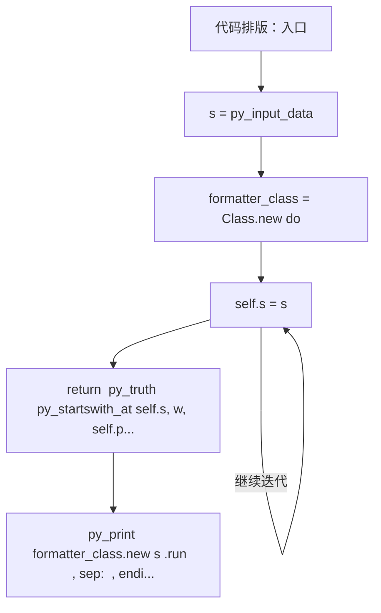
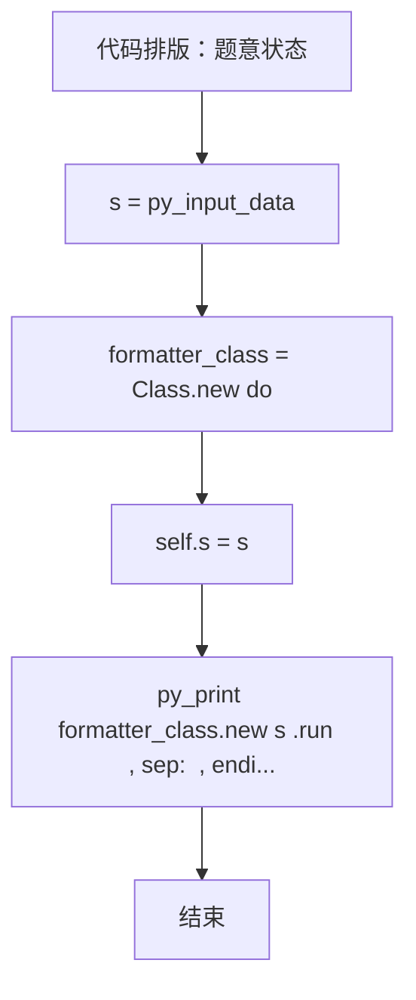

# L3-019 - 代码排版（30 分）

| 项目 | 限制 |
| --- | --- |
| 时间限制 | 150 ms |
| 内存限制 | 65536 KB |
| 代码长度限制 | 16 KB |

## 题目描述

某编程大赛中设计有一个挑战环节，选手可以查看其他选手的代码，发现错误后，提交一组测试数据将对手挑落马下。为了减小被挑战的几率，有些选手会故意将代码写得很难看懂，比如把所有回车去掉，提交所有内容都在一行的程序，令挑战者望而生畏。

为了对付这种选手，现请你编写一个代码排版程序，将写成一行的程序重新排版。当然要写一个完美的排版程序可太难了，这里只简单地要求处理C语言里的for、while、if-else这三种特殊结构，而将其他所有句子都当成顺序执行的语句处理。输出的要求如下：

- 默认程序起始没有缩进；每一级缩进是 2 个空格；
- 每行开头除了规定的缩进空格外，不输出多余的空格；
- 顺序执行的程序体是以分号“;”结尾的，遇到分号就换行；
- 在一对大括号“{”和“}”中的程序体输出时，两端的大括号单独占一行，内部程序体每行加一级缩进，即：

```
{
  程序体
}
```

- for的格式为：

```
for (条件) {
  程序体
}
```

- while的格式为：

```
while (条件) {
  程序体
}
```

- if-else的格式为：

```
if (条件) {
  程序体
}
else {
  程序体
}
```

### 输入格式

输入在一行中给出不超过 331 个字符的非空字符串，以回车结束。题目保证输入的是一个语法正确、可以正常编译运行的 main 函数模块。

### 输出格式

按题面要求的格式，输出排版后的程序。

### 输入样例
```in
int main()  {int n, i;  scanf("%d", &n);if( n>0)n++;else if (n<0) n--; else while(n<10)n++; for(i=0;  i<n; i++ ){ printf("n=%d\n", n);}return  0; }
```

### 输出样例
```out
int main()
{
  int n, i;
  scanf("%d", &n);
  if ( n>0) {
    n++;
  }
  else {
    if (n<0) {
      n--;
    }
    else {
      while (n<10) {
        n++;
      }
    }
  }
  for (i=0;  i<n; i++ ) {
    printf("n=%d\n", n);
  }
  return  0;
}
```

## 参考样例

### 样例 1

**输入**
```
int main()  {int n, i;  scanf("%d", &n);if( n>0)n++;else if (n<0) n--; else while(n<10)n++; for(i=0;  i<n; i++ ){ printf("n=%d\n", n);}return  0; }
```

**输出**
```
int main()
{
  int n, i;
  scanf("%d", &n);
  if ( n>0) {
    n++;
  }
  else {
    if (n<0) {
      n--;
    }
    else {
      while (n<10) {
        n++;
      }
    }
  }
  for (i=0;  i<n; i++ ) {
    printf("n=%d\n", n);
  }
  return  0;
}
```

## 实现原理与解题思路

本题的实现原理是：按题目格式读取字符串或数值，逐项维护必要状态，并在每次判断时直接执行题目给出的规则。先读取标准输入并按题目格式拆分字段，使用代码中的`formatter_class`、`start`、`dep`、`quote`保存计算过程，通过 4 个循环阶段逐步更新；处理完成后按照题目规定的顺序和格式输出结果。

## 代码流程说明

1. 读取并解析标准输入，转换为题目所需的数据结构。
2. 按题意执行核心算法，维护中间状态并处理边界情况。
3. 整理计算结果，按照输出格式生成答案。

## 代码实现

下面给出可独立运行的完整 Ruby 实现，关键步骤已在代码中标注。

```ruby
# frozen_string_literal: true
# 这些辅助方法只负责把题目输入、输出和常见序列操作映射为 Ruby 写法，
# 算法主体仍在下方的 entry 方法中，代码复制后可以独立运行。
module PTACompat
  UNSET = Object.new

  class CounterHash < Hash
    def initialize
      super(0)
    end
  end

  def py_tokens
    @pta_tokens ||= STDIN.read.split
  end

  def py_input_data
    @pta_input_data ||= STDIN.read
  end

  def py_readline
    STDIN.gets.to_s.chomp
  end

  def py_lines
    @pta_lines ||= STDIN.each_line.map(&:chomp)
  end

  def py_print(*values, sep: " ", ending: "\n")
    STDOUT.write(values.map(&:to_s).join(sep) + ending)
  end

  def py_int(value)
    value.to_i
  end

  def py_float(value)
    value.to_f
  end

  def py_str(value)
    value.to_s
  end

  def py_bool_int(value)
    value ? 1 : 0
  end

  def py_truth(value)
    return false if value.nil? || value == false
    return false if value.respond_to?(:zero?) && value.zero?
    return false if value.respond_to?(:empty?) && value.empty?

    true
  end

  def py_range(*args)
    first, last, step =
      case args.length
      when 1
        [0, args[0], 1]
      when 2
        [args[0], args[1], 1]
      else
        args
      end
    first = first.to_i
    last = last.to_i
    step = step.to_i
    raise ArgumentError, "range step cannot be zero" if step.zero?

    values = []
    current = first
    if step.positive?
      while current < last
        values << current
        current += step
      end
    else
      while current > last
        values << current
        current += step
      end
    end
    values
  end

  def py_map(function, values)
    values.map { |value| function.call(value) }
  end

  def py_iter(value)
    value.to_enum
  end

  def py_next(iterator)
    iterator.next
  end

  def py_iterable(value)
    value.is_a?(String) ? value.chars : value.to_a
  end

  def py_enumerate(values)
    values.each_with_index.map { |value, index| [index, value] }
  end

  def py_zip(*values)
    values.first.zip(*values.drop(1))
  end

  def py_slice(value, start_index = nil, stop_index = nil, step = nil)
    step ||= 1
    source = value.is_a?(String) ? value.chars : value.to_a
    size = source.length
    start_index = step.positive? ? 0 : size - 1 if start_index.nil?
    stop_index = step.positive? ? size : -size - 1 if stop_index.nil?
    start_index += size if start_index.negative?
    stop_index += size if stop_index.negative? && stop_index >= -size
    start_index =
      (
        if step.positive?
          [[start_index, 0].max, size].min
        else
          [[start_index, -1].max, size - 1].min
        end
      )
    stop_index =
      (
        if step.positive?
          [[stop_index, 0].max, size].min
        else
          [[stop_index, -1].max, size - 1].min
        end
      )

    result = []
    index = start_index
    if step.positive?
      while index < stop_index
        result << source[index]
        index += step
      end
    else
      while index > stop_index
        result << source[index]
        index += step
      end
    end
    value.is_a?(String) ? result.join : result
  end

  def py_len(value)
    value.length
  end

  def py_sum(values, initial = 0)
    values.sum(initial)
  end

  def py_abs(value)
    value.abs
  end

  def py_div(a, b)
    a.to_f / b
  end

  def py_divmod(a, b)
    [a.div(b), a % b]
  end

  def py_factorial(value)
    (1..value).reduce(1, :*)
  end

  def py_gcd(a, b)
    a.gcd(b)
  end

  def py_pow(base, exponent, modulus = nil)
    modulus.nil? ? base**exponent : base.pow(exponent, modulus)
  end

  def py_in(item, container)
    container.include?(item)
  end

  def py_counter(_values)
    CounterHash.new
  end

  def py_sorted(values, key: nil, reverse: false)
    result = (key ? values.sort_by { |value| key.call(value) } : values.sort)
    reverse ? result.reverse : result
  end

  def py_max(*values, key: nil, default: UNSET)
    values = values.first.to_a if values.length == 1 &&
      values.first.respond_to?(:each) && !values.first.is_a?(Numeric)
    return default unless values.any?

    key ? values.max_by { |value| key.call(value) } : values.max
  end

  def py_min(*values, key: nil, default: UNSET)
    values = values.first.to_a if values.length == 1 &&
      values.first.respond_to?(:each) && !values.first.is_a?(Numeric)
    return default unless values.any?

    key ? values.min_by { |value| key.call(value) } : values.min
  end

  def py_re_sub(pattern, replacement, value)
    value.gsub(Regexp.new(pattern), replacement)
  end

  def py_lstrip(value, chars)
    value.sub(/\A[#{Regexp.escape(chars)}]+/, "")
  end

  def py_startswith_at(value, prefix, index)
    value[index, prefix.length] == prefix
  end

  def py_replace_slice(value, start_index, stop_index, replacement)
    value[start_index...stop_index] = replacement
    value
  end

  def py_bisect_left(values, target)
    left = 0
    right = values.length
    while left < right
      middle = (left + right) / 2
      if values[middle] < target
        left = middle + 1
      else
        right = middle
      end
    end
    left
  end

  def py_bisect_right(values, target)
    left = 0
    right = values.length
    while left < right
      middle = (left + right) / 2
      if values[middle] <= target
        left = middle + 1
      else
        right = middle
      end
    end
    left
  end
end

class Hash
  def items
    to_a
  end
end

include PTACompat

# 题目入口：读取输入、执行核心算法并输出答案。

def entry
  formatter_class =
    Class.new do
      attr_accessor "control",
                    "kw",
                    "n",
                    "one",
                    "out",
                    "p",
                    "paren",
                    "s",
                    "semi",
                    "skip",
                    "stat"
      define_method(:initialize) do |s|
        self.s = s
        self.n = py_len(s)
        self.p = 0
        self.out = []
      end
      define_method(:skip) do ||
        # 按题目规则遍历输入或状态空间。
        while (
                ((self.p < self.n)) &&
                  py_truth((self.s[self.p].to_s.match?(/\A\s+\z/)))
              )
          self.p += 1
        end
      end
      define_method(:kw) do |w|
        return(
          py_truth(py_startswith_at(self.s, w, self.p)) &&
            (
              (((self.p + py_len(w)) == self.n)) ||
                (
                  !py_truth(
                    (
                      py_truth(
                        (
                          self.s[(self.p + py_len(w))].to_s.match?(
                            /\A[[:alnum:]]+\z/
                          )
                        )
                      ) || ((self.s[(self.p + py_len(w))] == "_"))
                    )
                  )
                )
            )
        )
      end
      define_method(:paren) do ||
        start = self.p
        dep = 0
        quote = nil
        esc = false
        while ((self.p < self.n))
          c = self.s[self.p]
          if py_truth(esc)
            esc = false
          else
            if py_truth(quote)
              if ((c == 92.chr))
                esc = true
              else
                quote = nil if ((c == quote))
              end
            else
              if (py_in(c, %q{"'}))
                quote = c
              else
                if ((c == "("))
                  dep += 1
                else
                  if ((c == ")"))
                    dep -= 1
                    if ((dep == 0))
                      self.p += 1
                      return py_slice(self.s, start, self.p, nil)
                    end
                  end
                end
              end
            end
          end
          self.p += 1
        end
        return py_slice(self.s, start, nil, nil)
      end
      define_method(:semi) do ||
        i = self.p
        dep = 0
        quote = nil
        esc = false
        while ((i < self.n))
          c = self.s[i]
          if py_truth(esc)
            esc = false
          else
            if py_truth(quote)
              if ((c == 92.chr))
                esc = true
              else
                quote = nil if ((c == quote))
              end
            else
              if (py_in(c, %q{"'}))
                quote = c
              else
                if ((c == "("))
                  dep += 1
                else
                  if ((c == ")"))
                    dep = py_max(0, (dep - 1))
                  else
                    return i if (((c == ";")) && ((dep == 0)))
                  end
                end
              end
            end
          end
          i += 1
        end
        return(self.n - 1)
      end
      define_method(:one) do |ind|
        self.skip()
        return if ((self.p >= self.n))
        if py_truth(self.kw("if"))
          self.control("if", ind)
        else
          if py_truth(self.kw("for"))
            self.control("for", ind)
          else
            if py_truth(self.kw("while"))
              self.control("while", ind)
            else
              if ((self.s[self.p] == "{"))
                self.out.append((("  " * ind) + "{"))
                self.p += 1
                self.stat((ind + 1))
                self.skip()
                if (((self.p < self.n)) && ((self.s[self.p] == "}")))
                  self.out.append((("  " * ind) + "}"))
                  self.p += 1
                end
              else
                j = self.semi()
                self.out.append(
                  (
                    ("  " * ind) +
                      py_slice(self.s, self.p, (j + 1), nil).strip()
                  )
                )
                self.p = (j + 1)
              end
            end
          end
        end
      end
      define_method(:stat) do |ind|
        while py_truth(true)
          self.skip()
          return if (((self.p >= self.n)) || ((self.s[self.p] == "}")))
          self.one(ind)
        end
      end
      define_method(:control) do |name, ind|
        self.p += py_len(name)
        self.skip()
        cond =
          (
            if (((self.p < self.n)) && ((self.s[self.p] == "(")))
              self.paren()
            else
              ""
            end
          )
        self.out.append(((((("  " * ind) + name) + " ") + cond) + " {"))
        self.skip()
        if (((self.p < self.n)) && ((self.s[self.p] == "{")))
          self.p += 1
          self.stat((ind + 1))
          self.skip()
          self.p += 1 if (((self.p < self.n)) && ((self.s[self.p] == "}")))
        else
          self.one((ind + 1))
        end
        self.out.append((("  " * ind) + "}"))
        if ((name == "if"))
          save = self.p
          self.skip()
          if py_truth(self.kw("else"))
            self.p += 4
            self.skip()
            self.out.append((("  " * ind) + "else {"))
            if py_truth(self.kw("if"))
              self.control("if", (ind + 1))
            else
              if (((self.p < self.n)) && ((self.s[self.p] == "{")))
                self.p += 1
                self.stat((ind + 1))
                self.skip()
                if (((self.p < self.n)) && ((self.s[self.p] == "}")))
                  self.p += 1
                end
              else
                self.one((ind + 1))
              end
            end
            self.out.append((("  " * ind) + "}"))
          else
            self.p = save
          end
        end
      end
      define_method(:run) do ||
        self.skip()
        j = self.s.index("{") || -1
        if ((j >= 0))
          self.out.append(py_slice(self.s, self.p, j, nil).strip())
          self.out.append("{")
          self.p = (j + 1)
          self.stat(1)
          self.skip()
          if (((self.p < self.n)) && ((self.s[self.p] == "}")))
            self.out.append("}")
            self.p += 1
          end
        else
          self.stat(0)
        end
        return(self.out.join("\n") + "\n")
      end
    end
  main =
    lambda do ||
      # 读取并解析题目输入。
      s = py_input_data
      if py_truth(s.strip())
        # 按题目要求输出最终结果。
        py_print(formatter_class.new(s).run(), sep: " ", ending: "")
      end
    end
  main.call
end
entry

```

## 代码流程图



## 解题流程图


