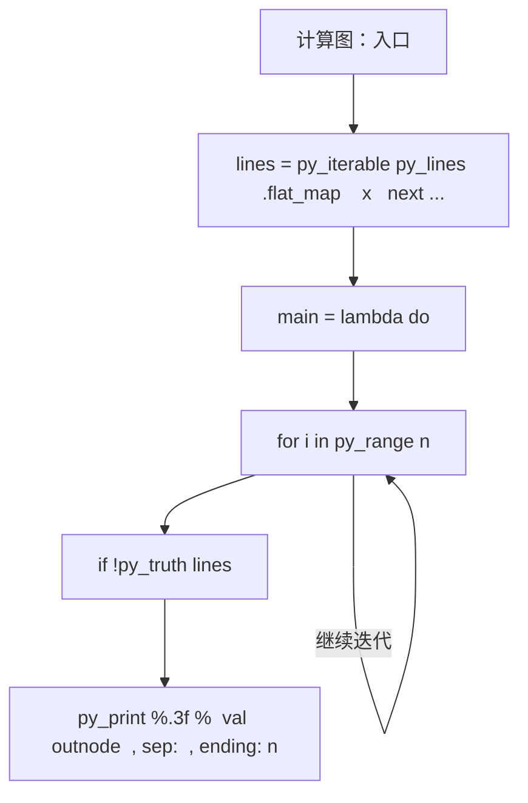
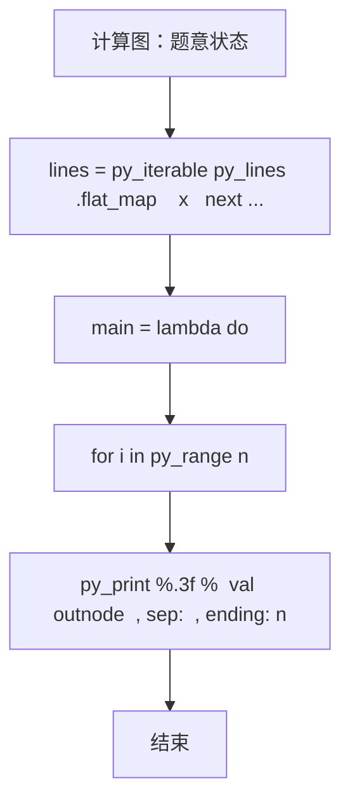

# L3-023 - 计算图（30 分）

| 项目 | 限制 |
| --- | --- |
| 时间限制 | 400 ms |
| 内存限制 | 65536 KB |
| 代码长度限制 | 16 KB |

## 题目描述

“计算图”（computational graph）是现代深度学习系统的基础执行引擎，提供了一种表示任意数学表达式的方法，例如用有向无环图表示的神经网络。 图中的节点表示基本操作或输入变量，边表示节点之间的中间值的依赖性。 例如，下图就是一个函数
$$f(x_1,x_2)=\ln x_1 + x_1 x_2 - \sin x_2$$
的计算图。


现在给定一个计算图，请你根据所有输入变量计算函数值及其偏导数（即梯度）。 例如，给定输入$$ x_1 = 2, x_2 = 5 $$，上述计算图获得函数值 $$ f(2,5)=\ln (2) + 2\times 5 - \sin (5) = 11.652$$；并且根据微分链式法则，上图得到的梯度 $$\nabla f = [\partial f / \partial x_1 , \partial f / \partial x_2 ] =   [ 1/x_1 + x_2 , x_1 - \cos x_2] = [5.500,1.716]$$。

知道你已经把微积分忘了，所以这里只要求你处理几个简单的算子：加法、减法、乘法、指数（$$e^x$$，即编程语言中的 exp(x) 函数）、对数（$$\ln x$$，即编程语言中的 log(x) 函数）和正弦函数（$$\sin x$$，即编程语言中的 sin(x) 函数）。

友情提醒：

- 常数的导数是 0；$$x$$ 的导数是 1；$$e^x$$ 的导数还是 $$e^x$$；$$\ln x$$ 的导数是 $$1/x$$；$$\sin x$$ 的导数是 $$\cos x$$。
- 回顾一下什么是**偏导数**：在数学中，一个多变量的函数的偏导数，就是它关于其中一个变量的导数而保持其他变量恒定。在上面的例子中，当我们对 $$x_1$$ 求偏导数 $$\partial f / \partial x_1$$ 时，就将 $$x_2$$ 当成常数，所以得到 $$\ln x_1$$ 的导数是 $$1/x_1$$，$$x_1 x_2$$ 的导数是 $$x_2$$，$$\sin x_2$$ 的导数是 0。
- 回顾一下**链式法则**：复合函数的导数是构成复合这有限个函数在相应点的导数的乘积，即若有 $$u=f(y)$$，$$y=g(x)$$，则 $$du/dx = du/dy \cdot dy/dx$$。例如对 $$\sin (\ln x)$$ 求导，就得到 $$\cos (\ln x) \cdot (1/x)$$。

如果你注意观察，可以发现在计算图中，计算函数值是一个从左向右进行的计算，而计算偏导数则正好相反。

### 输入格式

输入在第一行给出正整数 $$N$$（$$\le 5\times 10^4$$），为计算图中的顶点数。

以下 $$N$$ 行，第 $$i$$ 行给出第 $$i$$ 个顶点的信息，其中 $$i=0, 1, \cdots , N-1$$。第一个值是顶点的类型编号，分别为：

- 0 代表输入变量
- 1 代表加法，对应 $$x_1 + x_2$$
- 2 代表减法，对应 $$x_1 - x_2$$
- 3 代表乘法，对应 $$x_1 \times x_2$$
- 4 代表指数，对应 $$e^x$$
- 5 代表对数，对应 $$\ln x$$
- 6 代表正弦函数，对应 $$\sin x$$

对于输入变量，后面会跟它的双精度浮点数值；对于单目算子，后面会跟它对应的单个变量的顶点编号（编号从 0 开始）；对于双目算子，后面会跟它对应两个变量的顶点编号。

题目保证只有一个输出顶点（即没有出边的顶点，例如上图最右边的 `-`），且计算过程不会超过双精度浮点数的计算精度范围。

### 输出格式

首先在第一行输出给定计算图的函数值。在第二行顺序输出函数对于每个变量的偏导数的值，其间以一个空格分隔，行首尾不得有多余空格。偏导数的输出顺序与输入变量的出现顺序相同。输出小数点后 3 位。

### 输入样例
```in
7
0 2.0
0 5.0
5 0
3 0 1
6 1
1 2 3
2 5 4
```

### 输出样例
```out
11.652
5.500 1.716
```

## 参考样例

### 样例 1

**输入**
```
7
0 2.0
0 5.0
5 0
3 0 1
6 1
1 2 3
2 5 4
```

**输出**
```
11.652
5.500 1.716
```

## 实现原理与解题思路

本题的实现原理是：按题目格式读取字符串或数值，逐项维护必要状态，并在每次判断时直接执行题目给出的规则。先读取标准输入并按题目格式拆分字段，使用代码中的`lines`、`n`、`typ`、`val`保存计算过程，通过 6 个循环阶段逐步更新；处理完成后按照题目规定的顺序和格式输出结果。

## 代码流程说明

1. 读取并解析标准输入，转换为题目所需的数据结构。
2. 按题意执行核心算法，维护中间状态并处理边界情况。
3. 整理计算结果，按照输出格式生成答案。

## 代码实现

下面给出可独立运行的完整 Ruby 实现，关键步骤已在代码中标注。

```ruby
# frozen_string_literal: true
# 这些辅助方法只负责把题目输入、输出和常见序列操作映射为 Ruby 写法，
# 算法主体仍在下方的 entry 方法中，代码复制后可以独立运行。
module PTACompat
  UNSET = Object.new

  class CounterHash < Hash
    def initialize
      super(0)
    end
  end

  def py_tokens
    @pta_tokens ||= STDIN.read.split
  end

  def py_input_data
    @pta_input_data ||= STDIN.read
  end

  def py_readline
    STDIN.gets.to_s.chomp
  end

  def py_lines
    @pta_lines ||= STDIN.each_line.map(&:chomp)
  end

  def py_print(*values, sep: " ", ending: "\n")
    STDOUT.write(values.map(&:to_s).join(sep) + ending)
  end

  def py_int(value)
    value.to_i
  end

  def py_float(value)
    value.to_f
  end

  def py_str(value)
    value.to_s
  end

  def py_bool_int(value)
    value ? 1 : 0
  end

  def py_truth(value)
    return false if value.nil? || value == false
    return false if value.respond_to?(:zero?) && value.zero?
    return false if value.respond_to?(:empty?) && value.empty?

    true
  end

  def py_range(*args)
    first, last, step =
      case args.length
      when 1
        [0, args[0], 1]
      when 2
        [args[0], args[1], 1]
      else
        args
      end
    first = first.to_i
    last = last.to_i
    step = step.to_i
    raise ArgumentError, "range step cannot be zero" if step.zero?

    values = []
    current = first
    if step.positive?
      while current < last
        values << current
        current += step
      end
    else
      while current > last
        values << current
        current += step
      end
    end
    values
  end

  def py_map(function, values)
    values.map { |value| function.call(value) }
  end

  def py_iter(value)
    value.to_enum
  end

  def py_next(iterator)
    iterator.next
  end

  def py_iterable(value)
    value.is_a?(String) ? value.chars : value.to_a
  end

  def py_enumerate(values)
    values.each_with_index.map { |value, index| [index, value] }
  end

  def py_zip(*values)
    values.first.zip(*values.drop(1))
  end

  def py_slice(value, start_index = nil, stop_index = nil, step = nil)
    step ||= 1
    source = value.is_a?(String) ? value.chars : value.to_a
    size = source.length
    start_index = step.positive? ? 0 : size - 1 if start_index.nil?
    stop_index = step.positive? ? size : -size - 1 if stop_index.nil?
    start_index += size if start_index.negative?
    stop_index += size if stop_index.negative? && stop_index >= -size
    start_index =
      (
        if step.positive?
          [[start_index, 0].max, size].min
        else
          [[start_index, -1].max, size - 1].min
        end
      )
    stop_index =
      (
        if step.positive?
          [[stop_index, 0].max, size].min
        else
          [[stop_index, -1].max, size - 1].min
        end
      )

    result = []
    index = start_index
    if step.positive?
      while index < stop_index
        result << source[index]
        index += step
      end
    else
      while index > stop_index
        result << source[index]
        index += step
      end
    end
    value.is_a?(String) ? result.join : result
  end

  def py_len(value)
    value.length
  end

  def py_sum(values, initial = 0)
    values.sum(initial)
  end

  def py_abs(value)
    value.abs
  end

  def py_div(a, b)
    a.to_f / b
  end

  def py_divmod(a, b)
    [a.div(b), a % b]
  end

  def py_factorial(value)
    (1..value).reduce(1, :*)
  end

  def py_gcd(a, b)
    a.gcd(b)
  end

  def py_pow(base, exponent, modulus = nil)
    modulus.nil? ? base**exponent : base.pow(exponent, modulus)
  end

  def py_in(item, container)
    container.include?(item)
  end

  def py_counter(_values)
    CounterHash.new
  end

  def py_sorted(values, key: nil, reverse: false)
    result = (key ? values.sort_by { |value| key.call(value) } : values.sort)
    reverse ? result.reverse : result
  end

  def py_max(*values, key: nil, default: UNSET)
    values = values.first.to_a if values.length == 1 &&
      values.first.respond_to?(:each) && !values.first.is_a?(Numeric)
    return default unless values.any?

    key ? values.max_by { |value| key.call(value) } : values.max
  end

  def py_min(*values, key: nil, default: UNSET)
    values = values.first.to_a if values.length == 1 &&
      values.first.respond_to?(:each) && !values.first.is_a?(Numeric)
    return default unless values.any?

    key ? values.min_by { |value| key.call(value) } : values.min
  end

  def py_re_sub(pattern, replacement, value)
    value.gsub(Regexp.new(pattern), replacement)
  end

  def py_lstrip(value, chars)
    value.sub(/\A[#{Regexp.escape(chars)}]+/, "")
  end

  def py_startswith_at(value, prefix, index)
    value[index, prefix.length] == prefix
  end

  def py_replace_slice(value, start_index, stop_index, replacement)
    value[start_index...stop_index] = replacement
    value
  end

  def py_bisect_left(values, target)
    left = 0
    right = values.length
    while left < right
      middle = (left + right) / 2
      if values[middle] < target
        left = middle + 1
      else
        right = middle
      end
    end
    left
  end

  def py_bisect_right(values, target)
    left = 0
    right = values.length
    while left < right
      middle = (left + right) / 2
      if values[middle] <= target
        left = middle + 1
      else
        right = middle
      end
    end
    left
  end
end

class Hash
  def items
    to_a
  end
end

include PTACompat

# 题目入口：读取输入、执行核心算法并输出答案。

def entry
  main =
    lambda do ||
      lines =
        # 读取并解析题目输入。
        py_iterable(py_lines).flat_map do |x|
          next [] unless py_truth(x.strip())
          [x.split()]
        end
      return if (!py_truth(lines))
      n = py_int(lines[0][0])
      typ = ([0] * n)
      val = ([0.0] * n)
      ins = ([nil] * n)
      outs = py_iterable(py_range(n)).flat_map { |_| [[]] }
      indeg = ([0] * n)
      inputs = []
      # 按题目规则遍历输入或状态空间。
      for i in py_range(n)
        z = lines[(i + 1)]
        t = py_int(z[0])
        typ[i] = t
        if ((t == 0))
          val[i] = py_float(z[1])
          inputs.append(i)
        else
          if ((t <= 3))
            ins[i] = [py_int(z[1]), py_int(z[2])]
            indeg[i] = 2
          else
            ins[i] = [py_int(z[1])]
            indeg[i] = 1
          end
        end
        if py_truth(ins[i])
          for u in ins[i]
            outs[u].append(i)
          end
        end
      end
      # 初始化算法状态，保持后续转移所需的不变量。
      q =
        py_iterable(py_range(n)).flat_map do |i|
          next [] unless py_truth(((indeg[i] == 0)))
          [i]
        end
      topo = []
      while py_truth(q)
        u = q.popleft()
        topo.append(u)
        for v in outs[u]
          indeg[v] -= 1
          q.append(v) if ((indeg[v] == 0))
        end
      end
      for u in topo
        t = typ[u]
        if ((t == 1))
          val[u] = (val[ins[u][0]] + val[ins[u][1]])
        else
          if ((t == 2))
            val[u] = (val[ins[u][0]] - val[ins[u][1]])
          else
            if ((t == 3))
              val[u] = (val[ins[u][0]] * val[ins[u][1]])
            else
              if ((t == 4))
                val[u] = Math.exp(val[ins[u][0]])
              else
                if ((t == 5))
                  val[u] = Math.log(val[ins[u][0]])
                else
                  val[u] = Math.sin(val[ins[u][0]]) if ((t == 6))
                end
              end
            end
          end
        end
      end
      outnode =
        py_next(
          py_iterable(py_range(n)).flat_map do |i|
            next [] unless py_truth((!py_truth(outs[i])))
            [i]
          end
        )
      grad = ([0.0] * n)
      grad[outnode] = 1
      for u in py_slice(topo, nil, nil, (-1))
        g = grad[u]
        t = typ[u]
        next if (!py_truth(g))
        if ((t == 1))
          grad[ins[u][0]] += g
          grad[ins[u][1]] += g
        else
          if ((t == 2))
            grad[ins[u][0]] += g
            grad[ins[u][1]] -= g
          else
            if ((t == 3))
              grad[ins[u][0]] += (g * val[ins[u][1]])
              grad[ins[u][1]] += (g * val[ins[u][0]])
            else
              if ((t == 4))
                grad[ins[u][0]] += (g * val[u])
              else
                if ((t == 5))
                  grad[ins[u][0]] += py_div(g, val[ins[u][0]])
                else
                  if ((t == 6))
                    grad[ins[u][0]] += (g * Math.cos(val[ins[u][0]]))
                  end
                end
              end
            end
          end
        end
      end
      # 按题目要求输出最终结果。
      py_print("%.3f" % [val[outnode]], sep: " ", ending: "\n")
      py_print(
        py_iterable(inputs)
          .flat_map do |i|
            ["%.3f" % [(((py_abs(grad[i]) < 0.0005)) ? 0 : grad[i])]]
          end
          .join(" "),
        sep: " ",
        ending: "\n"
      )
    end
  main.call
end
entry

```

## 代码流程图



## 解题流程图


