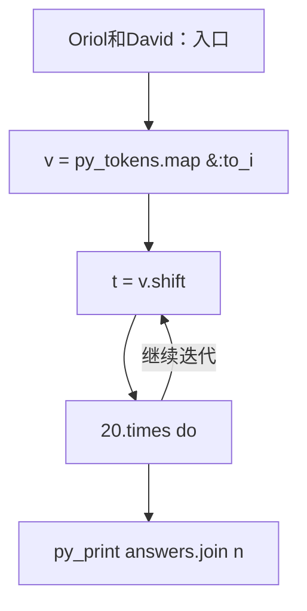
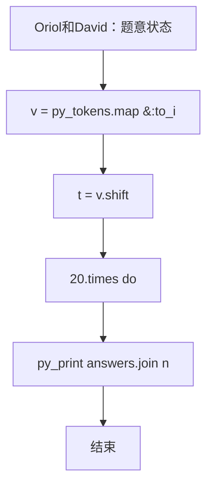

# L3-024 - Oriol和David（30 分）

| 项目 | 限制 |
| --- | --- |
| 时间限制 | 2000 ms |
| 内存限制 | 262144 KB |
| 代码长度限制 | 16 KB |

## 题目描述

Oriol 和 David 在一个边长为 16 单位长度的正方形区域内，初始位置分别为（7, 7）和（8, 8）。现在有 20 组、每组包含 20 个位置需要他们访问，位置以坐标（x, y）的形式给出，要求在时间 120 秒内访问尽可能多的点。（x和y均为正整数，且0 ≤ x < 16，0 ≤ y < 16）

注意事项：
* 针对任意一个位置，Oriol或David中的一人到达即视为访问成功；
* Oriol和David必须从第 1 组位置开始访问，且必须访问完第 i 组全部20个位置之后，才可以开始第 i + 1 组 20 个位置的访问。同组间各位置的访问顺序可自由决定；
* Oriol和David在完成当前组位置的访问后，无需返回开始位置、可以立即开始下一组位置的访问；
* Oriol和David可以向任意方向移动，移动时速率为 2 单位长度/秒；移动过程中，无任何障碍物阻拦。

### 输入格式

输入第一行是一个正整数 T (T ≤ 10)，表示数据组数。接下来给出 T 组数据。

对于每组数据，输入包含 20 组，每组 1 行，每行由 20 个坐标组成，每个坐标由 2 个整数 x 和 y 组成，代表 Oriol 和 David 要访问的 20 组 20 个位置的坐标；0 ≤ x < 16，0 ≤ y < 16，均用一个空格隔开。

### 输出格式

每组数据输出的第一行是一个整数N，代表分配方案访问过的位置组数；

接下来的N组每组的第一行包含两个整数 Ba 和 Bb，分别代表每组分配方案中 Oriol 和 David 负责访问的位置数，第二行和第三行分别包含 Ba 和 Bb 个整数 i，分别代表 Oriol 和 David 负责访问的位置在组内的序号（从0开始计数）。

0 ≤ N ≤ 20，0 ≤ Ba ≤ 20，0 ≤ Bb ≤ 20，0 ≤ i ≤ 19。

### 输入样例
```in
1
5 5 3 13 8 7 13 6 6 11 2 0 1 14 9 15 8 9 3 12 4 6 2 10 2 5 4 9 4 1 15 0 11 4 10 0 15 5 10 14
1 0 14 8 0 7 6 8 4 12 12 8 9 8 10 14 9 4 13 4 9 1 2 1 0 2 11 10 7 15 9 6 13 11 3 5 4 5 10 7
7 3 8 13 15 0 5 4 2 8 7 14 4 13 11 1 8 15 4 5 4 7 7 10 6 7 13 4 6 2 9 13 1 12 10 7 10 5 5 11
5 8 12 12 11 5 12 9 2 2 11 15 5 14 0 0 14 0 2 5 7 3 10 1 2 8 4 2 4 8 9 14 1 11 1 9 15 7 3 3
1 9 10 14 7 3 15 5 5 15 3 2 12 11 8 10 3 3 11 5 7 4 6 11 6 1 4 10 11 13 12 4 3 4 1 3 7 5 13 11
3 11 9 8 12 9 14 10 11 13 5 5 4 11 1 12 13 2 10 14 5 15 10 15 11 0 3 6 7 11 4 9 15 0 12 14 10 10 13 11
10 4 9 12 0 13 6 6 7 10 11 15 6 14 1 2 4 9 8 5 4 0 13 11 5 3 13 3 9 8 2 4 13 14 12 12 14 2 8 15
2 8 4 9 13 10 8 5 2 13 12 6 4 4 10 6 14 13 11 5 12 1 6 0 11 2 8 15 12 4 13 8 8 2 9 7 7 13 0 9
0 0 4 0 2 3 10 2 7 3 9 4 2 13 11 11 1 8 11 15 11 2 8 11 10 15 7 9 13 15 15 10 1 2 11 9 14 6 5 5
2 13 6 8 7 14 8 5 15 14 5 6 4 10 14 12 3 14 0 5 4 1 0 14 13 14 12 5 5 9 1 2 2 12 4 8 1 15 7 11
10 5 15 7 6 8 11 10 7 13 14 0 12 2 9 12 4 5 3 8 8 13 7 12 15 15 12 9 15 6 14 3 9 6 15 12 7 9 4 15
0 10 6 2 3 2 6 3 14 6 10 13 3 10 15 9 10 0 7 0 14 15 1 2 13 9 11 11 10 3 6 13 0 14 11 2 9 8 15 5
3 9 13 11 1 1 0 9 5 4 4 9 4 13 10 1 12 11 4 2 0 4 1 7 4 10 4 0 2 1 2 0 13 2 11 10 0 5 15 3
15 11 8 1 12 5 8 5 7 5 7 7 2 4 0 4 7 3 12 6 9 15 5 12 14 11 15 10 8 11 4 10 4 14 13 10 4 4 2 12
9 12 15 13 0 12 0 14 3 1 10 15 15 11 1 12 3 0 5 2 15 10 8 4 9 1 8 0 1 13 2 7 12 13 14 10 6 0 13 15
13 7 14 15 9 4 8 2 7 3 7 11 2 13 5 0 13 5 4 0 12 2 3 2 11 15 9 2 9 7 3 7 4 5 14 5 14 12 9 13
12 11 2 14 2 6 6 12 5 15 13 11 2 0 9 13 7 1 7 11 4 4 2 10 0 8 5 3 6 13 2 7 2 15 6 8 3 5 8 11
12 5 9 9 4 14 3 2 14 2 2 1 9 11 8 10 2 14 12 15 0 13 4 7 0 0 0 6 0 1 4 13 4 3 3 10 15 2 10 10
11 15 8 5 6 15 9 8 2 7 15 14 1 10 14 6 13 6 0 15 4 1 3 12 7 8 12 4 0 10 7 10 0 14 13 5 11 1 15 6
1 12 13 14 6 12 9 0 6 8 3 15 5 4 4 2 15 10 3 6 13 12 8 4 15 3 1 5 7 1 6 14 8 6 2 6 11 3 4 4
```

### 输出样例
```out
2
10 10
1 2 3 4 5 6 7 8 9 0
11 12 13 14 15 16 17 18 19 10
1 19
1
0 2 3 4 5 6 7 8 9 11 12 13 14 15 16 17 18 19 10
```

## 参考样例

### 样例 1

**输入**
```
1
5 5 3 13 8 7 13 6 6 11 2 0 1 14 9 15 8 9 3 12 4 6 2 10 2 5 4 9 4 1 15 0 11 4 10 0 15 5 10 14
1 0 14 8 0 7 6 8 4 12 12 8 9 8 10 14 9 4 13 4 9 1 2 1 0 2 11 10 7 15 9 6 13 11 3 5 4 5 10 7
7 3 8 13 15 0 5 4 2 8 7 14 4 13 11 1 8 15 4 5 4 7 7 10 6 7 13 4 6 2 9 13 1 12 10 7 10 5 5 11
5 8 12 12 11 5 12 9 2 2 11 15 5 14 0 0 14 0 2 5 7 3 10 1 2 8 4 2 4 8 9 14 1 11 1 9 15 7 3 3
1 9 10 14 7 3 15 5 5 15 3 2 12 11 8 10 3 3 11 5 7 4 6 11 6 1 4 10 11 13 12 4 3 4 1 3 7 5 13 11
3 11 9 8 12 9 14 10 11 13 5 5 4 11 1 12 13 2 10 14 5 15 10 15 11 0 3 6 7 11 4 9 15 0 12 14 10 10 13 11
10 4 9 12 0 13 6 6 7 10 11 15 6 14 1 2 4 9 8 5 4 0 13 11 5 3 13 3 9 8 2 4 13 14 12 12 14 2 8 15
2 8 4 9 13 10 8 5 2 13 12 6 4 4 10 6 14 13 11 5 12 1 6 0 11 2 8 15 12 4 13 8 8 2 9 7 7 13 0 9
0 0 4 0 2 3 10 2 7 3 9 4 2 13 11 11 1 8 11 15 11 2 8 11 10 15 7 9 13 15 15 10 1 2 11 9 14 6 5 5
2 13 6 8 7 14 8 5 15 14 5 6 4 10 14 12 3 14 0 5 4 1 0 14 13 14 12 5 5 9 1 2 2 12 4 8 1 15 7 11
10 5 15 7 6 8 11 10 7 13 14 0 12 2 9 12 4 5 3 8 8 13 7 12 15 15 12 9 15 6 14 3 9 6 15 12 7 9 4 15
0 10 6 2 3 2 6 3 14 6 10 13 3 10 15 9 10 0 7 0 14 15 1 2 13 9 11 11 10 3 6 13 0 14 11 2 9 8 15 5
3 9 13 11 1 1 0 9 5 4 4 9 4 13 10 1 12 11 4 2 0 4 1 7 4 10 4 0 2 1 2 0 13 2 11 10 0 5 15 3
15 11 8 1 12 5 8 5 7 5 7 7 2 4 0 4 7 3 12 6 9 15 5 12 14 11 15 10 8 11 4 10 4 14 13 10 4 4 2 12
9 12 15 13 0 12 0 14 3 1 10 15 15 11 1 12 3 0 5 2 15 10 8 4 9 1 8 0 1 13 2 7 12 13 14 10 6 0 13 15
13 7 14 15 9 4 8 2 7 3 7 11 2 13 5 0 13 5 4 0 12 2 3 2 11 15 9 2 9 7 3 7 4 5 14 5 14 12 9 13
12 11 2 14 2 6 6 12 5 15 13 11 2 0 9 13 7 1 7 11 4 4 2 10 0 8 5 3 6 13 2 7 2 15 6 8 3 5 8 11
12 5 9 9 4 14 3 2 14 2 2 1 9 11 8 10 2 14 12 15 0 13 4 7 0 0 0 6 0 1 4 13 4 3 3 10 15 2 10 10
11 15 8 5 6 15 9 8 2 7 15 14 1 10 14 6 13 6 0 15 4 1 3 12 7 8 12 4 0 10 7 10 0 14 13 5 11 1 15 6
1 12 13 14 6 12 9 0 6 8 3 15 5 4 4 2 15 10 3 6 13 12 8 4 15 3 1 5 7 1 6 14 8 6 2 6 11 3 4 4
```

**输出**
```
2
10 10
1 2 3 4 5 6 7 8 9 0
11 12 13 14 15 16 17 18 19 10
1 19
1
0 2 3 4 5 6 7 8 9 11 12 13 14 15 16 17 18 19 10
```

## 实现原理与解题思路

本题的实现原理是：使用栈、队列或二分边界维护操作顺序，在每次操作后保持数据结构的题目约束。先读取标准输入并按题目格式拆分字段，使用代码中的`v`、`t`、`answers`、`xa`保存计算过程，直接完成计算；处理完成后按照题目规定的顺序和格式输出结果。

## 代码流程说明

1. 读取并解析标准输入，转换为题目所需的数据结构。
2. 按题意执行核心算法，维护中间状态并处理边界情况。
3. 整理计算结果，按照输出格式生成答案。

## 代码实现

下面给出可独立运行的完整 Ruby 实现，关键步骤已在代码中标注。

```ruby
# frozen_string_literal: true
# 这些辅助方法只负责把题目输入、输出和常见序列操作映射为 Ruby 写法，
# 算法主体仍在下方的 entry 方法中，代码复制后可以独立运行。
module PTACompat
  UNSET = Object.new

  class CounterHash < Hash
    def initialize
      super(0)
    end
  end

  def py_tokens
    @pta_tokens ||= STDIN.read.split
  end

  def py_input_data
    @pta_input_data ||= STDIN.read
  end

  def py_readline
    STDIN.gets.to_s.chomp
  end

  def py_lines
    @pta_lines ||= STDIN.each_line.map(&:chomp)
  end

  def py_print(*values, sep: " ", ending: "\n")
    STDOUT.write(values.map(&:to_s).join(sep) + ending)
  end

  def py_int(value)
    value.to_i
  end

  def py_float(value)
    value.to_f
  end

  def py_str(value)
    value.to_s
  end

  def py_bool_int(value)
    value ? 1 : 0
  end

  def py_truth(value)
    return false if value.nil? || value == false
    return false if value.respond_to?(:zero?) && value.zero?
    return false if value.respond_to?(:empty?) && value.empty?

    true
  end

  def py_range(*args)
    first, last, step =
      case args.length
      when 1
        [0, args[0], 1]
      when 2
        [args[0], args[1], 1]
      else
        args
      end
    first = first.to_i
    last = last.to_i
    step = step.to_i
    raise ArgumentError, "range step cannot be zero" if step.zero?

    values = []
    current = first
    if step.positive?
      while current < last
        values << current
        current += step
      end
    else
      while current > last
        values << current
        current += step
      end
    end
    values
  end

  def py_map(function, values)
    values.map { |value| function.call(value) }
  end

  def py_iter(value)
    value.to_enum
  end

  def py_next(iterator)
    iterator.next
  end

  def py_iterable(value)
    value.is_a?(String) ? value.chars : value.to_a
  end

  def py_enumerate(values)
    values.each_with_index.map { |value, index| [index, value] }
  end

  def py_zip(*values)
    values.first.zip(*values.drop(1))
  end

  def py_slice(value, start_index = nil, stop_index = nil, step = nil)
    step ||= 1
    source = value.is_a?(String) ? value.chars : value.to_a
    size = source.length
    start_index = step.positive? ? 0 : size - 1 if start_index.nil?
    stop_index = step.positive? ? size : -size - 1 if stop_index.nil?
    start_index += size if start_index.negative?
    stop_index += size if stop_index.negative? && stop_index >= -size
    start_index =
      (
        if step.positive?
          [[start_index, 0].max, size].min
        else
          [[start_index, -1].max, size - 1].min
        end
      )
    stop_index =
      (
        if step.positive?
          [[stop_index, 0].max, size].min
        else
          [[stop_index, -1].max, size - 1].min
        end
      )

    result = []
    index = start_index
    if step.positive?
      while index < stop_index
        result << source[index]
        index += step
      end
    else
      while index > stop_index
        result << source[index]
        index += step
      end
    end
    value.is_a?(String) ? result.join : result
  end

  def py_len(value)
    value.length
  end

  def py_sum(values, initial = 0)
    values.sum(initial)
  end

  def py_abs(value)
    value.abs
  end

  def py_div(a, b)
    a.to_f / b
  end

  def py_divmod(a, b)
    [a.div(b), a % b]
  end

  def py_factorial(value)
    (1..value).reduce(1, :*)
  end

  def py_gcd(a, b)
    a.gcd(b)
  end

  def py_pow(base, exponent, modulus = nil)
    modulus.nil? ? base**exponent : base.pow(exponent, modulus)
  end

  def py_in(item, container)
    container.include?(item)
  end

  def py_counter(_values)
    CounterHash.new
  end

  def py_sorted(values, key: nil, reverse: false)
    result = (key ? values.sort_by { |value| key.call(value) } : values.sort)
    reverse ? result.reverse : result
  end

  def py_max(*values, key: nil, default: UNSET)
    values = values.first.to_a if values.length == 1 &&
      values.first.respond_to?(:each) && !values.first.is_a?(Numeric)
    return default unless values.any?

    key ? values.max_by { |value| key.call(value) } : values.max
  end

  def py_min(*values, key: nil, default: UNSET)
    values = values.first.to_a if values.length == 1 &&
      values.first.respond_to?(:each) && !values.first.is_a?(Numeric)
    return default unless values.any?

    key ? values.min_by { |value| key.call(value) } : values.min
  end

  def py_re_sub(pattern, replacement, value)
    value.gsub(Regexp.new(pattern), replacement)
  end

  def py_lstrip(value, chars)
    value.sub(/\A[#{Regexp.escape(chars)}]+/, "")
  end

  def py_startswith_at(value, prefix, index)
    value[index, prefix.length] == prefix
  end

  def py_replace_slice(value, start_index, stop_index, replacement)
    value[start_index...stop_index] = replacement
    value
  end

  def py_bisect_left(values, target)
    left = 0
    right = values.length
    while left < right
      middle = (left + right) / 2
      if values[middle] < target
        left = middle + 1
      else
        right = middle
      end
    end
    left
  end

  def py_bisect_right(values, target)
    left = 0
    right = values.length
    while left < right
      middle = (left + right) / 2
      if values[middle] <= target
        left = middle + 1
      else
        right = middle
      end
    end
    left
  end
end

class Hash
  def items
    to_a
  end
end

include PTACompat

# 题目入口：读取输入、执行核心算法并输出答案。

# 读取并解析题目输入。
v = py_tokens.map(&:to_i)
t = v.shift
answers = []
t.times do
  xa = ya = 7
  xb = yb = 8
  total = 0.0
  rounds = []
  20.times do
    points = 20.times.map { [v.shift, v.shift] }
    group_a = []
    group_b = []
    points.each_with_index do |(x, y), i|
      da = Math.hypot(x - xa, y - ya)
      db = Math.hypot(x - xb, y - yb)
      (da <= db ? group_a : group_b) << i
    end
    tour =
      lambda do |sx, sy, ids|
        current = [sx, sy]
        unused = ids.dup
        order = []
        distance = 0.0
        until unused.empty?
          j =
            unused.min_by do |i|
              Math.hypot(points[i][0] - current[0], points[i][1] - current[1])
            end
          distance +=
            Math.hypot(points[j][0] - current[0], points[j][1] - current[1])
          current = points[j]
          unused.delete(j)
          order << j
        end
        [distance, order]
      end
    cost_a, order_a = tour.call(xa, ya, group_a)
    cost_b, order_b = tour.call(xb, yb, group_b)
    time = [cost_a, cost_b].max / 2.0
    break if total + time > 120.0 + 1e-9
    total += time
    rounds << [order_a, order_b]
    xa, ya = points[order_a[-1]] if order_a.any?
    xb, yb = points[order_b[-1]] if order_b.any?
  end
  answers << rounds.length.to_s
  rounds.each do |oa, ob|
    answers << "#{oa.length} #{ob.length}"
    answers << oa.join(" ")
    answers << ob.join(" ")
  end
end
# 按题目要求输出最终结果。
py_print(answers.join("\n"))

```

## 代码流程图



## 解题流程图


