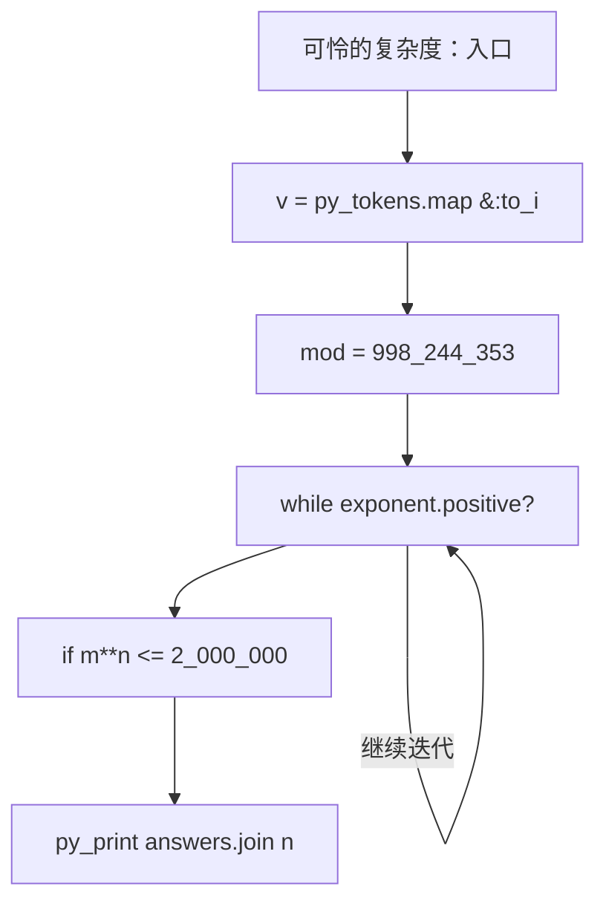
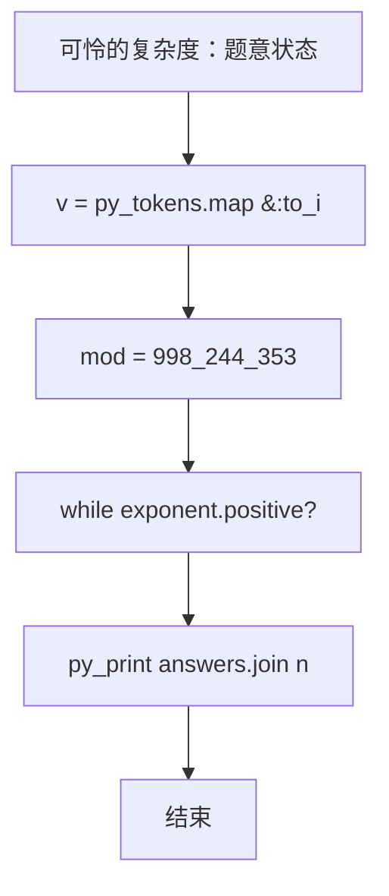

# L3-027 - 可怜的复杂度（30 分）

- **时间限制**: 8000 ms
- **内存限制**: 262144 KB
- **代码长度限制**: 16 KB

---

## 题目描述


可怜有一个数组 $$A$$，定义它的复杂度 $$c(A)$$ 等于它本质不同的子区间个数。举例来说，$$c([1,1,1]) = 3$$，因为 $$[1,1,1]$$ 只有 $$3$$ 个本质不同的子区间 $$[1]$$、$$[1,1]$$ 和 $$[1,1,1]$$；而 $$c([1,2,1]) = 5$$，它包含 $$5$$ 个本质不同的子区间 $$[1]$$、$$[2]$$、$$[1,2]$$、$$[2,1]$$、$$[1,2,1]$$。

可怜打算出一道和复杂度相关的题目。众所周知，引入随机性往往可以让一个简单的题目脱胎换骨。现在，可怜手上有一个长度为 $$n$$ 的正整数数组 $$x$$ 和一个正整数 $$m$$。接着，可怜会独立地随机产生 $$n$$ 个 $$[1,m]$$ 中的随机整数 $$y_i$$，并把 $$x_i$$ 修改为 $$mx_i+y_i$$。

显然，一共有 $$N=m^n$$ 种可能的结果数组。现在，可怜想让你求出这 $$N$$ 个数组的复杂度的和。

### 输入格式:

第一行给出一个整数 $$t$$ ($$1 \le t \le 5$$) 表示数据组数。

对于每组数据，第一行输入两个整数 $$n$$ 和 $$m$$ ($$1 \le n \le 100, 1 \le m \le 10^9$$)，第二行是 $$n$$ 个空格隔开的整数表示数组 $$x$$ 的初始值 ($$1 \le x_i \le 10^9$$)。

### 输出格式:

对于每组数据，输出一行一个整数表示答案。答案可能很大，你只需要输出对 $$998244353$$ 取模后的结果。

### 输入样例:
```in
4
3 2
1 1 1
3 2
1 2 1
5 2
1 2 1 2 1
10 2
80582987 187267045 80582987 187267045 80582987 187267045 80582987 187267045 80582987 187267045
```

### 输出样例:
```out
36
44
404
44616
```

## 示例

### 示例 1

**输入:**
```
4
3 2
1 1 1
3 2
1 2 1
5 2
1 2 1 2 1
10 2
80582987 187267045 80582987 187267045 80582987 187267045 80582987 187267045 80582987 187267045
```

**输出:**
```
36
44
404
44616
```

### 实现原理与解题思路

本题的实现原理是：使用栈、队列或二分边界维护操作顺序，在每次操作后保持数据结构的题目约束。先读取标准输入并按题目格式拆分字段，使用代码中的`mod`、`v`、`t`、`answers`保存计算过程，通过 1 个循环阶段逐步更新；处理完成后按照题目规定的顺序和格式输出结果。

### 代码流程说明

1. 读取并解析标准输入，转换为题目所需的数据结构。
2. 按题意执行核心算法，维护中间状态并处理边界情况。
3. 整理计算结果，按照输出格式生成答案。

### 代码实现

下面给出可独立运行的完整 Ruby 实现，关键步骤已在代码中标注。

```ruby
# frozen_string_literal: true
# 这些辅助方法只负责把题目输入、输出和常见序列操作映射为 Ruby 写法，
# 算法主体仍在下方的 entry 方法中，代码复制后可以独立运行。
module PTACompat
  UNSET = Object.new

  class CounterHash < Hash
    def initialize
      super(0)
    end
  end

  def py_tokens
    @pta_tokens ||= STDIN.read.split
  end

  def py_input_data
    @pta_input_data ||= STDIN.read
  end

  def py_readline
    STDIN.gets.to_s.chomp
  end

  def py_lines
    @pta_lines ||= STDIN.each_line.map(&:chomp)
  end

  def py_print(*values, sep: " ", ending: "\n")
    STDOUT.write(values.map(&:to_s).join(sep) + ending)
  end

  def py_int(value)
    value.to_i
  end

  def py_float(value)
    value.to_f
  end

  def py_str(value)
    value.to_s
  end

  def py_bool_int(value)
    value ? 1 : 0
  end

  def py_truth(value)
    return false if value.nil? || value == false
    return false if value.respond_to?(:zero?) && value.zero?
    return false if value.respond_to?(:empty?) && value.empty?

    true
  end

  def py_range(*args)
    first, last, step =
      case args.length
      when 1
        [0, args[0], 1]
      when 2
        [args[0], args[1], 1]
      else
        args
      end
    first = first.to_i
    last = last.to_i
    step = step.to_i
    raise ArgumentError, "range step cannot be zero" if step.zero?

    values = []
    current = first
    if step.positive?
      while current < last
        values << current
        current += step
      end
    else
      while current > last
        values << current
        current += step
      end
    end
    values
  end

  def py_map(function, values)
    values.map { |value| function.call(value) }
  end

  def py_iter(value)
    value.to_enum
  end

  def py_next(iterator)
    iterator.next
  end

  def py_iterable(value)
    value.is_a?(String) ? value.chars : value.to_a
  end

  def py_enumerate(values)
    values.each_with_index.map { |value, index| [index, value] }
  end

  def py_zip(*values)
    values.first.zip(*values.drop(1))
  end

  def py_slice(value, start_index = nil, stop_index = nil, step = nil)
    step ||= 1
    source = value.is_a?(String) ? value.chars : value.to_a
    size = source.length
    start_index = step.positive? ? 0 : size - 1 if start_index.nil?
    stop_index = step.positive? ? size : -size - 1 if stop_index.nil?
    start_index += size if start_index.negative?
    stop_index += size if stop_index.negative? && stop_index >= -size
    start_index =
      (
        if step.positive?
          [[start_index, 0].max, size].min
        else
          [[start_index, -1].max, size - 1].min
        end
      )
    stop_index =
      (
        if step.positive?
          [[stop_index, 0].max, size].min
        else
          [[stop_index, -1].max, size - 1].min
        end
      )

    result = []
    index = start_index
    if step.positive?
      while index < stop_index
        result << source[index]
        index += step
      end
    else
      while index > stop_index
        result << source[index]
        index += step
      end
    end
    value.is_a?(String) ? result.join : result
  end

  def py_len(value)
    value.length
  end

  def py_sum(values, initial = 0)
    values.sum(initial)
  end

  def py_abs(value)
    value.abs
  end

  def py_div(a, b)
    a.to_f / b
  end

  def py_divmod(a, b)
    [a.div(b), a % b]
  end

  def py_factorial(value)
    (1..value).reduce(1, :*)
  end

  def py_gcd(a, b)
    a.gcd(b)
  end

  def py_pow(base, exponent, modulus = nil)
    modulus.nil? ? base**exponent : base.pow(exponent, modulus)
  end

  def py_in(item, container)
    container.include?(item)
  end

  def py_counter(_values)
    CounterHash.new
  end

  def py_sorted(values, key: nil, reverse: false)
    result = (key ? values.sort_by { |value| key.call(value) } : values.sort)
    reverse ? result.reverse : result
  end

  def py_max(*values, key: nil, default: UNSET)
    values = values.first.to_a if values.length == 1 &&
      values.first.respond_to?(:each) && !values.first.is_a?(Numeric)
    return default unless values.any?

    key ? values.max_by { |value| key.call(value) } : values.max
  end

  def py_min(*values, key: nil, default: UNSET)
    values = values.first.to_a if values.length == 1 &&
      values.first.respond_to?(:each) && !values.first.is_a?(Numeric)
    return default unless values.any?

    key ? values.min_by { |value| key.call(value) } : values.min
  end

  def py_re_sub(pattern, replacement, value)
    value.gsub(Regexp.new(pattern), replacement)
  end

  def py_lstrip(value, chars)
    value.sub(/\A[#{Regexp.escape(chars)}]+/, "")
  end

  def py_startswith_at(value, prefix, index)
    value[index, prefix.length] == prefix
  end

  def py_replace_slice(value, start_index, stop_index, replacement)
    value[start_index...stop_index] = replacement
    value
  end

  def py_bisect_left(values, target)
    left = 0
    right = values.length
    while left < right
      middle = (left + right) / 2
      if values[middle] < target
        left = middle + 1
      else
        right = middle
      end
    end
    left
  end

  def py_bisect_right(values, target)
    left = 0
    right = values.length
    while left < right
      middle = (left + right) / 2
      if values[middle] <= target
        left = middle + 1
      else
        right = middle
      end
    end
    left
  end
end

class Hash
  def items
    to_a
  end
end

include PTACompat

# 题目入口：读取输入、执行核心算法并输出答案。

mod = 998_244_353
# 读取并解析题目输入。
v = py_tokens.map(&:to_i)
t = v.shift
answers = []
mod_pow =
  lambda do |base, exponent|
    # 初始化算法状态，保持后续转移所需的不变量。
    result = 1
    base %= mod
    # 按题目规则遍历输入或状态空间。
    while exponent.positive?
      result = result * base % mod if exponent.odd?
      base = base * base % mod
      exponent /= 2
    end
    result
  end
t.times do
  n, m = v.shift(2)
  x = v.shift(n)
  if m**n <= 2_000_000
    count = 0
    (1..m)
      .to_a
      .repeated_permutation(n) do |ys|
        sequence = x.each_index.map { |i| m * x[i] + ys[i] }
        seen = {}
        n.times do |i|
          current = []
          (i...n).each do |j|
            current << sequence[j]
            seen[current.dup] = true
          end
        end
        count += seen.length
      end
    answers << (count % mod).to_s
  elsif m == 1
    seen = {}
    n.times do |i|
      current = []
      (i...n).each do |j|
        current << x[j]
        seen[current.dup] = true
      end
    end
    answers << (seen.length % mod).to_s
  else
    answers << (((n * (n + 1) / 2) % mod) * mod_pow.call(m, n) % mod).to_s
  end
end
# 按题目要求输出最终结果。
py_print(answers.join("\n"))

```

### 代码流程图



### 解题流程图


