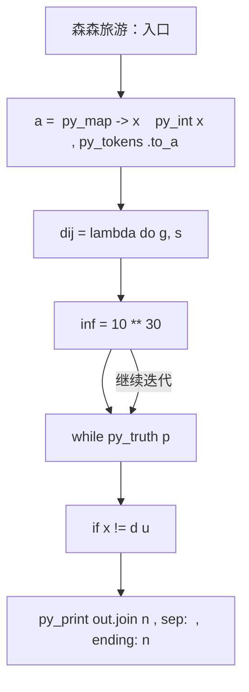
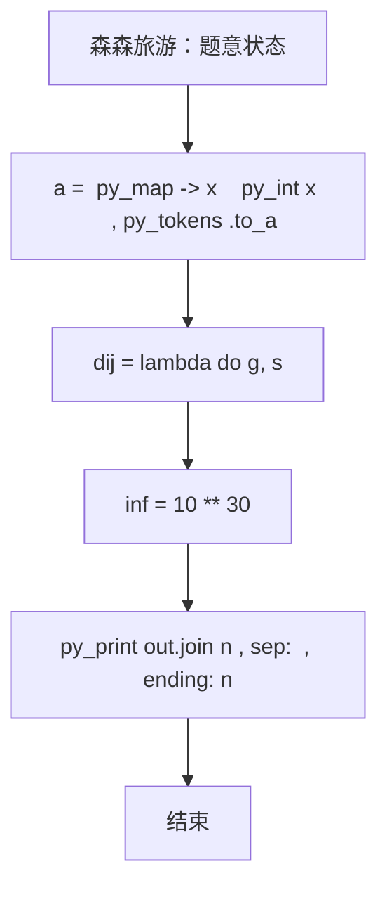

# L3-028 - 森森旅游（30 分）

| 项目 | 限制 |
| --- | --- |
| 时间限制 | 1000 ms |
| 内存限制 | 131072 KB |
| 代码长度限制 | 16 KB |

## 题目描述

好久没出去旅游啦！森森决定去 Z 省旅游一下。

Z 省有 $$n$$ 座城市（从 $$1$$ 到 $$n$$ 编号）以及 $$m$$ 条连接两座城市的有向旅行线路（例如自驾、长途汽车、火车、飞机、轮船等），每次经过一条旅行线路时都需要支付该线路的费用（但这个收费标准可能不止一种，例如车票跟机票一般不是一个价格）。

Z 省为了鼓励大家在省内多逛逛，推出了**旅游金计划**：在 $$i$$ 号城市可以用 $$1$$ 元现金兑换 $$a_i$$ 元旅游金（只要现金足够，可以无限次兑换）。城市间的交通即可以使用现金支付路费，也可以用旅游金支付。具体来说，当通过第 $$j$$ 条旅行线路时，可以用 $$c_j$$ 元现金**或** $$d_j$$ 元旅游金支付路费。**注意：** 每次只能选择一种支付方式，不可同时使用现金和旅游金混合支付。但对于不同的线路，旅客可以自由选择不同的支付方式。

森森决定从 $$1$$ 号城市出发，到 $$n$$ 号城市去。他打算在出发前准备一些现金，并在途中的某个城市将剩余现金 **全部** 换成旅游金后继续旅游，直到到达 $$n$$ 号城市为止。当然，他也可以选择在 $$1$$ 号城市就兑换旅游金，或全部使用现金完成旅程。

Z 省政府会根据每个城市参与活动的情况调整汇率（即调整在某个城市 $$1$$ 元现金能换多少旅游金）。现在你需要帮助森森计算一下，在每次调整之后最少需要携带多少现金才能完成他的旅程。

### 输入格式

输入在第一行给出三个整数 $$n$$，$$m$$ 与 $$q$$（$$1 \le n \le 10^5$$，$$1 \le m \le 2 \times 10^5$$，$$1 \le q \le 10^5$$），依次表示城市的数量、旅行线路的数量以及汇率调整的次数。

接下来 $$m$$ 行，每行给出四个整数 $$u$$，$$v$$，$$c$$ 与 $$d$$（$$1 \le u, v \le n$$，$$1 \le c, d \le 10^9$$），表示一条从 $$u$$ 号城市通向 $$v$$ 号城市的有向旅行线路。每次通过该线路需要支付 $$c$$ 元现金或 $$d$$ 元旅游金。数字间以空格分隔。输入保证从 $$1$$ 号城市出发，一定可以通过若干条线路到达 $$n$$ 号城市，但两城市间的旅行线路可能不止一条，对应不同的收费标准；也允许在城市内部游玩（即 $$u$$ 和 $$v$$ 相同）。

接下来的一行输入 $$n$$ 个整数 $$a_1, a_2, \cdots, a_n$$（$$1 \le a_i \le 10^9$$），其中 $$a_i$$ 表示一开始在 $$i$$ 号城市能用 $$1$$ 元现金兑换 $$a_i$$ 个旅游金。数字间以空格分隔。

接下来 $$q$$ 行描述汇率的调整。第 $$i$$ 行输入两个整数 $$x_i$$ 与 $$a'_i$$（$$1 \le x_i \le n$$，$$1 \le a'_i \le 10^9$$），表示第 $$i$$ 次汇率调整后，$$x_i$$ 号城市能用 $$1$$ 元现金兑换 $$a'_i$$ 个旅游金，而其它城市旅游金汇率不变。**请注意：**每次汇率调整都是在上一次汇率调整的基础上进行的。

### 输出格式

对每一次汇率调整，在对应的一行中输出调整后森森至少需要准备多少现金，才能按他的计划从 $$1$$ 号城市旅行到 $$n$$ 号城市。

**再次提醒：**如果森森决定在途中的某个城市兑换旅游金，那么他必须将剩余现金**全部、一次性**兑换，剩下的旅途将完全使用旅游金支付。

### 输入样例
```in
6 11 3
1 2 3 5
1 3 8 4
2 4 4 6
3 1 8 6
1 3 10 8
2 3 2 8
3 4 5 3
3 5 10 7
3 3 2 3
4 6 10 12
5 6 10 6
3 4 5 2 5 100
1 2
2 1
1 17
```

### 输出样例
```out
8
8
1
```

## 参考样例

### 样例 1

**输入**
```
6 11 3
1 2 3 5
1 3 8 4
2 4 4 6
3 1 8 6
1 3 10 8
2 3 2 8
3 4 5 3
3 5 10 7
3 3 2 3
4 6 10 12
5 6 10 6
3 4 5 2 5 100
1 2
2 1
1 17
```

**输出**
```
8
8
1
```

## 实现原理与解题思路

本题的实现原理是：先对记录按关键字排序，再按题目规定的优先级顺序处理，保证每一步选择满足当前最优条件。先读取标准输入并按题目格式拆分字段，使用代码中的`dij`、`inf`、`d`、`p`保存计算过程，通过 4 个循环阶段逐步更新；处理完成后按照题目规定的顺序和格式输出结果。

## 代码流程说明

1. 读取并解析标准输入，转换为题目所需的数据结构。
2. 按题意执行核心算法，维护中间状态并处理边界情况。
3. 整理计算结果，按照输出格式生成答案。

## 代码实现

下面给出可独立运行的完整 Ruby 实现，关键步骤已在代码中标注。

```ruby
# frozen_string_literal: true
# 这些辅助方法只负责把题目输入、输出和常见序列操作映射为 Ruby 写法，
# 算法主体仍在下方的 entry 方法中，代码复制后可以独立运行。
module PTACompat
  UNSET = Object.new

  class CounterHash < Hash
    def initialize
      super(0)
    end
  end

  def py_tokens
    @pta_tokens ||= STDIN.read.split
  end

  def py_input_data
    @pta_input_data ||= STDIN.read
  end

  def py_readline
    STDIN.gets.to_s.chomp
  end

  def py_lines
    @pta_lines ||= STDIN.each_line.map(&:chomp)
  end

  def py_print(*values, sep: " ", ending: "\n")
    STDOUT.write(values.map(&:to_s).join(sep) + ending)
  end

  def py_int(value)
    value.to_i
  end

  def py_float(value)
    value.to_f
  end

  def py_str(value)
    value.to_s
  end

  def py_bool_int(value)
    value ? 1 : 0
  end

  def py_truth(value)
    return false if value.nil? || value == false
    return false if value.respond_to?(:zero?) && value.zero?
    return false if value.respond_to?(:empty?) && value.empty?

    true
  end

  def py_range(*args)
    first, last, step =
      case args.length
      when 1
        [0, args[0], 1]
      when 2
        [args[0], args[1], 1]
      else
        args
      end
    first = first.to_i
    last = last.to_i
    step = step.to_i
    raise ArgumentError, "range step cannot be zero" if step.zero?

    values = []
    current = first
    if step.positive?
      while current < last
        values << current
        current += step
      end
    else
      while current > last
        values << current
        current += step
      end
    end
    values
  end

  def py_map(function, values)
    values.map { |value| function.call(value) }
  end

  def py_iter(value)
    value.to_enum
  end

  def py_next(iterator)
    iterator.next
  end

  def py_iterable(value)
    value.is_a?(String) ? value.chars : value.to_a
  end

  def py_enumerate(values)
    values.each_with_index.map { |value, index| [index, value] }
  end

  def py_zip(*values)
    values.first.zip(*values.drop(1))
  end

  def py_slice(value, start_index = nil, stop_index = nil, step = nil)
    step ||= 1
    source = value.is_a?(String) ? value.chars : value.to_a
    size = source.length
    start_index = step.positive? ? 0 : size - 1 if start_index.nil?
    stop_index = step.positive? ? size : -size - 1 if stop_index.nil?
    start_index += size if start_index.negative?
    stop_index += size if stop_index.negative? && stop_index >= -size
    start_index =
      (
        if step.positive?
          [[start_index, 0].max, size].min
        else
          [[start_index, -1].max, size - 1].min
        end
      )
    stop_index =
      (
        if step.positive?
          [[stop_index, 0].max, size].min
        else
          [[stop_index, -1].max, size - 1].min
        end
      )

    result = []
    index = start_index
    if step.positive?
      while index < stop_index
        result << source[index]
        index += step
      end
    else
      while index > stop_index
        result << source[index]
        index += step
      end
    end
    value.is_a?(String) ? result.join : result
  end

  def py_len(value)
    value.length
  end

  def py_sum(values, initial = 0)
    values.sum(initial)
  end

  def py_abs(value)
    value.abs
  end

  def py_div(a, b)
    a.to_f / b
  end

  def py_divmod(a, b)
    [a.div(b), a % b]
  end

  def py_factorial(value)
    (1..value).reduce(1, :*)
  end

  def py_gcd(a, b)
    a.gcd(b)
  end

  def py_pow(base, exponent, modulus = nil)
    modulus.nil? ? base**exponent : base.pow(exponent, modulus)
  end

  def py_in(item, container)
    container.include?(item)
  end

  def py_counter(_values)
    CounterHash.new
  end

  def py_sorted(values, key: nil, reverse: false)
    result = (key ? values.sort_by { |value| key.call(value) } : values.sort)
    reverse ? result.reverse : result
  end

  def py_max(*values, key: nil, default: UNSET)
    values = values.first.to_a if values.length == 1 &&
      values.first.respond_to?(:each) && !values.first.is_a?(Numeric)
    return default unless values.any?

    key ? values.max_by { |value| key.call(value) } : values.max
  end

  def py_min(*values, key: nil, default: UNSET)
    values = values.first.to_a if values.length == 1 &&
      values.first.respond_to?(:each) && !values.first.is_a?(Numeric)
    return default unless values.any?

    key ? values.min_by { |value| key.call(value) } : values.min
  end

  def py_re_sub(pattern, replacement, value)
    value.gsub(Regexp.new(pattern), replacement)
  end

  def py_lstrip(value, chars)
    value.sub(/\A[#{Regexp.escape(chars)}]+/, "")
  end

  def py_startswith_at(value, prefix, index)
    value[index, prefix.length] == prefix
  end

  def py_replace_slice(value, start_index, stop_index, replacement)
    value[start_index...stop_index] = replacement
    value
  end

  def py_bisect_left(values, target)
    left = 0
    right = values.length
    while left < right
      middle = (left + right) / 2
      if values[middle] < target
        left = middle + 1
      else
        right = middle
      end
    end
    left
  end

  def py_bisect_right(values, target)
    left = 0
    right = values.length
    while left < right
      middle = (left + right) / 2
      if values[middle] <= target
        left = middle + 1
      else
        right = middle
      end
    end
    left
  end
end

class Hash
  def items
    to_a
  end
end

include PTACompat

# 题目入口：读取输入、执行核心算法并输出答案。

def entry
  dij =
    lambda do |g, s|
      inf = (10**30)
      d = ([inf] * py_len(g))
      d[s] = 0
      p = [[0, s]]
      # 按题目规则遍历输入或状态空间。
      while py_truth(p)
        x, u = p.shift
        next if ((x != d[u]))
        for v, w in g[u]
          if (((x + w) < d[v]))
            d[v] = (x + w)
            p.push([d[v], v])
            p.sort!
          end
        end
      end
      return d
    end
  main =
    lambda do ||
      # 读取并解析题目输入。
      a = (py_map(->(x) { py_int(x) }, py_tokens).to_a)
      return if (!py_truth(a))
      n, m, q = py_slice(a, nil, 3, nil)
      p = 3
      gc = py_iterable(py_range((n + 1))).flat_map { |_| [[]] }
      gd = py_iterable(py_range((n + 1))).flat_map { |_| [[]] }
      for _ in py_range(m)
        u, v, c, d = py_slice(a, p, (p + 4), nil)
        p += 4
        gc[u].append([v, c])
        gd[v].append([u, d])
      end
      rate = ([0] + py_slice(a, p, (p + n), nil))
      p += n
      dc = dij.call(gc, 1)
      dd = dij.call(gd, n)
      inf = (10**30)
      value =
        lambda do |i|
          return(
            if (((dc[i] >= inf)) || ((dd[i] >= inf)))
              inf
            else
              (dc[i] + (((dd[i] + rate[i]) - 1).div(rate[i])))
            end
          )
        end
      cur =
        (
          [0] +
            py_iterable(py_range(1, (n + 1))).flat_map { |i| [value.call(i)] }
        )
      # 初始化算法状态，保持后续转移所需的不变量。
      out = []
      for _ in py_range(q)
        x, r = py_slice(a, p, (p + 2), nil)
        p += 2
        rate[x] = r
        cur[x] = value.call(x)
        out.append(py_str(py_min(py_slice(cur, 1, nil, nil))))
      end
      # 按题目要求输出最终结果。
      py_print(out.join("\n"), sep: " ", ending: "\n")
    end
  main.call
end
entry

```

## 代码流程图



## 解题流程图


