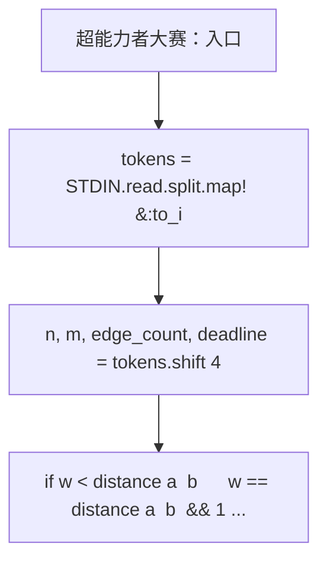
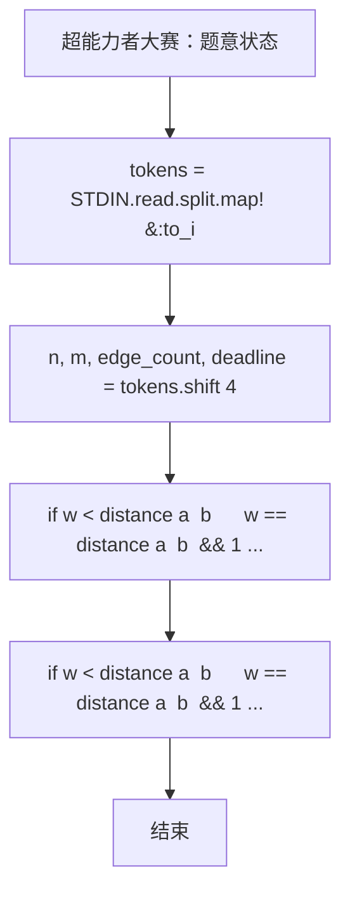

# L3-034 - 超能力者大赛（30 分）

| 项目 | 限制 |
| --- | --- |
| 时间限制 | 600 ms |
| 内存限制 | 65536 KB |
| 代码长度限制 | 16 KB |

## 题目描述


知乎上有这样一个话题：“全世界范围内突然出现 666 个超能力者，击败对手就能获得对手的超能力，最终获胜者将如何自处？”

现在让我们来将这个超能力者大赛的规则具体化：给定 $N$ 位超能力者（超能力者从 0 到 $N-1$ 编号，你的编号为 0），分布在全世界 $M$ 座城市中（城市从 0 到 $M-1$ 编号），比赛从第 1 天开始，到第 $D$ 天结束。每位超能力者有一个能力值 $E_i$（$i=0, \cdots , N-1$）。

如果你的能力值**大于等于**对手的能力值，就可以将其击败，并且对方的能力值立刻直接累加到你的能力值上。但是，当你每次到达一座城市，击败一位对手后，就会惊动这座城市中所有剩下的超能力者（包括联盟）。这座城市中剩下的所有个体能力值**小于等于**你的超能力者就会立刻团结起来形成联盟，联盟的能力值等于所有联盟成员能力值的总和。联盟将从此作为一个整体进攻或防御你，你可将联盟等价地理解为一个超能力者，它还可能在后续的战斗中继续与其它弱小的同城选手或联盟合并。第二天，这个城市中任何能力值**大于**你的对手就会找上门来，而你为了自保，就只能赶紧离开这个城市……

此外，还有如下补充规定：

* 你每天只能进行 1 场战斗，击败一个超能力者（包括联盟），或者被一个能力值**大于**你的超能力者（包括联盟）击败。
* 比赛中间没有一天可以休息，你或者在战斗，或者在去往另一个城市的路上。
* 当你到达一个城市时，会在到达的第二天进行战斗。
* 当你结束战斗要离开这个城市时，是第二天开始出发。

下面我们为你设计一套贪心算法，就请你验证一下，这个算法能否让你得到这个大赛的冠军。算法步骤很简单：

* 第 1 步：从所有超能力者（包括联盟）中找出一个与自己能力值最接近、同时自己能够击败的对手，用最短时间去到对方的城市，在到达后第二天击败之；
* 第 2 步：如果该城市中没有能力值**大于**你的超能力者（包括联盟），按照规则逐一击败之；如果该城市中已经没有超能力者、或你第二天没有必胜把握，则回到第 1 步。

重复上述步骤，直到你：

* 击败了所有超能力者；或
* 你已经无路可逃（即剩下的所有超能力者的能力值都**大于**你）；或
* 比赛终止时间到。

第 1 步中有可能遇到多个符合条件的对手，并列情况下优先选最近的；距离也并列的情况下选途径城市最少的；再有并列就选城市编号最小的。

### 输入格式

输入在第一行中给出 4 个正整数：$N$（$\le 10^5$），为参加比赛的超能力者人数；$M$（$\le 200$），为比赛涉及的城市数量；$M_e$ 为城市间直达通路的数量；$D$（$\le 1000$）为比赛时长（以“天”为单位）。\
随后 $N$ 行，第 $i$ 行（$i=0, \cdots , N-1$）给出第 $i$ 位参赛者的信息，格式为：

```
所在城市编号 能力值
```

其中`能力值`是不超过 1000 的正整数。\
接下来是城市通路信息，分 $M_e$ 行，每行给出一对城市间的双向直接通路信息，格式为：

```
城市1 城市2 通行时间
```

其中`通行时间`为不超过 $D/2$ 的正整数，以“天”为单位。题目保证每条道路的信息只出现一次，没有重复。

### 输出格式

顺次输出你每一步的活动，每个活动占一行，格式为：

```
Get e at city on day d.
```

表示第 `d` 天在编号为 `city` 的城市击败了一个能力值为 `e` 的对手。

```
Move from city1 to city2.
```

表示从编号为 `city1` 的城市**到达**了编号为 `city2` 的城市。

```
WIN on day d with e!
```

表示在第 `d` 天成为唯一的赢家，此时你的能力值是 `e`。

```
Lose on day d with e.
```

表示在第 `d` 天走投无路成为输家，此时你的能力值是 `e`。

```
Game over with e.
```

表示比赛结束你没能成为唯一赢家，此时你的能力值是 `e`。注意：比赛最后一天是先判断输赢，才判断结束的。即：如果最后一天剩下所有人都比你厉害，是判你输，而不是 Game over。

### 输入样例 1
```in
17 8 14 40
1 10
2 22
0 3
5 18
6 10
1 5
3 106
7 18
5 10
0 27
4 18
7 10
4 10
0 5
3 85
4 8
3 9
5 6 1
5 2 1
5 0 5
5 3 6
6 2 8
6 3 3
6 0 2
2 0 2
2 3 1
0 3 4
1 0 1
1 3 1
1 4 3
1 7 3
```

### 输出样例 1
```out
Move from 1 to 4.
Get 10 at 4 on day 4.
Move from 4 to 7.
Get 18 at 7 on day 11.
Get 10 at 7 on day 12.
Move from 7 to 0.
Get 27 at 0 on day 17.
Get 8 at 0 on day 18.
Move from 0 to 4.
Get 26 at 4 on day 23.
Move from 4 to 3.
Get 106 at 3 on day 28.
Get 94 at 3 on day 29.
Move from 3 to 2.
Get 22 at 2 on day 31.
Move from 2 to 5.
Get 18 at 5 on day 33.
Get 10 at 5 on day 34.
Move from 5 to 6.
Get 10 at 6 on day 36.
Move from 6 to 1.
Get 5 at 1 on day 40.
WIN on day 40 with 374!
```

### 输入样例 2
```in
7 4 5 30
2 10
2 10
1 9
1 25
1 25
0 40
3 30
0 1 1
1 2 2
2 3 3
3 0 2
1 3 3
```

### 输出样例 2
```out
Get 10 at 2 on day 1.
Move from 2 to 1.
Get 9 at 1 on day 4.
Lose on day 5 with 29.
```

### 输入样例 3
```in
7 4 5 7
2 20
2 9
1 9
1 25
1 25
0 40
3 30
0 1 1
1 2 2
2 3 3
3 0 2
1 3 3
```

### 输出样例 3
```out
Get 9 at 2 on day 1.
Move from 2 to 1.
Get 25 at 1 on day 4.
Get 34 at 1 on day 5.
Move from 1 to 0.
Get 40 at 0 on day 7.
Game over with 128.
```

## 参考样例

### 样例 1

**输入**
```
17 8 14 40
1 10
2 22
0 3
5 18
6 10
1 5
3 106
7 18
5 10
0 27
4 18
7 10
4 10
0 5
3 85
4 8
3 9
5 6 1
5 2 1
5 0 5
5 3 6
6 2 8
6 3 3
6 0 2
2 0 2
2 3 1
0 3 4
1 0 1
1 3 1
1 4 3
1 7 3
```

**输出**
```
Move from 1 to 4.
Get 10 at 4 on day 4.
Move from 4 to 7.
Get 18 at 7 on day 11.
Get 10 at 7 on day 12.
Move from 7 to 0.
Get 27 at 0 on day 17.
Get 8 at 0 on day 18.
Move from 0 to 4.
Get 26 at 4 on day 23.
Move from 4 to 3.
Get 106 at 3 on day 28.
Get 94 at 3 on day 29.
Move from 3 to 2.
Get 22 at 2 on day 31.
Move from 2 to 5.
Get 18 at 5 on day 33.
Get 10 at 5 on day 34.
Move from 5 to 6.
Get 10 at 6 on day 36.
Move from 6 to 1.
Get 5 at 1 on day 40.
WIN on day 40 with 374!
```

### 样例 2

**输入**
```
7 4 5 30
2 10
2 10
1 9
1 25
1 25
0 40
3 30
0 1 1
1 2 2
2 3 3
3 0 2
1 3 3
```

**输出**
```
Get 10 at 2 on day 1.
Move from 2 to 1.
Get 9 at 1 on day 4.
Lose on day 5 with 29.
```

### 样例 3

**输入**
```
7 4 5 7
2 20
2 9
1 9
1 25
1 25
0 40
3 30
0 1 1
1 2 2
2 3 3
3 0 2
1 3 3
```

**输出**
```
Get 9 at 2 on day 1.
Move from 2 to 1.
Get 25 at 1 on day 4.
Get 34 at 1 on day 5.
Move from 1 to 0.
Get 40 at 0 on day 7.
Game over with 128.
```

## 实现原理与解题思路

本题的实现原理是：使用栈、队列或二分边界维护操作顺序，在每次操作后保持数据结构的题目约束。先准备题目要求的固定数据，使用代码中的`tokens`、`cities`、`powers`、`inf`保存计算过程，直接完成计算；处理完成后按照题目规定的顺序和格式输出结果。

## 代码流程说明

1. 读取并解析标准输入，转换为题目所需的数据结构。
2. 按题意执行核心算法，维护中间状态并处理边界情况。
3. 整理计算结果，按照输出格式生成答案。

## 代码实现

下面给出可独立运行的完整 Ruby 实现，关键步骤已在代码中标注。

```ruby
# frozen_string_literal: true
# 这些辅助方法只负责把题目输入、输出和常见序列操作映射为 Ruby 写法，
# 算法主体仍在下方的 entry 方法中，代码复制后可以独立运行。
module PTACompat
  UNSET = Object.new

  class CounterHash < Hash
    def initialize
      super(0)
    end
  end

  def py_tokens
    @pta_tokens ||= STDIN.read.split
  end

  def py_input_data
    @pta_input_data ||= STDIN.read
  end

  def py_readline
    STDIN.gets.to_s.chomp
  end

  def py_lines
    @pta_lines ||= STDIN.each_line.map(&:chomp)
  end

  def py_print(*values, sep: " ", ending: "\n")
    STDOUT.write(values.map(&:to_s).join(sep) + ending)
  end

  def py_int(value)
    value.to_i
  end

  def py_float(value)
    value.to_f
  end

  def py_str(value)
    value.to_s
  end

  def py_bool_int(value)
    value ? 1 : 0
  end

  def py_truth(value)
    return false if value.nil? || value == false
    return false if value.respond_to?(:zero?) && value.zero?
    return false if value.respond_to?(:empty?) && value.empty?

    true
  end

  def py_range(*args)
    first, last, step =
      case args.length
      when 1
        [0, args[0], 1]
      when 2
        [args[0], args[1], 1]
      else
        args
      end
    first = first.to_i
    last = last.to_i
    step = step.to_i
    raise ArgumentError, "range step cannot be zero" if step.zero?

    values = []
    current = first
    if step.positive?
      while current < last
        values << current
        current += step
      end
    else
      while current > last
        values << current
        current += step
      end
    end
    values
  end

  def py_map(function, values)
    values.map { |value| function.call(value) }
  end

  def py_iter(value)
    value.to_enum
  end

  def py_next(iterator)
    iterator.next
  end

  def py_iterable(value)
    value.is_a?(String) ? value.chars : value.to_a
  end

  def py_enumerate(values)
    values.each_with_index.map { |value, index| [index, value] }
  end

  def py_zip(*values)
    values.first.zip(*values.drop(1))
  end

  def py_slice(value, start_index = nil, stop_index = nil, step = nil)
    step ||= 1
    source = value.is_a?(String) ? value.chars : value.to_a
    size = source.length
    start_index = step.positive? ? 0 : size - 1 if start_index.nil?
    stop_index = step.positive? ? size : -size - 1 if stop_index.nil?
    start_index += size if start_index.negative?
    stop_index += size if stop_index.negative? && stop_index >= -size
    start_index =
      (
        if step.positive?
          [[start_index, 0].max, size].min
        else
          [[start_index, -1].max, size - 1].min
        end
      )
    stop_index =
      (
        if step.positive?
          [[stop_index, 0].max, size].min
        else
          [[stop_index, -1].max, size - 1].min
        end
      )

    result = []
    index = start_index
    if step.positive?
      while index < stop_index
        result << source[index]
        index += step
      end
    else
      while index > stop_index
        result << source[index]
        index += step
      end
    end
    value.is_a?(String) ? result.join : result
  end

  def py_len(value)
    value.length
  end

  def py_sum(values, initial = 0)
    values.sum(initial)
  end

  def py_abs(value)
    value.abs
  end

  def py_div(a, b)
    a.to_f / b
  end

  def py_divmod(a, b)
    [a.div(b), a % b]
  end

  def py_factorial(value)
    (1..value).reduce(1, :*)
  end

  def py_gcd(a, b)
    a.gcd(b)
  end

  def py_pow(base, exponent, modulus = nil)
    modulus.nil? ? base**exponent : base.pow(exponent, modulus)
  end

  def py_in(item, container)
    container.include?(item)
  end

  def py_counter(_values)
    CounterHash.new
  end

  def py_sorted(values, key: nil, reverse: false)
    result = (key ? values.sort_by { |value| key.call(value) } : values.sort)
    reverse ? result.reverse : result
  end

  def py_max(*values, key: nil, default: UNSET)
    values = values.first.to_a if values.length == 1 &&
      values.first.respond_to?(:each) && !values.first.is_a?(Numeric)
    return default unless values.any?

    key ? values.max_by { |value| key.call(value) } : values.max
  end

  def py_min(*values, key: nil, default: UNSET)
    values = values.first.to_a if values.length == 1 &&
      values.first.respond_to?(:each) && !values.first.is_a?(Numeric)
    return default unless values.any?

    key ? values.min_by { |value| key.call(value) } : values.min
  end

  def py_re_sub(pattern, replacement, value)
    value.gsub(Regexp.new(pattern), replacement)
  end

  def py_lstrip(value, chars)
    value.sub(/\A[#{Regexp.escape(chars)}]+/, "")
  end

  def py_startswith_at(value, prefix, index)
    value[index, prefix.length] == prefix
  end

  def py_replace_slice(value, start_index, stop_index, replacement)
    value[start_index...stop_index] = replacement
    value
  end

  def py_bisect_left(values, target)
    left = 0
    right = values.length
    while left < right
      middle = (left + right) / 2
      if values[middle] < target
        left = middle + 1
      else
        right = middle
      end
    end
    left
  end

  def py_bisect_right(values, target)
    left = 0
    right = values.length
    while left < right
      middle = (left + right) / 2
      if values[middle] <= target
        left = middle + 1
      else
        right = middle
      end
    end
    left
  end
end

class Hash
  def items
    to_a
  end
end

include PTACompat

# 题目入口：读取输入、执行核心算法并输出答案。

# L3-034 超能力者大赛
# 按题面规定模拟：全局选择能力值最大的可击败对手，平局按距离、
# 最少经过城市数、城市编号处理；到达城市后次日战斗，同城安全时连续清理。

tokens = STDIN.read.split.map!(&:to_i)
exit if tokens.empty?

n, m, edge_count, deadline = tokens.shift(4)
cities = Array.new(n)
powers = Array.new(n)
n.times { |i| cities[i], powers[i] = tokens.shift(2) }

inf = 1_000_000_000
distance = Array.new(m) { Array.new(m, inf) }
hops = Array.new(m) { Array.new(m, inf) }
m.times do |i|
  distance[i][i] = 0
  hops[i][i] = 0
end
edge_count.times do
  a, b, w = tokens.shift(3)
  if w < distance[a][b] || (w == distance[a][b] && 1 < hops[a][b])
    distance[a][b] = distance[b][a] = w
    hops[a][b] = hops[b][a] = 1
  end
end

m.times do |k|
  m.times do |i|
    next if distance[i][k] >= inf
    m.times do |j|
      next if distance[k][j] >= inf
      new_distance = distance[i][k] + distance[k][j]
      new_hops = hops[i][k] + hops[k][j]
      if new_distance < distance[i][j] ||
           (new_distance == distance[i][j] && new_hops < hops[i][j])
        distance[i][j] = new_distance
        hops[i][j] = new_hops
      end
    end
  end
end

foes = Array.new(m) { [] }
(1...n).each { |i| foes[cities[i]] << powers[i] }
current_power = powers[0]
current_city = cities[0]
day = 0
output = []

loop do
  if foes.all?(&:empty?)
    output << "WIN on day #{day} with #{current_power}!"
    break
  end

  # 到达城市后的第二天，若城内没有更强者，必须继续逐一战斗。
  stay_value = nil
  if day.positive?
    local = foes[current_city]
    if !local.empty? && local.none? { |value| value > current_power }
      stay_value = local.select { |value| value <= current_power }.max
    end
  end

  if stay_value
    battle_day = day + 1
    if battle_day > deadline
      output << "Game over with #{current_power}."
      break
    end
    output << "Get #{stay_value} at #{current_city} on day #{battle_day}."
    foes[current_city].delete_at(foes[current_city].index(stay_value))
    day = battle_day
    current_power += stay_value
  else
    candidate = nil
    m.times do |city|
      next if foes[city].empty? || distance[current_city][city] >= inf
      foes[city].each do |value|
        next if value > current_power
        key = [
          -value,
          distance[current_city][city],
          hops[current_city][city],
          city
        ]
        candidate = [key, city, value] if candidate.nil? ||
          (key <=> candidate[0]) == -1
      end
    end

    if candidate.nil?
      lose_day = day.zero? ? 1 : day + 1
      lose_day = deadline if lose_day > deadline
      output << "Lose on day #{lose_day} with #{current_power}."
      break
    end

    _, target_city, target_value = candidate
    travel = distance[current_city][target_city]
    battle_day = day + 1 + travel
    if battle_day > deadline
      arrival_day = day.zero? ? travel : day + travel
      if travel.positive? && arrival_day <= deadline
        output << "Move from #{current_city} to #{target_city}."
      end
      output << "Game over with #{current_power}."
      break
    end

    if travel.positive?
      output << "Move from #{current_city} to #{target_city}."
      current_city = target_city
    end
    output << "Get #{target_value} at #{target_city} on day #{battle_day}."
    foes[target_city].delete_at(foes[target_city].index(target_value))
    day = battle_day
    current_power += target_value
  end

  # 战斗会把当前城市中所有不超过己方能力的剩余个体合成一个联盟。
  weak, strong = foes[current_city].partition { |value| value <= current_power }
  foes[current_city] = strong
  foes[current_city] << weak.sum unless weak.empty?
end

STDOUT.write(output.join("\n"))
STDOUT.write("\n") unless output.empty?

```

## 代码流程图



## 解题流程图


