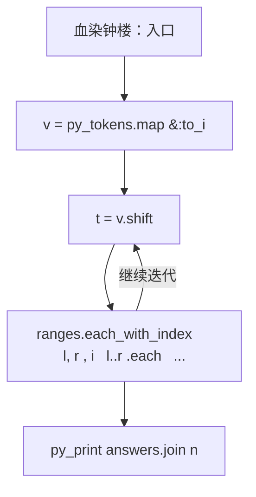
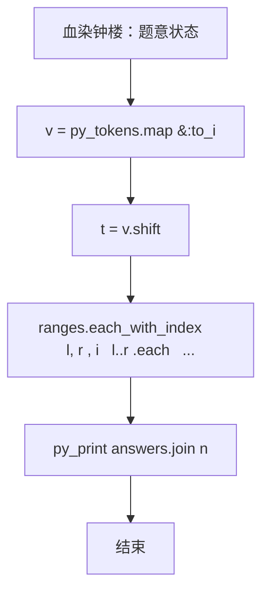

# L3-036 - 血染钟楼（30 分）

| 项目 | 限制 |
| --- | --- |
| 时间限制 | 6000 ms |
| 内存限制 | 65536 KB |
| 代码长度限制 | 16 KB |

## 题目描述

九条可怜最近非常沉迷血染钟楼 —— 一款类狼人杀的身份推理类的游戏。在一局血染钟楼的游戏中，玩家们之间隐藏着一名"恶魔"，而所有善良玩家的目标就是将抽到恶魔身份的玩家绳之以法。

今天，九条可怜和她的小伙伴们开了一局 $n+1$ 名玩家参与的游戏，可怜的编号是 $0$，其他玩家编号从 $1$ 到 $n$。
可怜抽到的身份是占卜师，其技能如下（注意这儿和标准钟楼规则有出入）：

1. 每个夜晚，你可以选择任意名玩家，并得知被选择的玩家中是否有恶魔。
2. 有一名除你以外善良玩家始终被你的能力视为恶魔。

换句话说，在剩下的 $n$ 名玩家中，存在着两名未知的玩家，如果这两名玩家均未被可怜选中，可怜就会得到信息 0，否则就会得到信息 1。
在抽到身份的时候，可怜就对游戏开始的前 $m$ 个夜晚进行了规划：她打算在第 $i$ 个夜晚选中编号在区间 $[l_i, r_i]$ 内的所有玩家。
因为血染钟楼的第一个夜晚通常比较漫长，所以可怜在百无聊赖之际开始了头脑风暴。如果一切顺利，在 $m$ 晚之后，她将能得到 $m$ 个 0 或 1 的信息，共有 $2^m$ 种不同的可能性。可怜想要知道在这些可能性中，有多少种结果是可能发生的且可以让她**唯一**确定被她技能识别的两名玩家。

### 输入格式

第一行输入一个整数 $t (1 \leq t \leq 10^3)$，表示数据组数。
第二行输入两个整数 $n, m(1 \leq n,m \leq 10^5)$，表示可怜以外的玩家数量以及可怜规划的夜晚数量。
接下来 $m$ 行每行两个整数 $l_i, r_i (1 \leq l_i \leq r_i \leq n)$，表示可怜的计划中在第 $i$ 晚会被选中的玩家编号区间。
输入保证所有数据中满足 $n > 10^3$ 或 $m > 10^3$ 的数据不超过 $5$ 组。

### 输出格式

对于每组数据，输出一行一个整数，表示满足条件的可能性数量。答案可能很大，你只需要输出对 $998244353$ 取模后的结果。

### 输入样例
```in
3
4 1
2 3
5 4
2 5
1 3
5 5
2 4
10 10
1 2
6 6
3 7
3 6
1 8
9 10
1 6
4 4
8 8
5 8
```

### 输出样例
```out
1
2
7
```

## 参考样例

### 样例 1

**输入**
```
3
4 1
2 3
5 4
2 5
1 3
5 5
2 4
10 10
1 2
6 6
3 7
3 6
1 8
9 10
1 6
4 4
8 8
5 8
```

**输出**
```
1
2
7
```

## 实现原理与解题思路

本题的实现原理是：使用栈、队列或二分边界维护操作顺序，在每次操作后保持数据结构的题目约束。先读取标准输入并按题目格式拆分字段，使用代码中的`v`、`t`、`answers`、`ranges`保存计算过程，直接完成计算；处理完成后按照题目规定的顺序和格式输出结果。

## 代码流程说明

1. 读取并解析标准输入，转换为题目所需的数据结构。
2. 按题意执行核心算法，维护中间状态并处理边界情况。
3. 整理计算结果，按照输出格式生成答案。

## 代码实现

下面给出可独立运行的完整 Ruby 实现，关键步骤已在代码中标注。

```ruby
# frozen_string_literal: true
# 这些辅助方法只负责把题目输入、输出和常见序列操作映射为 Ruby 写法，
# 算法主体仍在下方的 entry 方法中，代码复制后可以独立运行。
module PTACompat
  UNSET = Object.new

  class CounterHash < Hash
    def initialize
      super(0)
    end
  end

  def py_tokens
    @pta_tokens ||= STDIN.read.split
  end

  def py_input_data
    @pta_input_data ||= STDIN.read
  end

  def py_readline
    STDIN.gets.to_s.chomp
  end

  def py_lines
    @pta_lines ||= STDIN.each_line.map(&:chomp)
  end

  def py_print(*values, sep: " ", ending: "\n")
    STDOUT.write(values.map(&:to_s).join(sep) + ending)
  end

  def py_int(value)
    value.to_i
  end

  def py_float(value)
    value.to_f
  end

  def py_str(value)
    value.to_s
  end

  def py_bool_int(value)
    value ? 1 : 0
  end

  def py_truth(value)
    return false if value.nil? || value == false
    return false if value.respond_to?(:zero?) && value.zero?
    return false if value.respond_to?(:empty?) && value.empty?

    true
  end

  def py_range(*args)
    first, last, step =
      case args.length
      when 1
        [0, args[0], 1]
      when 2
        [args[0], args[1], 1]
      else
        args
      end
    first = first.to_i
    last = last.to_i
    step = step.to_i
    raise ArgumentError, "range step cannot be zero" if step.zero?

    values = []
    current = first
    if step.positive?
      while current < last
        values << current
        current += step
      end
    else
      while current > last
        values << current
        current += step
      end
    end
    values
  end

  def py_map(function, values)
    values.map { |value| function.call(value) }
  end

  def py_iter(value)
    value.to_enum
  end

  def py_next(iterator)
    iterator.next
  end

  def py_iterable(value)
    value.is_a?(String) ? value.chars : value.to_a
  end

  def py_enumerate(values)
    values.each_with_index.map { |value, index| [index, value] }
  end

  def py_zip(*values)
    values.first.zip(*values.drop(1))
  end

  def py_slice(value, start_index = nil, stop_index = nil, step = nil)
    step ||= 1
    source = value.is_a?(String) ? value.chars : value.to_a
    size = source.length
    start_index = step.positive? ? 0 : size - 1 if start_index.nil?
    stop_index = step.positive? ? size : -size - 1 if stop_index.nil?
    start_index += size if start_index.negative?
    stop_index += size if stop_index.negative? && stop_index >= -size
    start_index =
      (
        if step.positive?
          [[start_index, 0].max, size].min
        else
          [[start_index, -1].max, size - 1].min
        end
      )
    stop_index =
      (
        if step.positive?
          [[stop_index, 0].max, size].min
        else
          [[stop_index, -1].max, size - 1].min
        end
      )

    result = []
    index = start_index
    if step.positive?
      while index < stop_index
        result << source[index]
        index += step
      end
    else
      while index > stop_index
        result << source[index]
        index += step
      end
    end
    value.is_a?(String) ? result.join : result
  end

  def py_len(value)
    value.length
  end

  def py_sum(values, initial = 0)
    values.sum(initial)
  end

  def py_abs(value)
    value.abs
  end

  def py_div(a, b)
    a.to_f / b
  end

  def py_divmod(a, b)
    [a.div(b), a % b]
  end

  def py_factorial(value)
    (1..value).reduce(1, :*)
  end

  def py_gcd(a, b)
    a.gcd(b)
  end

  def py_pow(base, exponent, modulus = nil)
    modulus.nil? ? base**exponent : base.pow(exponent, modulus)
  end

  def py_in(item, container)
    container.include?(item)
  end

  def py_counter(_values)
    CounterHash.new
  end

  def py_sorted(values, key: nil, reverse: false)
    result = (key ? values.sort_by { |value| key.call(value) } : values.sort)
    reverse ? result.reverse : result
  end

  def py_max(*values, key: nil, default: UNSET)
    values = values.first.to_a if values.length == 1 &&
      values.first.respond_to?(:each) && !values.first.is_a?(Numeric)
    return default unless values.any?

    key ? values.max_by { |value| key.call(value) } : values.max
  end

  def py_min(*values, key: nil, default: UNSET)
    values = values.first.to_a if values.length == 1 &&
      values.first.respond_to?(:each) && !values.first.is_a?(Numeric)
    return default unless values.any?

    key ? values.min_by { |value| key.call(value) } : values.min
  end

  def py_re_sub(pattern, replacement, value)
    value.gsub(Regexp.new(pattern), replacement)
  end

  def py_lstrip(value, chars)
    value.sub(/\A[#{Regexp.escape(chars)}]+/, "")
  end

  def py_startswith_at(value, prefix, index)
    value[index, prefix.length] == prefix
  end

  def py_replace_slice(value, start_index, stop_index, replacement)
    value[start_index...stop_index] = replacement
    value
  end

  def py_bisect_left(values, target)
    left = 0
    right = values.length
    while left < right
      middle = (left + right) / 2
      if values[middle] < target
        left = middle + 1
      else
        right = middle
      end
    end
    left
  end

  def py_bisect_right(values, target)
    left = 0
    right = values.length
    while left < right
      middle = (left + right) / 2
      if values[middle] <= target
        left = middle + 1
      else
        right = middle
      end
    end
    left
  end
end

class Hash
  def items
    to_a
  end
end

include PTACompat

# 题目入口：读取输入、执行核心算法并输出答案。

# 读取并解析题目输入。
v = py_tokens.map(&:to_i)
t = v.shift
answers = []
t.times do
  n, m = v.shift(2)
  ranges = m.times.map { [v.shift, v.shift] }
  masks = Array.new(n + 1, 0)
  ranges.each_with_index { |(l, r), i| (l..r).each { |x| masks[x] |= 1 << i } }
  counts = Hash.new(0)
  (1..n).each { |x| (x + 1..n).each { |y| counts[masks[x] | masks[y]] += 1 } }
  answers << (counts.count { |_, count| count == 1 } % 998_244_353)
end
# 按题目要求输出最终结果。
py_print(answers.join("\n"))

```

## 代码流程图



## 解题流程图


