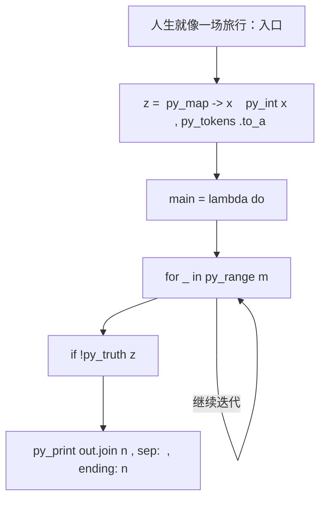
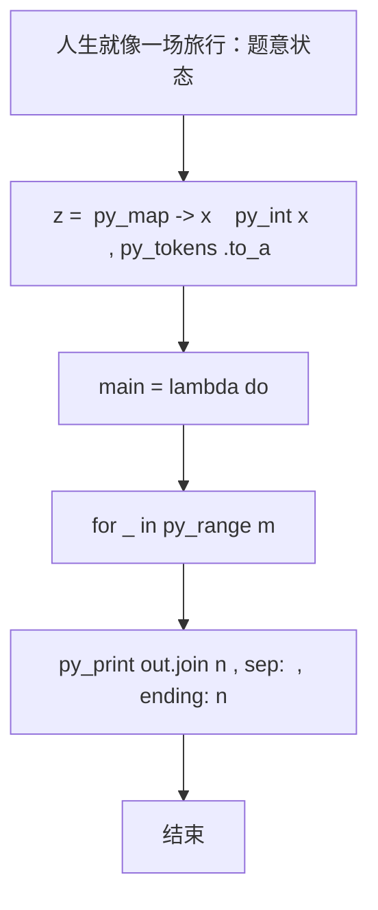

# L3-040 - 人生就像一场旅行（30 分）

| 项目 | 限制 |
| --- | --- |
| 时间限制 | 400 ms |
| 内存限制 | 65536 KB |
| 代码长度限制 | 16 KB |

## 题目描述

“人生就像一场旅行，不在乎目的地，在乎的是沿途的风景以及看风景的心情。”——但前提是，你得有张能刷得起沿途消费的银行卡。

给定一张旅游地图和银行卡的消费额度，从任一座城市出发，去任一座城市都走最便宜的路线，能够到达哪些地方？如果再给每条道路加一个“途径风景心情指数”，当有多个可达目的地时，选沿途心情指数总值最高的，则可以到达哪些地方？

### 输入格式

输入第一行给出 4 个正整数：$b$（$\le 10^6$）为银行卡的消费额度；$n$（$1<n\le 500$）为地图中城市总数；$m$ 为城市间直达道路条数（任意两城市间最多有一条双向道路）；$k$（$\le n$）为咨询次数。
随后 $m$ 行，每行给出一条道路的信息，格式如下：
```
城市1 城市2 旅费 途径风景心情指数
```
其中 `城市1` 和 `城市2` 为道路两端城市的编号，城市从 1 到 $n$ 编号；`旅费` 为不超过 1000 的正整数；`途径风景心情指数` 为区间 $[0, 100]$ 内的整数。
最后一行给出 $k$ 个城市的编号，为需要咨询的出发城市的编号。
同行数字间以空格分隔。

### 输出格式

对于每个需要咨询的出发城市编号，输出 2 行信息：第一行按升序输出消费额度内从该城市出发能到达的城市编号；第二行按编号升序输出第一行列出的城市中沿途心情指数总值最高的。同行数字间以 1 个空格分隔，行首尾不得有多余空格。如果哪里都去不了，则输出 `T_T`。

### 输入样例
```in
500 8 11 3
1 2 400 20
2 3 100 50
1 4 1000 90
1 5 300 10
4 5 200 60
2 5 100 10
3 5 500 80
5 6 200 20
6 7 500 70
3 7 300 10
7 8 800 100
1 8 7
```

### 输出样例
```out
2 3 4 5 6
3 4
T_T
2 3 5 6
5 6
```

## 参考样例

### 样例 1

**输入**
```
500 8 11 3
1 2 400 20
2 3 100 50
1 4 1000 90
1 5 300 10
4 5 200 60
2 5 100 10
3 5 500 80
5 6 200 20
6 7 500 70
3 7 300 10
7 8 800 100
1 8 7
```

**输出**
```
2 3 4 5 6
3 4
T_T
2 3 5 6
5 6
```

## 实现原理与解题思路

本题的实现原理是：先对记录按关键字排序，再按题目规定的优先级顺序处理，保证每一步选择满足当前最优条件。先读取标准输入并按题目格式拆分字段，使用代码中的`z`、`p`、`g`、`out`保存计算过程，通过 4 个循环阶段逐步更新；处理完成后按照题目规定的顺序和格式输出结果。

## 代码流程说明

1. 读取并解析标准输入，转换为题目所需的数据结构。
2. 按题意执行核心算法，维护中间状态并处理边界情况。
3. 整理计算结果，按照输出格式生成答案。

## 代码实现

下面给出可独立运行的完整 Ruby 实现，关键步骤已在代码中标注。

```ruby
# frozen_string_literal: true
# 这些辅助方法只负责把题目输入、输出和常见序列操作映射为 Ruby 写法，
# 算法主体仍在下方的 entry 方法中，代码复制后可以独立运行。
module PTACompat
  UNSET = Object.new

  class CounterHash < Hash
    def initialize
      super(0)
    end
  end

  def py_tokens
    @pta_tokens ||= STDIN.read.split
  end

  def py_input_data
    @pta_input_data ||= STDIN.read
  end

  def py_readline
    STDIN.gets.to_s.chomp
  end

  def py_lines
    @pta_lines ||= STDIN.each_line.map(&:chomp)
  end

  def py_print(*values, sep: " ", ending: "\n")
    STDOUT.write(values.map(&:to_s).join(sep) + ending)
  end

  def py_int(value)
    value.to_i
  end

  def py_float(value)
    value.to_f
  end

  def py_str(value)
    value.to_s
  end

  def py_bool_int(value)
    value ? 1 : 0
  end

  def py_truth(value)
    return false if value.nil? || value == false
    return false if value.respond_to?(:zero?) && value.zero?
    return false if value.respond_to?(:empty?) && value.empty?

    true
  end

  def py_range(*args)
    first, last, step =
      case args.length
      when 1
        [0, args[0], 1]
      when 2
        [args[0], args[1], 1]
      else
        args
      end
    first = first.to_i
    last = last.to_i
    step = step.to_i
    raise ArgumentError, "range step cannot be zero" if step.zero?

    values = []
    current = first
    if step.positive?
      while current < last
        values << current
        current += step
      end
    else
      while current > last
        values << current
        current += step
      end
    end
    values
  end

  def py_map(function, values)
    values.map { |value| function.call(value) }
  end

  def py_iter(value)
    value.to_enum
  end

  def py_next(iterator)
    iterator.next
  end

  def py_iterable(value)
    value.is_a?(String) ? value.chars : value.to_a
  end

  def py_enumerate(values)
    values.each_with_index.map { |value, index| [index, value] }
  end

  def py_zip(*values)
    values.first.zip(*values.drop(1))
  end

  def py_slice(value, start_index = nil, stop_index = nil, step = nil)
    step ||= 1
    source = value.is_a?(String) ? value.chars : value.to_a
    size = source.length
    start_index = step.positive? ? 0 : size - 1 if start_index.nil?
    stop_index = step.positive? ? size : -size - 1 if stop_index.nil?
    start_index += size if start_index.negative?
    stop_index += size if stop_index.negative? && stop_index >= -size
    start_index =
      (
        if step.positive?
          [[start_index, 0].max, size].min
        else
          [[start_index, -1].max, size - 1].min
        end
      )
    stop_index =
      (
        if step.positive?
          [[stop_index, 0].max, size].min
        else
          [[stop_index, -1].max, size - 1].min
        end
      )

    result = []
    index = start_index
    if step.positive?
      while index < stop_index
        result << source[index]
        index += step
      end
    else
      while index > stop_index
        result << source[index]
        index += step
      end
    end
    value.is_a?(String) ? result.join : result
  end

  def py_len(value)
    value.length
  end

  def py_sum(values, initial = 0)
    values.sum(initial)
  end

  def py_abs(value)
    value.abs
  end

  def py_div(a, b)
    a.to_f / b
  end

  def py_divmod(a, b)
    [a.div(b), a % b]
  end

  def py_factorial(value)
    (1..value).reduce(1, :*)
  end

  def py_gcd(a, b)
    a.gcd(b)
  end

  def py_pow(base, exponent, modulus = nil)
    modulus.nil? ? base**exponent : base.pow(exponent, modulus)
  end

  def py_in(item, container)
    container.include?(item)
  end

  def py_counter(_values)
    CounterHash.new
  end

  def py_sorted(values, key: nil, reverse: false)
    result = (key ? values.sort_by { |value| key.call(value) } : values.sort)
    reverse ? result.reverse : result
  end

  def py_max(*values, key: nil, default: UNSET)
    values = values.first.to_a if values.length == 1 &&
      values.first.respond_to?(:each) && !values.first.is_a?(Numeric)
    return default unless values.any?

    key ? values.max_by { |value| key.call(value) } : values.max
  end

  def py_min(*values, key: nil, default: UNSET)
    values = values.first.to_a if values.length == 1 &&
      values.first.respond_to?(:each) && !values.first.is_a?(Numeric)
    return default unless values.any?

    key ? values.min_by { |value| key.call(value) } : values.min
  end

  def py_re_sub(pattern, replacement, value)
    value.gsub(Regexp.new(pattern), replacement)
  end

  def py_lstrip(value, chars)
    value.sub(/\A[#{Regexp.escape(chars)}]+/, "")
  end

  def py_startswith_at(value, prefix, index)
    value[index, prefix.length] == prefix
  end

  def py_replace_slice(value, start_index, stop_index, replacement)
    value[start_index...stop_index] = replacement
    value
  end

  def py_bisect_left(values, target)
    left = 0
    right = values.length
    while left < right
      middle = (left + right) / 2
      if values[middle] < target
        left = middle + 1
      else
        right = middle
      end
    end
    left
  end

  def py_bisect_right(values, target)
    left = 0
    right = values.length
    while left < right
      middle = (left + right) / 2
      if values[middle] <= target
        left = middle + 1
      else
        right = middle
      end
    end
    left
  end
end

class Hash
  def items
    to_a
  end
end

include PTACompat

# 题目入口：读取输入、执行核心算法并输出答案。

def entry
  main =
    lambda do ||
      # 读取并解析题目输入。
      z = (py_map(->(x) { py_int(x) }, py_tokens).to_a)
      return if (!py_truth(z))
      b, n, m, k = py_slice(z, nil, 4, nil)
      p = 4
      # 初始化算法状态，保持后续转移所需的不变量。
      g = py_iterable(py_range((n + 1))).flat_map { |_| [[]] }
      # 按题目规则遍历输入或状态空间。
      for _ in py_range(m)
        u, v, c, h = py_slice(z, p, (p + 4), nil)
        p += 4
        g[u].append([v, c, h])
        g[v].append([u, c, h])
      end
      out = []
      for s in py_slice(z, p, (p + k), nil)
        inf = (10**30)
        d = ([inf] * (n + 1))
        happy = ([(-1)] * (n + 1))
        d[s] = 0
        happy[s] = 0
        pq = [[0, 0, s]]
        while py_truth(pq)
          cost, neg, u = pq.shift
          next if (((cost != d[u])) || (((-neg) != happy[u])))
          for v, c, h in g[u]
            q = [(cost + c), (-((-neg) + h)), v]
            if (((q[0] < d[v])) || (((q[0] == d[v])) && (((-q[1]) > happy[v]))))
              d[v], happy[v] = [q[0], (-q[1])]
              pq.push(q)
              pq.sort!
            end
          end
        end
        reach =
          py_iterable(py_range(1, (n + 1))).flat_map do |i|
            next [] unless py_truth((((i != s)) && ((d[i] <= b))))
            [i]
          end
        if (!py_truth(reach))
          out.append("T_T")
        else
          mx = py_max(py_iterable(reach).flat_map { |i| [happy[i]] })
          out.append(py_map(->(x) { py_str(x) }, reach).join(" "))
          out.append(
            py_map(
              ->(x) { py_str(x) },
              py_iterable(reach).flat_map do |i|
                next [] unless py_truth(((happy[i] == mx)))
                [i]
              end
            ).join(" ")
          )
        end
      end
      # 按题目要求输出最终结果。
      py_print(out.join("\n"), sep: " ", ending: "\n")
    end
  main.call
end
entry

```

## 代码流程图



## 解题流程图


