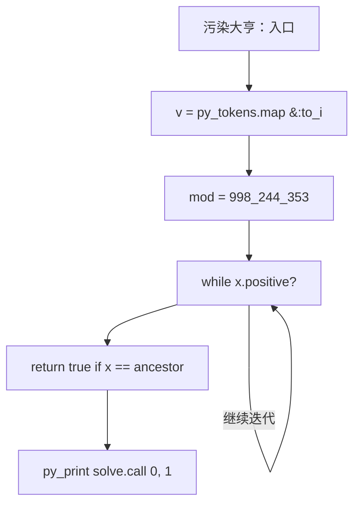
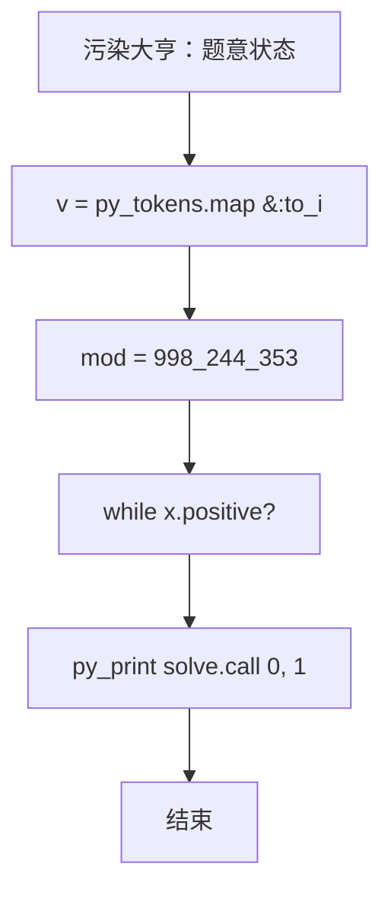

# L3-042 - 污染大亨（30 分）

- **时间限制**: 5000 ms
- **内存限制**: 524288 KB
- **代码长度限制**: 16 KB

---

## 题目描述


九条可怜今天玩一款关于环境、污染和交罚款的德式桌游。

游戏的地图是一条河的河道。因为河流会分叉，所以其河道以有根树的形式呈现。在河道边上有 $n$ 个小镇，其中编号为 $1$ 的小镇对应了河流的源头，而第 $i (i > 1)$ 个小镇的直接上游是编号为 $f_i (1 \leq f_i < i)$ 的小镇。

游戏开始时河流完全没有受到污染。而在游戏的每一轮，可怜需要选择一个**还没有被污染的小镇**修建一个新的工厂。在工厂开工后，它会立刻对该小镇以及其下游的所有小镇产生**永久污染**，也就意味着在游戏的剩余时间内，这些小镇再也不能作为工厂的地址。可怜需要不断重复这一过程，直到河道中的所有小镇都被污染为止 —— 因为每一轮一定会有一个新的小镇受到污染，所以游戏的轮数不会超过 $n$ 轮。

既然造成了污染，可怜自然地也要缴纳罚款。在游戏的第 $i$ 轮，如果可怜的工厂对 $k$ 个小镇造成了污染，那么她将会收到 $k$ 张数值为 $c_i$ 的罚单，其中 $c_i$ 是预先给定的罚款系数；在游戏结束时，可怜需要缴纳的罚款数额为所有罚单上数值的**乘积**。 **注意**，一些处在下游的小镇可能会在游戏的不同轮内多次被造成污染。

下面是一局游戏的例子，假设 $n = 4$，小镇 2, 3, 4 的直接上游分别为小镇 1, 2, 2，且常数 $c_1$ 到 $c_4$ 分别为 $[1, 2, 3, 4]$。

1. 在第一轮，所有小镇都没有受到污染，于是可怜可以任选一个小镇新建工厂。如果她选择了小镇 3 ，那么她将对这一个小镇造成污染，收到一张数值为 $1$ 的罚单。
2. 在第二轮，目前只有小镇 3 受到了污染，于是可怜可以在小镇 1,2,4 中选择下一个工厂的地址。如果她选择了小镇 2，那么她将对小镇 2,3,4 同时造成污染，收到三张数值为 $2$ 的罚单。
3. 在第三轮，目前只有小镇 1 还没有受到污染，于是可怜只能选择在这一小镇新建下一个工厂。此时，她将同时污染所有小镇，收到四张数值为 $3$ 的罚单。
4. 此时，所有小镇都已经受到了污染，游戏结束。可怜一共需要缴纳的罚款为 $1 \times 2^3 \times 3^4 = 648$ 元。

现在，给定游戏的地图以及常数 $c_i$，你需要帮助可怜计算对于**所有可能的**游戏情况，可怜需要缴纳的罚款**总和**是多少。这个答案可能很大，所以你只需输出对 $998244353$ 取模后的结果。

### 输入格式:

第一行一个整数 $n (1 \leq n \leq 40)$，表示小镇数量。

第二行 $n-1$ 个整数，依次对应 $f_2$ 至 $f_n$，即每个非源头小镇的直接上游。输入保证 $1 \leq f_i < i$。

第三行 $n$ 个整数，表示 $c_1$ 至 $c_n$，即每一轮中的罚款系数。输入保证 $0 \leq c_i < 10^6$。

### 输出格式:

输出一行一个整数，表示对于所有可能的游戏情况，可怜需要缴纳的罚款总和对 $998244353$ 取模后的结果。

### 输入样例 1：
```in
4
1 2 2
1 2 3 4
```

### 输出样例 1：
```out
29317
```

### 输入样例 2：
```in
8
1 1 1 4 5 1 4
1 1 9 1 9 8 1 0
```

### 输出样例 2：
```out
314366430
```

## 示例

### 示例 1

**输入:**
```
4
1 2 2
1 2 3 4
```

**输出:**
```
29317
```

### 示例 2

**输入:**
```
8
1 1 1 4 5 1 4
1 1 9 1 9 8 1 0
```

**输出:**
```
314366430
```

### 实现原理与解题思路

本题的实现原理是：建立状态数组，按照题目给出的转移关系逐项更新，最后从目标状态恢复答案。先读取标准输入并按题目格式拆分字段，使用代码中的`mod`、`v`、`n`、`parents`保存计算过程，通过 2 个循环阶段逐步更新；处理完成后按照题目规定的顺序和格式输出结果。

### 代码流程说明

1. 读取并解析标准输入，转换为题目所需的数据结构。
2. 按题意执行核心算法，维护中间状态并处理边界情况。
3. 整理计算结果，按照输出格式生成答案。

### 代码实现

下面给出可独立运行的完整 Ruby 实现，关键步骤已在代码中标注。

```ruby
# frozen_string_literal: true
# 这些辅助方法只负责把题目输入、输出和常见序列操作映射为 Ruby 写法，
# 算法主体仍在下方的 entry 方法中，代码复制后可以独立运行。
module PTACompat
  UNSET = Object.new

  class CounterHash < Hash
    def initialize
      super(0)
    end
  end

  def py_tokens
    @pta_tokens ||= STDIN.read.split
  end

  def py_input_data
    @pta_input_data ||= STDIN.read
  end

  def py_readline
    STDIN.gets.to_s.chomp
  end

  def py_lines
    @pta_lines ||= STDIN.each_line.map(&:chomp)
  end

  def py_print(*values, sep: " ", ending: "\n")
    STDOUT.write(values.map(&:to_s).join(sep) + ending)
  end

  def py_int(value)
    value.to_i
  end

  def py_float(value)
    value.to_f
  end

  def py_str(value)
    value.to_s
  end

  def py_bool_int(value)
    value ? 1 : 0
  end

  def py_truth(value)
    return false if value.nil? || value == false
    return false if value.respond_to?(:zero?) && value.zero?
    return false if value.respond_to?(:empty?) && value.empty?

    true
  end

  def py_range(*args)
    first, last, step =
      case args.length
      when 1
        [0, args[0], 1]
      when 2
        [args[0], args[1], 1]
      else
        args
      end
    first = first.to_i
    last = last.to_i
    step = step.to_i
    raise ArgumentError, "range step cannot be zero" if step.zero?

    values = []
    current = first
    if step.positive?
      while current < last
        values << current
        current += step
      end
    else
      while current > last
        values << current
        current += step
      end
    end
    values
  end

  def py_map(function, values)
    values.map { |value| function.call(value) }
  end

  def py_iter(value)
    value.to_enum
  end

  def py_next(iterator)
    iterator.next
  end

  def py_iterable(value)
    value.is_a?(String) ? value.chars : value.to_a
  end

  def py_enumerate(values)
    values.each_with_index.map { |value, index| [index, value] }
  end

  def py_zip(*values)
    values.first.zip(*values.drop(1))
  end

  def py_slice(value, start_index = nil, stop_index = nil, step = nil)
    step ||= 1
    source = value.is_a?(String) ? value.chars : value.to_a
    size = source.length
    start_index = step.positive? ? 0 : size - 1 if start_index.nil?
    stop_index = step.positive? ? size : -size - 1 if stop_index.nil?
    start_index += size if start_index.negative?
    stop_index += size if stop_index.negative? && stop_index >= -size
    start_index =
      (
        if step.positive?
          [[start_index, 0].max, size].min
        else
          [[start_index, -1].max, size - 1].min
        end
      )
    stop_index =
      (
        if step.positive?
          [[stop_index, 0].max, size].min
        else
          [[stop_index, -1].max, size - 1].min
        end
      )

    result = []
    index = start_index
    if step.positive?
      while index < stop_index
        result << source[index]
        index += step
      end
    else
      while index > stop_index
        result << source[index]
        index += step
      end
    end
    value.is_a?(String) ? result.join : result
  end

  def py_len(value)
    value.length
  end

  def py_sum(values, initial = 0)
    values.sum(initial)
  end

  def py_abs(value)
    value.abs
  end

  def py_div(a, b)
    a.to_f / b
  end

  def py_divmod(a, b)
    [a.div(b), a % b]
  end

  def py_factorial(value)
    (1..value).reduce(1, :*)
  end

  def py_gcd(a, b)
    a.gcd(b)
  end

  def py_pow(base, exponent, modulus = nil)
    modulus.nil? ? base**exponent : base.pow(exponent, modulus)
  end

  def py_in(item, container)
    container.include?(item)
  end

  def py_counter(_values)
    CounterHash.new
  end

  def py_sorted(values, key: nil, reverse: false)
    result = (key ? values.sort_by { |value| key.call(value) } : values.sort)
    reverse ? result.reverse : result
  end

  def py_max(*values, key: nil, default: UNSET)
    values = values.first.to_a if values.length == 1 &&
      values.first.respond_to?(:each) && !values.first.is_a?(Numeric)
    return default unless values.any?

    key ? values.max_by { |value| key.call(value) } : values.max
  end

  def py_min(*values, key: nil, default: UNSET)
    values = values.first.to_a if values.length == 1 &&
      values.first.respond_to?(:each) && !values.first.is_a?(Numeric)
    return default unless values.any?

    key ? values.min_by { |value| key.call(value) } : values.min
  end

  def py_re_sub(pattern, replacement, value)
    value.gsub(Regexp.new(pattern), replacement)
  end

  def py_lstrip(value, chars)
    value.sub(/\A[#{Regexp.escape(chars)}]+/, "")
  end

  def py_startswith_at(value, prefix, index)
    value[index, prefix.length] == prefix
  end

  def py_replace_slice(value, start_index, stop_index, replacement)
    value[start_index...stop_index] = replacement
    value
  end

  def py_bisect_left(values, target)
    left = 0
    right = values.length
    while left < right
      middle = (left + right) / 2
      if values[middle] < target
        left = middle + 1
      else
        right = middle
      end
    end
    left
  end

  def py_bisect_right(values, target)
    left = 0
    right = values.length
    while left < right
      middle = (left + right) / 2
      if values[middle] <= target
        left = middle + 1
      else
        right = middle
      end
    end
    left
  end
end

class Hash
  def items
    to_a
  end
end

include PTACompat

# 题目入口：读取输入、执行核心算法并输出答案。

mod = 998_244_353
# 读取并解析题目输入。
v = py_tokens.map(&:to_i)
n = v.shift
parents = [0, 0] + v.shift(n - 1)
cost = [0] + v.shift(n)
descendant =
  lambda do |vtx, ancestor|
    x = vtx
    # 按题目规则遍历输入或状态空间。
    while x.positive?
      return true if x == ancestor
      x = parents[x]
    end
    false
  end
masks = Array.new(n + 1, 0)
(1..n).each do |u|
  (1..n).each { |w| masks[u] |= 1 << (w - 1) if descendant.call(w, u) }
end
full = (1 << n) - 1
memo = {}
solve =
  lambda do |mask, day|
    key = [mask, day]
    next memo[key] if memo.key?(key)
    if mask == full
      1
    else
      answer = 0
      (1..n).each do |u|
        next if mask[u - 1] == 1
        answer =
          (
            answer +
              mod_pow(cost[day], masks[u].digits(2).sum, mod) *
                solve.call(mask | masks[u], day + 1)
          ) % mod
      end
      memo[key] = answer
    end
  end
# Ruby Integer#digits is available, but count set bits explicitly for clarity.
mod_pow =
  lambda do |base, exponent, modulus|
    # 初始化算法状态，保持后续转移所需的不变量。
    result = 1
    base %= modulus
    while exponent.positive?
      result = result * base % modulus if exponent.odd?
      base = base * base % modulus
      exponent /= 2
    end
    result
  end
# Rebind the recursive closure after defining modular exponentiation.
solve =
  lambda do |mask, day|
    key = [mask, day]
    next memo[key] if memo.key?(key)
    if mask == full
      1
    else
      answer = 0
      (1..n).each do |u|
        next if (mask & (1 << (u - 1))) != 0
        bits = masks[u].digits(2).sum
        answer =
          (
            answer +
              mod_pow.call(cost[day], bits, mod) *
                solve.call(mask | masks[u], day + 1)
          ) % mod
      end
      memo[key] = answer
    end
  end
# 按题目要求输出最终结果。
py_print(solve.call(0, 1))

```

### 代码流程图



### 解题流程图


