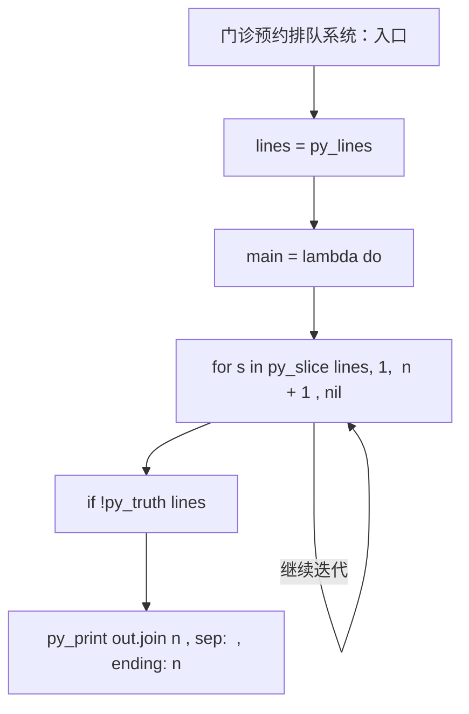
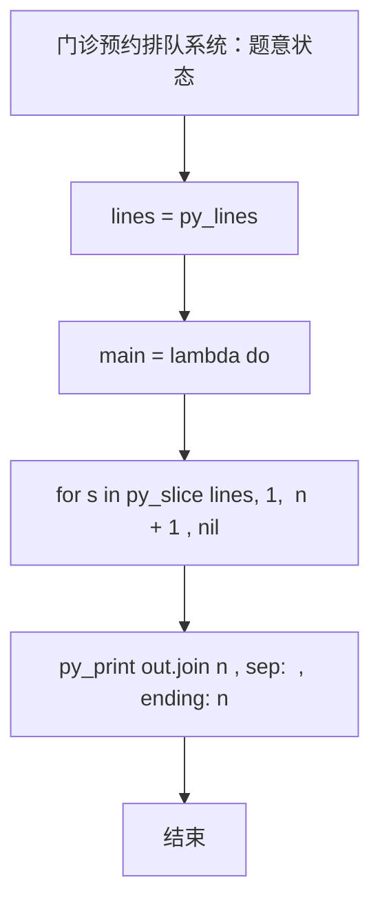

# L3-043 - 门诊预约排队系统（30 分）

| 项目 | 限制 |
| --- | --- |
| 时间限制 | 100 ms |
| 内存限制 | 65536 KB |
| 代码长度限制 | 16 KB |

## 题目描述

本题请你帮助医院开发一个门诊预约排队系统，基本需求如下：
- 系统内每天预设 $n$ 个就诊时间段，每个时间段对应一个号（从 1 到 $n$）；
- 患者可以从列表中选择一个可选的时间段预约挂号；
- 一个号只能被一位患者预约；
- 医生在一个号对应的时间段内，只能接待一位患者；
- 当医生准备接待下一位患者时，如果当前时间段对应的挂号患者在等待，则接待之；如果该患者不是等待状态，则接待已经到达等待的患者中预约号最小的那位；
- 80 岁及以上老人就诊有特别优先权，当然前提是老人家也挂号了。具体来说，当医生叫下一位患者就诊时，如果当前时间段对应的挂号患者没有在等待，且等待的队列中有 80 岁及以上的老人，则直接叫老人的号，无论老人挂的号是什么时间。如果有多位老人在等待，则按这些老人预约号的升序处理。
- 医生必须接待完所有患者，才能下班。

### 输入格式

输入第一行给出正整数 $n$（$\le 10^4$），为就诊患者的人数。随后 $n$ 行，按照前来就诊的时间顺序，每行给出一位患者的信息，格式如下：
```
就诊时间段 预约时间段 患者ID 患者年龄
```
其中 `时间段` 为区间 $[1, n]$ 内的整数，`患者ID` 为由 5 个数字组成的字符串，`患者年龄`  为区间 $[1, 200]$ 内的整数。题目保证每个就诊时间段有唯一的一位患者预约，但多位患者可能同时到达医院候诊。

### 输出格式

输出 $n$ 行，按照实际就诊时间段的递增顺序，每行输出一位患者的实际就诊时间段和 ID，其间以 1 个空格分隔，行首尾不得有多余空格。

### 输入样例
```in
9
1 3 02891 28
1 8 81926 83
1 2 37610 80
2 1 37428 79
3 7 46381 13
6 6 73846 93
8 5 18264 37
8 9 57382 24
8 4 27364 88
```

### 输出样例
```out
1 37610
2 81926
3 02891
4 37428
5 46381
6 73846
8 27364
9 57382
10 18264
```

## 参考样例

### 样例 1

**输入**
```
9
1 3 02891 28
1 8 81926 83
1 2 37610 80
2 1 37428 79
3 7 46381 13
6 6 73846 93
8 5 18264 37
8 9 57382 24
8 4 27364 88
```

**输出**
```
1 37610
2 81926
3 02891
4 37428
5 46381
6 73846
8 27364
9 57382
10 18264
```

## 实现原理与解题思路

本题的实现原理是：先对记录按关键字排序，再按题目规定的优先级顺序处理，保证每一步选择满足当前最优条件。先读取标准输入并按题目格式拆分字段，使用代码中的`lines`、`n`、`pts`、`by`保存计算过程，通过 5 个循环阶段逐步更新；处理完成后按照题目规定的顺序和格式输出结果。

## 代码流程说明

1. 读取并解析标准输入，转换为题目所需的数据结构。
2. 按题意执行核心算法，维护中间状态并处理边界情况。
3. 整理计算结果，按照输出格式生成答案。

## 代码实现

下面给出可独立运行的完整 Ruby 实现，关键步骤已在代码中标注。

```ruby
# frozen_string_literal: true
# 这些辅助方法只负责把题目输入、输出和常见序列操作映射为 Ruby 写法，
# 算法主体仍在下方的 entry 方法中，代码复制后可以独立运行。
module PTACompat
  UNSET = Object.new

  class CounterHash < Hash
    def initialize
      super(0)
    end
  end

  def py_tokens
    @pta_tokens ||= STDIN.read.split
  end

  def py_input_data
    @pta_input_data ||= STDIN.read
  end

  def py_readline
    STDIN.gets.to_s.chomp
  end

  def py_lines
    @pta_lines ||= STDIN.each_line.map(&:chomp)
  end

  def py_print(*values, sep: " ", ending: "\n")
    STDOUT.write(values.map(&:to_s).join(sep) + ending)
  end

  def py_int(value)
    value.to_i
  end

  def py_float(value)
    value.to_f
  end

  def py_str(value)
    value.to_s
  end

  def py_bool_int(value)
    value ? 1 : 0
  end

  def py_truth(value)
    return false if value.nil? || value == false
    return false if value.respond_to?(:zero?) && value.zero?
    return false if value.respond_to?(:empty?) && value.empty?

    true
  end

  def py_range(*args)
    first, last, step =
      case args.length
      when 1
        [0, args[0], 1]
      when 2
        [args[0], args[1], 1]
      else
        args
      end
    first = first.to_i
    last = last.to_i
    step = step.to_i
    raise ArgumentError, "range step cannot be zero" if step.zero?

    values = []
    current = first
    if step.positive?
      while current < last
        values << current
        current += step
      end
    else
      while current > last
        values << current
        current += step
      end
    end
    values
  end

  def py_map(function, values)
    values.map { |value| function.call(value) }
  end

  def py_iter(value)
    value.to_enum
  end

  def py_next(iterator)
    iterator.next
  end

  def py_iterable(value)
    value.is_a?(String) ? value.chars : value.to_a
  end

  def py_enumerate(values)
    values.each_with_index.map { |value, index| [index, value] }
  end

  def py_zip(*values)
    values.first.zip(*values.drop(1))
  end

  def py_slice(value, start_index = nil, stop_index = nil, step = nil)
    step ||= 1
    source = value.is_a?(String) ? value.chars : value.to_a
    size = source.length
    start_index = step.positive? ? 0 : size - 1 if start_index.nil?
    stop_index = step.positive? ? size : -size - 1 if stop_index.nil?
    start_index += size if start_index.negative?
    stop_index += size if stop_index.negative? && stop_index >= -size
    start_index =
      (
        if step.positive?
          [[start_index, 0].max, size].min
        else
          [[start_index, -1].max, size - 1].min
        end
      )
    stop_index =
      (
        if step.positive?
          [[stop_index, 0].max, size].min
        else
          [[stop_index, -1].max, size - 1].min
        end
      )

    result = []
    index = start_index
    if step.positive?
      while index < stop_index
        result << source[index]
        index += step
      end
    else
      while index > stop_index
        result << source[index]
        index += step
      end
    end
    value.is_a?(String) ? result.join : result
  end

  def py_len(value)
    value.length
  end

  def py_sum(values, initial = 0)
    values.sum(initial)
  end

  def py_abs(value)
    value.abs
  end

  def py_div(a, b)
    a.to_f / b
  end

  def py_divmod(a, b)
    [a.div(b), a % b]
  end

  def py_factorial(value)
    (1..value).reduce(1, :*)
  end

  def py_gcd(a, b)
    a.gcd(b)
  end

  def py_pow(base, exponent, modulus = nil)
    modulus.nil? ? base**exponent : base.pow(exponent, modulus)
  end

  def py_in(item, container)
    container.include?(item)
  end

  def py_counter(_values)
    CounterHash.new
  end

  def py_sorted(values, key: nil, reverse: false)
    result = (key ? values.sort_by { |value| key.call(value) } : values.sort)
    reverse ? result.reverse : result
  end

  def py_max(*values, key: nil, default: UNSET)
    values = values.first.to_a if values.length == 1 &&
      values.first.respond_to?(:each) && !values.first.is_a?(Numeric)
    return default unless values.any?

    key ? values.max_by { |value| key.call(value) } : values.max
  end

  def py_min(*values, key: nil, default: UNSET)
    values = values.first.to_a if values.length == 1 &&
      values.first.respond_to?(:each) && !values.first.is_a?(Numeric)
    return default unless values.any?

    key ? values.min_by { |value| key.call(value) } : values.min
  end

  def py_re_sub(pattern, replacement, value)
    value.gsub(Regexp.new(pattern), replacement)
  end

  def py_lstrip(value, chars)
    value.sub(/\A[#{Regexp.escape(chars)}]+/, "")
  end

  def py_startswith_at(value, prefix, index)
    value[index, prefix.length] == prefix
  end

  def py_replace_slice(value, start_index, stop_index, replacement)
    value[start_index...stop_index] = replacement
    value
  end

  def py_bisect_left(values, target)
    left = 0
    right = values.length
    while left < right
      middle = (left + right) / 2
      if values[middle] < target
        left = middle + 1
      else
        right = middle
      end
    end
    left
  end

  def py_bisect_right(values, target)
    left = 0
    right = values.length
    while left < right
      middle = (left + right) / 2
      if values[middle] <= target
        left = middle + 1
      else
        right = middle
      end
    end
    left
  end
end

class Hash
  def items
    to_a
  end
end

include PTACompat

# 题目入口：读取输入、执行核心算法并输出答案。

def entry
  main =
    lambda do ||
      # 读取并解析题目输入。
      lines = py_lines
      return if (!py_truth(lines))
      n = py_int(lines[0])
      pts = []
      by = {}
      # 按题目规则遍历输入或状态空间。
      for s in py_slice(lines, 1, (n + 1), nil)
        t, app, ident, age = s.split()
        x = [py_int(t), py_int(app), ident, py_int(age)]
        pts.append(x)
        by[py_int(app)] = x
      end
      pts.sort!
      allq = []
      elder = []
      waiting = Set.new([])
      # 初始化算法状态，保持后续转移所需的不变量。
      out = []
      i = 0
      time = 1
      while ((py_len(out) < n))
        time = py_max(time, pts[i][0]) if ((!py_truth(waiting)) && ((i < n)))
        while (((i < n)) && ((pts[i][0] <= time)))
          x = pts[i]
          i += 1
          waiting.add(x)
          allq.push([x[1], x])
          allq.sort!
          if ((x[3] >= 80))
            elder.push([x[1], x])
            elder.sort!
          end
        end
        if (!py_truth(waiting))
          time += 1
          next
        end
        owner = by.fetch(time, nil)
        if (py_in(owner, waiting))
          pick = owner
        else
          if py_truth(elder)
            pick = elder[0][1]
          else
            allq.shift while (py_truth(allq) && (!py_in(allq[0][1], waiting)))
            pick = allq[0][1]
          end
        end
        waiting.delete(pick)
        if ((pick[3] >= 80))
          elder.shift while (py_truth(elder) && (!py_in(elder[0][1], waiting)))
        end
        out.append("%s %s" % [time, pick[2]])
        time += 1
      end
      # 按题目要求输出最终结果。
      py_print(out.join("\n"), sep: " ", ending: "\n")
    end
  main.call
end
entry

```

## 代码流程图



## 解题流程图


