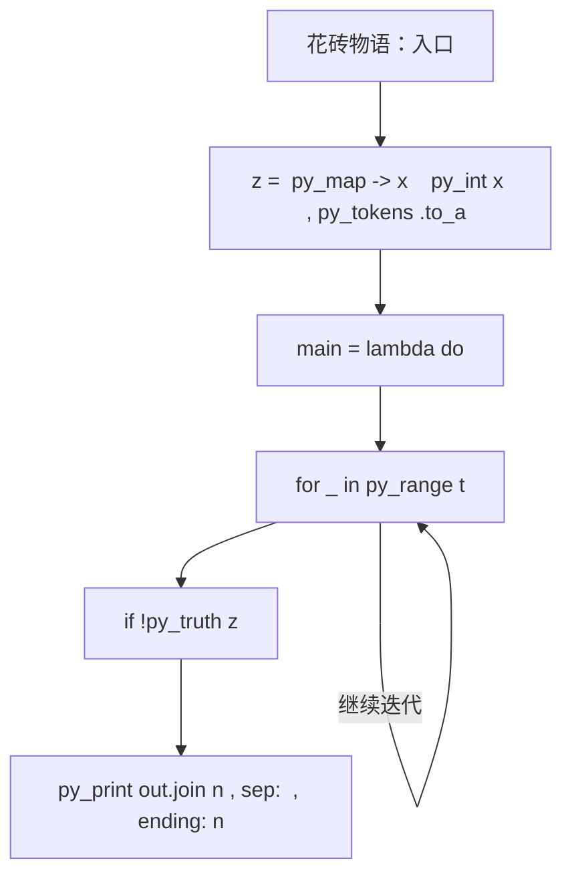
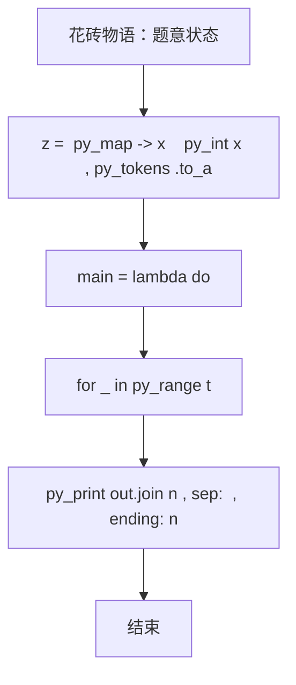

# L3-044 - 花砖物语（30 分）

- **时间限制**: 3000 ms
- **内存限制**: 131072 KB
- **代码长度限制**: 16 KB

---

## 题目描述


《花砖物语》是一款以瓷砖装饰为主题的德式桌游。在游戏中，玩家从工厂板块或桌面中央拿取花砖，将它们砌到自己的墙壁上以获得分数。游戏的核心机制之一在于拿取花砖的策略：从工厂板块上拿取一种颜色的所有花砖后，剩余的花砖会被移动到桌面中央；而桌面中央的花砖也可以被后续的玩家一次性拿走。

<center>


（BoardGameGeek 用户 *@Badass Vio* 拍摄的照片）
</center>

现有 $n$ 个工厂板块，第 $i$ 个工厂板块上恰好有两块花砖：一块红色花砖，花纹编号为 $r_i$；一块蓝色花砖，花纹编号为 $b_i$。

每次操作时，你可以选择以下两种方式之一：

1. **从工厂板块拿取**：选择一个仍有花砖的工厂板块，从中拿取一块花砖，将该工厂板块上剩余的那块花砖移动到桌面中央。
2. **从桌面中央拿取**：选择桌面中央某一种花砖（由颜色和花纹编号共同确定），拿取桌面中央所有该种花砖。

问：至少需要多少次操作，才能将所有 $2n$ 块花砖全部拿完？

### 输入格式:

有多组测试数据。第一行输入一个整数 $T$（$1 \le T \le 5$）表示测试数据组数。对于每组测试数据：

第一行输入一个整数 $n$（$1 \le n \le 10^5$），表示工厂板块的数量。

对于接下来 $n$ 行，第 $i$ 行输入两个整数 $r_i$ 和 $b_i$（$1 \le r_i, b_i \le n$），分别表示第 $i$ 个工厂板块上红色花砖和蓝色花砖的花纹编号。

### 输出格式:

对于每组数据，输出一行一个整数，表示拿完所有花砖所需的最少操作次数。

### 输入样例:
```in
2
4
1 2
1 3
2 2
4 1
18
1 14
3 7
3 13
4 10
7 18
9 3
10 4
11 6
11 13
11 15
12 14
13 12
14 6
16 8
17 1
17 5
18 8
18 11
```

### 输出样例:
```out
7
30
```

## 示例

### 示例 1

**输入:**
```
2
4
1 2
1 3
2 2
4 1
18
1 14
3 7
3 13
4 10
7 18
9 3
10 4
11 6
11 13
11 15
12 14
13 12
14 6
16 8
17 1
17 5
18 8
18 11
```

**输出:**
```
7
30
```

### 实现原理与解题思路

本题的实现原理是：将输入关系组织成邻接表，通过搜索访问可达状态，并在遍历中维护题目要求的结果。先读取标准输入并按题目格式拆分字段，使用代码中的`z`、`t`、`p`、`out`保存计算过程，通过 4 个循环阶段逐步更新；处理完成后按照题目规定的顺序和格式输出结果。

### 代码流程说明

1. 读取并解析标准输入，转换为题目所需的数据结构。
2. 按题意执行核心算法，维护中间状态并处理边界情况。
3. 整理计算结果，按照输出格式生成答案。

### 代码实现

下面给出可独立运行的完整 Ruby 实现，关键步骤已在代码中标注。

```ruby
# frozen_string_literal: true
# 这些辅助方法只负责把题目输入、输出和常见序列操作映射为 Ruby 写法，
# 算法主体仍在下方的 entry 方法中，代码复制后可以独立运行。
module PTACompat
  UNSET = Object.new

  class CounterHash < Hash
    def initialize
      super(0)
    end
  end

  def py_tokens
    @pta_tokens ||= STDIN.read.split
  end

  def py_input_data
    @pta_input_data ||= STDIN.read
  end

  def py_readline
    STDIN.gets.to_s.chomp
  end

  def py_lines
    @pta_lines ||= STDIN.each_line.map(&:chomp)
  end

  def py_print(*values, sep: " ", ending: "\n")
    STDOUT.write(values.map(&:to_s).join(sep) + ending)
  end

  def py_int(value)
    value.to_i
  end

  def py_float(value)
    value.to_f
  end

  def py_str(value)
    value.to_s
  end

  def py_bool_int(value)
    value ? 1 : 0
  end

  def py_truth(value)
    return false if value.nil? || value == false
    return false if value.respond_to?(:zero?) && value.zero?
    return false if value.respond_to?(:empty?) && value.empty?

    true
  end

  def py_range(*args)
    first, last, step =
      case args.length
      when 1
        [0, args[0], 1]
      when 2
        [args[0], args[1], 1]
      else
        args
      end
    first = first.to_i
    last = last.to_i
    step = step.to_i
    raise ArgumentError, "range step cannot be zero" if step.zero?

    values = []
    current = first
    if step.positive?
      while current < last
        values << current
        current += step
      end
    else
      while current > last
        values << current
        current += step
      end
    end
    values
  end

  def py_map(function, values)
    values.map { |value| function.call(value) }
  end

  def py_iter(value)
    value.to_enum
  end

  def py_next(iterator)
    iterator.next
  end

  def py_iterable(value)
    value.is_a?(String) ? value.chars : value.to_a
  end

  def py_enumerate(values)
    values.each_with_index.map { |value, index| [index, value] }
  end

  def py_zip(*values)
    values.first.zip(*values.drop(1))
  end

  def py_slice(value, start_index = nil, stop_index = nil, step = nil)
    step ||= 1
    source = value.is_a?(String) ? value.chars : value.to_a
    size = source.length
    start_index = step.positive? ? 0 : size - 1 if start_index.nil?
    stop_index = step.positive? ? size : -size - 1 if stop_index.nil?
    start_index += size if start_index.negative?
    stop_index += size if stop_index.negative? && stop_index >= -size
    start_index =
      (
        if step.positive?
          [[start_index, 0].max, size].min
        else
          [[start_index, -1].max, size - 1].min
        end
      )
    stop_index =
      (
        if step.positive?
          [[stop_index, 0].max, size].min
        else
          [[stop_index, -1].max, size - 1].min
        end
      )

    result = []
    index = start_index
    if step.positive?
      while index < stop_index
        result << source[index]
        index += step
      end
    else
      while index > stop_index
        result << source[index]
        index += step
      end
    end
    value.is_a?(String) ? result.join : result
  end

  def py_len(value)
    value.length
  end

  def py_sum(values, initial = 0)
    values.sum(initial)
  end

  def py_abs(value)
    value.abs
  end

  def py_div(a, b)
    a.to_f / b
  end

  def py_divmod(a, b)
    [a.div(b), a % b]
  end

  def py_factorial(value)
    (1..value).reduce(1, :*)
  end

  def py_gcd(a, b)
    a.gcd(b)
  end

  def py_pow(base, exponent, modulus = nil)
    modulus.nil? ? base**exponent : base.pow(exponent, modulus)
  end

  def py_in(item, container)
    container.include?(item)
  end

  def py_counter(_values)
    CounterHash.new
  end

  def py_sorted(values, key: nil, reverse: false)
    result = (key ? values.sort_by { |value| key.call(value) } : values.sort)
    reverse ? result.reverse : result
  end

  def py_max(*values, key: nil, default: UNSET)
    values = values.first.to_a if values.length == 1 &&
      values.first.respond_to?(:each) && !values.first.is_a?(Numeric)
    return default unless values.any?

    key ? values.max_by { |value| key.call(value) } : values.max
  end

  def py_min(*values, key: nil, default: UNSET)
    values = values.first.to_a if values.length == 1 &&
      values.first.respond_to?(:each) && !values.first.is_a?(Numeric)
    return default unless values.any?

    key ? values.min_by { |value| key.call(value) } : values.min
  end

  def py_re_sub(pattern, replacement, value)
    value.gsub(Regexp.new(pattern), replacement)
  end

  def py_lstrip(value, chars)
    value.sub(/\A[#{Regexp.escape(chars)}]+/, "")
  end

  def py_startswith_at(value, prefix, index)
    value[index, prefix.length] == prefix
  end

  def py_replace_slice(value, start_index, stop_index, replacement)
    value[start_index...stop_index] = replacement
    value
  end

  def py_bisect_left(values, target)
    left = 0
    right = values.length
    while left < right
      middle = (left + right) / 2
      if values[middle] < target
        left = middle + 1
      else
        right = middle
      end
    end
    left
  end

  def py_bisect_right(values, target)
    left = 0
    right = values.length
    while left < right
      middle = (left + right) / 2
      if values[middle] <= target
        left = middle + 1
      else
        right = middle
      end
    end
    left
  end
end

class Hash
  def items
    to_a
  end
end

include PTACompat

# 题目入口：读取输入、执行核心算法并输出答案。

def entry
  main =
    lambda do ||
      # 读取并解析题目输入。
      z = (py_map(->(x) { py_int(x) }, py_tokens).to_a)
      return if (!py_truth(z))
      t = z[0]
      p = 1
      # 初始化算法状态，保持后续转移所需的不变量。
      out = []
      # 按题目规则遍历输入或状态空间。
      for _ in py_range(t)
        n = z[p]
        p += 1
        g = py_iterable(py_range((n + 1))).flat_map { |_| [[]] }
        for _ in py_range(n)
          r, b = py_slice(z, p, (p + 2), nil)
          p += 2
          g[r].append(b)
        end
        match = ([0] * (n + 1))
        dfs =
          lambda do |u, seen|
            for v in g[u]
              next if py_truth(seen[v])
              seen[v] = 1
              if ((!py_truth(match[v])) || py_truth(dfs.call(match[v], seen)))
                match[v] = u
                return 1
              end
            end
            return 0
          end
        ans = 0
        for u in py_range(1, (n + 1))
          ans += dfs.call(u, ([0] * (n + 1)))
        end
        out.append(py_str((n + ans)))
      end
      # 按题目要求输出最终结果。
      py_print(out.join("\n"), sep: " ", ending: "\n")
    end
  main.call
end
entry

```

### 代码流程图



### 解题流程图


