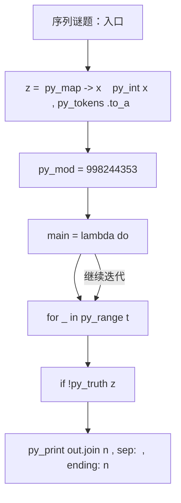
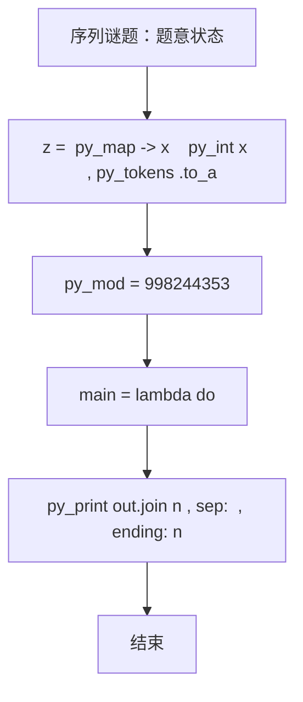

# L3-045 - 序列谜题（30 分）

| 项目 | 限制 |
| --- | --- |
| 时间限制 | 1000 ms |
| 内存限制 | 524288 KB |
| 代码长度限制 | 16 KB |

## 题目描述

给定一个长度为 $n$ 的整数序列 $a$，求有多少个长度为 $n$ 的整数序列 $b$ 满足 $1\le b_i\le n$（$1\le i\le n$），且 $a\circ b=b\circ a$。其中 $a\circ b=c$ 满足 $c_i=a_{b_i}$（$1\le i\le n$）。答案对 $998244353$ 取模。

### 输入格式

输入第一行给出一个正整数 $T$，表示测试数据的组数。

对于每组数据：第一行给出一个整数 $n$；第二行给出 $n$ 个正整数 $a_1,\dots,a_n$，数据间以空格分隔。

对于全部数据有：$n\ge 1$, $\sum n^2\le 2.5\times 10^7$, $1\le a_i\le n$。

### 输出格式

对于每组数据，在一行中输出一个整数，表示答案。

### 输入样例
```in
3
4
2 1 4 3
6
1 3 2 5 6 4
7
1 3 7 4 3 5 6
```

### 输出样例
```out
16
12
28
```

## 参考样例

### 样例 1

**输入**
```
3
4
2 1 4 3
6
1 3 2 5 6 4
7
1 3 7 4 3 5 6
```

**输出**
```
16
12
28
```

## 实现原理与解题思路

本题的实现原理是：建立状态数组，按照题目给出的转移关系逐项更新，最后从目标状态恢复答案。先读取标准输入并按题目格式拆分字段，使用代码中的`z`、`t`、`p`、`out`保存计算过程，通过 13 个循环阶段逐步更新；处理完成后按照题目规定的顺序和格式输出结果。

## 代码流程说明

1. 读取并解析标准输入，转换为题目所需的数据结构。
2. 按题意执行核心算法，维护中间状态并处理边界情况。
3. 整理计算结果，按照输出格式生成答案。

## 代码实现

下面给出可独立运行的完整 Ruby 实现，关键步骤已在代码中标注。

```ruby
# frozen_string_literal: true
# 这些辅助方法只负责把题目输入、输出和常见序列操作映射为 Ruby 写法，
# 算法主体仍在下方的 entry 方法中，代码复制后可以独立运行。
module PTACompat
  UNSET = Object.new

  class CounterHash < Hash
    def initialize
      super(0)
    end
  end

  def py_tokens
    @pta_tokens ||= STDIN.read.split
  end

  def py_input_data
    @pta_input_data ||= STDIN.read
  end

  def py_readline
    STDIN.gets.to_s.chomp
  end

  def py_lines
    @pta_lines ||= STDIN.each_line.map(&:chomp)
  end

  def py_print(*values, sep: " ", ending: "\n")
    STDOUT.write(values.map(&:to_s).join(sep) + ending)
  end

  def py_int(value)
    value.to_i
  end

  def py_float(value)
    value.to_f
  end

  def py_str(value)
    value.to_s
  end

  def py_bool_int(value)
    value ? 1 : 0
  end

  def py_truth(value)
    return false if value.nil? || value == false
    return false if value.respond_to?(:zero?) && value.zero?
    return false if value.respond_to?(:empty?) && value.empty?

    true
  end

  def py_range(*args)
    first, last, step =
      case args.length
      when 1
        [0, args[0], 1]
      when 2
        [args[0], args[1], 1]
      else
        args
      end
    first = first.to_i
    last = last.to_i
    step = step.to_i
    raise ArgumentError, "range step cannot be zero" if step.zero?

    values = []
    current = first
    if step.positive?
      while current < last
        values << current
        current += step
      end
    else
      while current > last
        values << current
        current += step
      end
    end
    values
  end

  def py_map(function, values)
    values.map { |value| function.call(value) }
  end

  def py_iter(value)
    value.to_enum
  end

  def py_next(iterator)
    iterator.next
  end

  def py_iterable(value)
    value.is_a?(String) ? value.chars : value.to_a
  end

  def py_enumerate(values)
    values.each_with_index.map { |value, index| [index, value] }
  end

  def py_zip(*values)
    values.first.zip(*values.drop(1))
  end

  def py_slice(value, start_index = nil, stop_index = nil, step = nil)
    step ||= 1
    source = value.is_a?(String) ? value.chars : value.to_a
    size = source.length
    start_index = step.positive? ? 0 : size - 1 if start_index.nil?
    stop_index = step.positive? ? size : -size - 1 if stop_index.nil?
    start_index += size if start_index.negative?
    stop_index += size if stop_index.negative? && stop_index >= -size
    start_index =
      (
        if step.positive?
          [[start_index, 0].max, size].min
        else
          [[start_index, -1].max, size - 1].min
        end
      )
    stop_index =
      (
        if step.positive?
          [[stop_index, 0].max, size].min
        else
          [[stop_index, -1].max, size - 1].min
        end
      )

    result = []
    index = start_index
    if step.positive?
      while index < stop_index
        result << source[index]
        index += step
      end
    else
      while index > stop_index
        result << source[index]
        index += step
      end
    end
    value.is_a?(String) ? result.join : result
  end

  def py_len(value)
    value.length
  end

  def py_sum(values, initial = 0)
    values.sum(initial)
  end

  def py_abs(value)
    value.abs
  end

  def py_div(a, b)
    a.to_f / b
  end

  def py_divmod(a, b)
    [a.div(b), a % b]
  end

  def py_factorial(value)
    (1..value).reduce(1, :*)
  end

  def py_gcd(a, b)
    a.gcd(b)
  end

  def py_pow(base, exponent, modulus = nil)
    modulus.nil? ? base**exponent : base.pow(exponent, modulus)
  end

  def py_in(item, container)
    container.include?(item)
  end

  def py_counter(_values)
    CounterHash.new
  end

  def py_sorted(values, key: nil, reverse: false)
    result = (key ? values.sort_by { |value| key.call(value) } : values.sort)
    reverse ? result.reverse : result
  end

  def py_max(*values, key: nil, default: UNSET)
    values = values.first.to_a if values.length == 1 &&
      values.first.respond_to?(:each) && !values.first.is_a?(Numeric)
    return default unless values.any?

    key ? values.max_by { |value| key.call(value) } : values.max
  end

  def py_min(*values, key: nil, default: UNSET)
    values = values.first.to_a if values.length == 1 &&
      values.first.respond_to?(:each) && !values.first.is_a?(Numeric)
    return default unless values.any?

    key ? values.min_by { |value| key.call(value) } : values.min
  end

  def py_re_sub(pattern, replacement, value)
    value.gsub(Regexp.new(pattern), replacement)
  end

  def py_lstrip(value, chars)
    value.sub(/\A[#{Regexp.escape(chars)}]+/, "")
  end

  def py_startswith_at(value, prefix, index)
    value[index, prefix.length] == prefix
  end

  def py_replace_slice(value, start_index, stop_index, replacement)
    value[start_index...stop_index] = replacement
    value
  end

  def py_bisect_left(values, target)
    left = 0
    right = values.length
    while left < right
      middle = (left + right) / 2
      if values[middle] < target
        left = middle + 1
      else
        right = middle
      end
    end
    left
  end

  def py_bisect_right(values, target)
    left = 0
    right = values.length
    while left < right
      middle = (left + right) / 2
      if values[middle] <= target
        left = middle + 1
      else
        right = middle
      end
    end
    left
  end
end

class Hash
  def items
    to_a
  end
end

include PTACompat

# 题目入口：读取输入、执行核心算法并输出答案。

def entry
  py_mod = 998_244_353
  main =
    lambda do ||
      # 读取并解析题目输入。
      z = (py_map(->(x) { py_int(x) }, py_tokens).to_a)
      return if (!py_truth(z))
      t = z[0]
      p = 1
      # 初始化算法状态，保持后续转移所需的不变量。
      out = []
      # 按题目规则遍历输入或状态空间。
      for _ in py_range(t)
        n = z[p]
        p += 1
        f = py_iterable(py_slice(z, p, (p + n), nil)).flat_map { |x| [(x - 1)] }
        p += n
        rev = py_iterable(py_range(n)).flat_map { |_| [[]] }
        for i, v in py_enumerate(f)
          rev[v].append(i)
        end
        indeg = ([0] * n)
        for v in f
          indeg[v] += 1
        end
        q =
          py_iterable(py_enumerate(indeg)).flat_map do |__item_0|
            i, d = __item_0
            next [] unless py_truth(((d == 0)))
            [i]
          end
        cyc = ([true] * n)
        h = 0
        while ((h < py_len(q)))
          u = q[h]
          h += 1
          cyc[u] = false
          indeg[f[u]] -= 1
          q.append(f[u]) if ((indeg[f[u]] == 0))
        end
        py_a = py_iterable(py_range(n)).flat_map { |_| [([1] * n)] }
        order =
          (
            q +
              py_iterable(py_range(n)).flat_map do |i|
                next [] unless py_truth(cyc[i])
                [i]
              end
          )
        for u in order
          next if (!py_truth(rev[u]))
          row = ([1] * n)
          for child in rev[u]
            next if (py_truth(cyc[child]) && py_truth(cyc[u]))
            sums = ([0] * n)
            for x in py_range(n)
              sums[f[x]] = ((sums[f[x]] + py_a[child][x]) % py_mod)
            end
            row =
              py_iterable(py_range(n)).flat_map do |v|
                [((row[v] * sums[v]) % py_mod)]
              end
          end
          py_a[u] = row
        end
        comp = ([(-1)] * n)
        cycles = []
        for i in py_range(n)
          if (py_truth(cyc[i]) && ((comp[i] < 0)))
            c = []
            u = i
            while ((comp[u] < 0))
              comp[u] = py_len(cycles)
              c.append(u)
              u = f[u]
            end
            cycles.append(c)
          end
        end
        ans = 1
        for s in cycles
          ways = 0
          for tt in cycles
            next if py_truth((py_len(s) % py_len(tt)))
            for sh in py_range(py_len(tt))
              v = 1
              for k, u in py_enumerate(s)
                v = ((v * py_a[u][tt[((sh + k) % py_len(tt))]]) % py_mod)
              end
              ways = ((ways + v) % py_mod)
            end
          end
          ans = ((ans * ways) % py_mod)
        end
        out.append(py_str(ans))
      end
      # 按题目要求输出最终结果。
      py_print(out.join("\n"), sep: " ", ending: "\n")
    end
  main.call
end
entry

```

## 代码流程图



## 解题流程图


